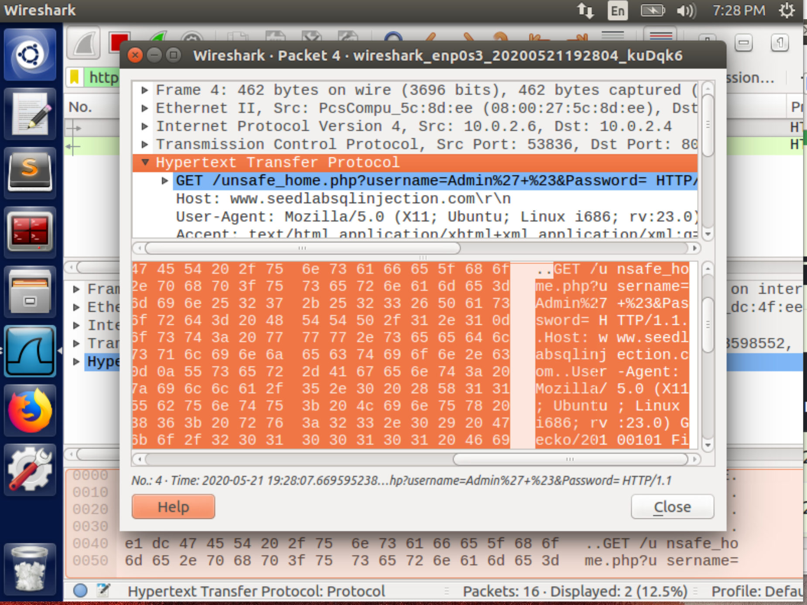
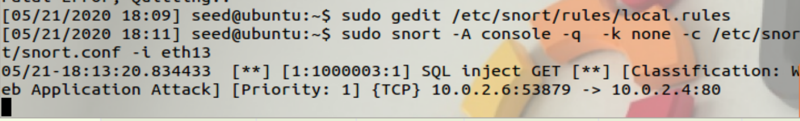
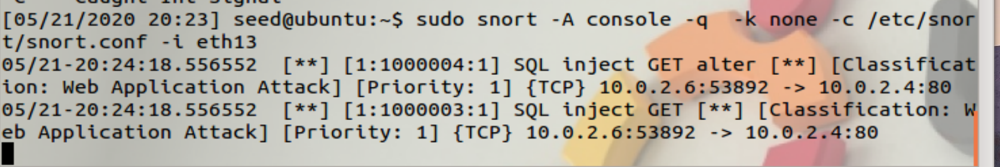
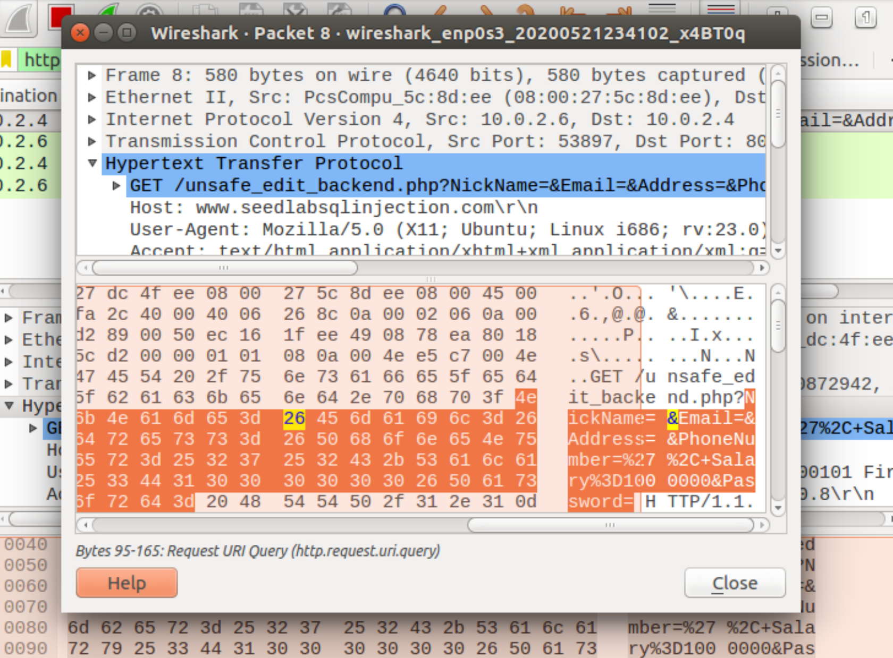
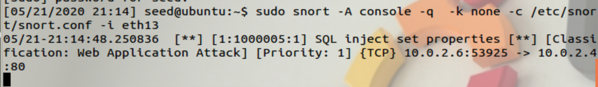
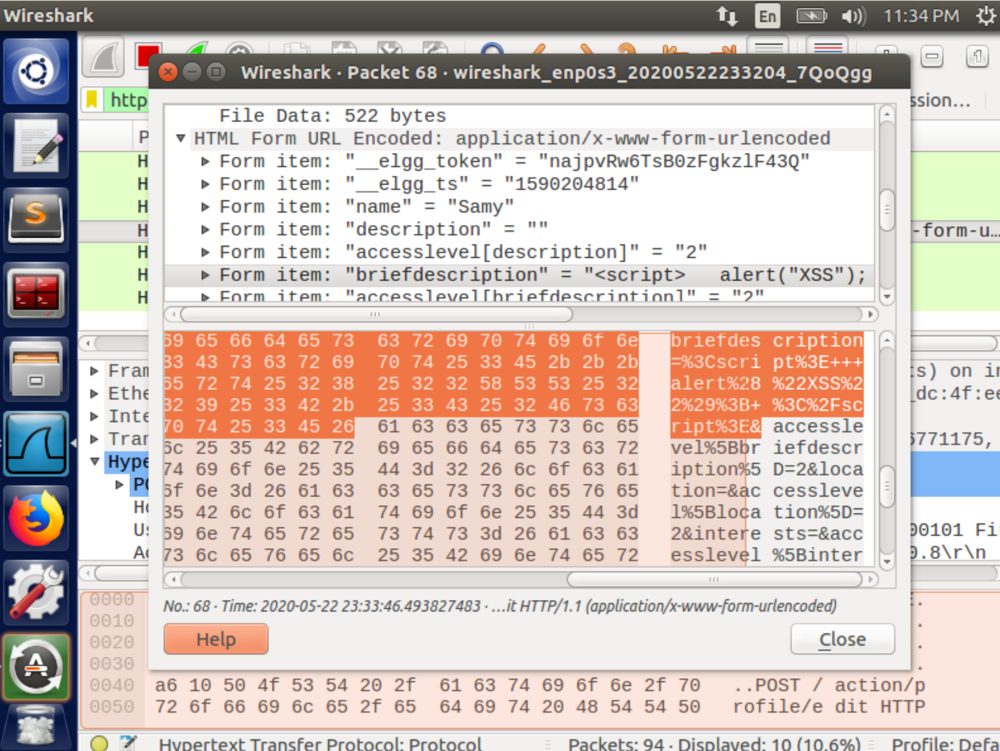

# Find `snort` rules for XSS attack

## Pre-requirement

Install `snort` on Ubuntu 16.04 (VM provided by seed-project) as

```
sudo apt install snort
```

Edit `/etc/snort/snort.conf` using `sudo gedit /etc/snort/snort.conf`:

```conf
# ipvar HOME_NET any
ipvar HOME_NET 10.0.2.0/16
```

Compose all rules in file `/etc/snort/rules/local.rules`

```
sudo gedit /etc/snort/rules/local.rules
```

Then run it with

```
sudo snort -A console -q -c /etc/snort/snort.conf -i enp0s3
```

Now, the IP address of the testing VM is set as `10.0.2.15/16`.

## Built-in rules about XSS

search the folder `/etc/snort/rules/` in local by keyword `"XSS"`:

```
egrep "XSS" /etc/snort/rules/*.rules
```

Results ([`XSS_lookup.txt`](./XSS_lookup.txt)):

```
/etc/snort/rules/community-deleted.rules:#alert tcp $EXTERNAL_NET any -> $HTTP_SERVERS $HTTP_PORTS (msg:"COMMUNITY DELETED PhpWebGallery XSS attempt"; content:"GET"; nocase; depth:3; uricontent:"comments"; nocase; uricontent:"|2E|php"; nocase; uricontent:"|3F|keyword"; nocase; reference:bugtraq,18798; classtype:web-application-attack; sid:100000848; rev:2;)
/etc/snort/rules/community-web-attacks.rules:alert tcp $EXTERNAL_NET any -> $HTTP_SERVERS $HTTP_PORTS (msg:"COMMUNITY WEB-ATTACKS SAP WAS syscmd access"; flow:to_server,established; uricontent:"/sap/bc/BSp/sap/menu/frameset.htm"; nocase; uricontent:"sap-syscmd"; nocase; reference:url,www.cybsec.com/vuln/CYBSEC_Security_Advisory_Multiple_XSS_in_SAP_WAS.pdf; classtype:web-application-activity; sid:100000183; rev:1;)
/etc/snort/rules/community-web-cgi.rules:alert tcp any any -> $HOME_NET $HTTP_PORTS (msg:"COMMUNITY WEB-CGI Roller Weblog XSS exploit"; flow:established,to_server; content:"POST"; nocase; depth:4; content:"method=post"; nocase; pcre:"/(name|email|url)=[^\r\n]*\x3Cscript\x3E/smi"; reference:bugtraq,20045; classtype:web-application-activity; sid:100000878; rev:2;)
/etc/snort/rules/community-web-cgi.rules:alert tcp any any -> $HOME_NET $HTTP_PORTS (msg:"COMMUNITY WEB-CGI Roller Weblog XSS exploit"; flow:established,to_server; content:"POST"; nocase; depth:4; content:"method=preview"; nocase; content:"content="; nocase; distance:0; reference:bugtraq,20045; classtype:web-application-activity; sid:100000879; rev:2;)
/etc/snort/rules/community-web-cgi.rules:alert tcp any any -> $HOME_NET $HTTP_PORTS (msg:"COMMUNITY WEB-CGI Roller Weblog XSS exploit"; flow:established,to_server; uricontent:"/sitesearch.do"; nocase; uricontent:"q="; nocase; uricontent:"<script>"; nocase; reference:bugtraq,20045; classtype:web-application-activity; sid:100000880; rev:2;)
/etc/snort/rules/community-web-php.rules:alert tcp $EXTERNAL_NET any -> $HTTP_SERVERS $HTTP_PORTS (msg:"COMMUNITY WEB-PHP XSS attempt"; flow:to_server,established; uricontent:"|2E|php"; nocase; uricontent:"|3C|script|3E|"; nocase; uricontent:"|3C 2F|script|3E|"; nocase; classtype:web-application-attack; sid:100000187; rev:2;)
/etc/snort/rules/community-web-php.rules:alert tcp $EXTERNAL_NET any -> $HTTP_SERVERS $HTTP_PORTS (msg:"COMMUNITY WEB-PHP Horde index.php show XSS attempt"; flow:established,to_server; uricontent:"/services/help/index.php"; nocase; uricontent:"show="; nocase; uricontent:"URL=javascript"; nocase; reference:bugtraq,18845; classtype:web-application-attack; sid:100000703; rev:2;)
/etc/snort/rules/community-web-php.rules:alert tcp $EXTERNAL_NET any -> $HOME_NET $HTTP_PORTS (msg:"COMMUNITY WEB-PHP CubeCart XSS attack"; flow:to_server,established; uricontent:"/admin/filemanager/preview.php?file="; nocase; pcre:"/((1)?&(x|y)=)?/Ri"; reference:url,retrogod.altervista.org/cubecart_3011_adv.html; classtype:web-application-attack; sid:100000871; rev:2;)
/etc/snort/rules/community-web-php.rules:alert tcp $EXTERNAL_NET any -> $HOME_NET $HTTP_PORTS (msg:"COMMUNITY WEB-PHP CubeCart XSS attack"; flow:to_server,established; uricontent:"/admin/login.php?email="; nocase; reference:url,retrogod.altervista.org/cubecart_3011_adv.html; classtype:web-application-attack; sid:100000872; rev:2;)
```

## TCP/UDP traffic on non-standard ports

Assume we want to issue warnings upon finding any TCP/UDP traffics on ports expect on own 22/23/80/443 ports:

```
alert tcp any any <> 10.0.2.15 ![22,23,80,443] (msg: "communicate on special ports";sid:1000001; rev:1;)
alert udp any any <> 10.0.2.15 ![22,23,80,443] (msg: "communicate on special ports";sid:1000002; rev:1;)
```

Try to ping its port 4000 from VM `10.0.2.4`

```
nc -vz 10.0.2.15 4000
```

It alerts as expected:


## SQL Inject

All snort rules are verified on Ubuntu 12.04 (see [its install and use guide](../Heartbleed-Attack/README.MD#detect-the-attack-with-snort)) VM (`10.0.2.6`) as Version 2.9.2 IPv6 GRE. *Somehow, the results cannot be reproduced on Ubuntu 16.04, perhaps snort is installed improperly on it, we temporarily leave the issue in to-do list*

For example, we do SQL inject attack like [task 2.1](../SQL-Injection-Attack/readme.md#task-21) using `Admin' #` as username, which means we should send such an HTTP GET request:



It's significant and valid component is `#` (URL encode: `%23`) right after `'` (URL encode `%27`) to make the following SQL clauses as comments.


```sh
alert tcp any any -> 10.0.2.4 80 \ 
# specify the server ip and http/https port in your machine
(msg: "SQL inject GET"; \
flow:to_server,established; \
content: "GET";  nocase; http_method;\ 
#check if its method is GET
content: "php?"; nocase; http_uri; \ 
#the web script is written in php so it will be a suffix in request uri
content: "username="; nocase; http_uri; pcre:"/(\%27).*(\%23)/ix"; \ 
# inject in field "username", check if there is any "' #" pattern in it
classtype:web-application-attack; sid:1000003; rev:1;)
```


When we use `Admin' #` log in the website from VM `10.0.2.6` it will alert:



If you don't know any username but want to do SQL injection, you might use such a username

```
xxx' OR 1=1 # 
```


The pattern `' OR \w*=\w* #` is a critical signal in such attacks.

```sh
alert tcp any any -> 10.0.2.4 80 \ 
# specify the server ip and http/https port in your machine
(msg: "SQL inject GET alter"; \
flow:to_server,established; \
content: "GET";  nocase; http_method;\ 
#check if its method is GET
content: "php?"; nocase; http_uri; \ 
#the web script is written in php so it will be a suffix in request uri
content: "username="; nocase; http_uri; pcre:"/(\%27).*OR.*\w*(\%3D)\w*(\%23)/ix"; \ 
# inject in field "username", check if there is any "' #" pattern and short-circuiting in it
classtype:web-application-attack; sid:1000004; rev:1;)
```

Not surprisingly, when typing `a' OR 1=1` as injected username, both 2 rules will be triggered:



It is a special case within the scenes that the former rule describes.

In [task 3.2](../SQL-Injection-Attack/readme.md#task-32), we inject with `', salary=1000000 #` to update the `salary` record which is not mutable in edit profile page. It's done by sending an HTTP GET request as:



Its remarkable feature is `'` followed by `,` (URL encode `%2C`) , `=` (URL encode `%3D`), and `#`.

```sh
alert tcp any any -> 10.0.2.4 80 \ 
# specify the server ip and http/https port in your machine
(msg: "SQL inject set properties"; \
flow:to_server,established; \
content: "GET";  nocase; http_method;\ 
#check if its method is GET
content: "php?"; nocase; http_uri; \ 
#the web script is written in php so it will be a suffix in request uri
content: "phonenumber="; nocase; http_uri; pcre:"/(\%27).* (\%2C).*\w*(\%3D)\w*.*(\%23)/ix"; \ 
# inject in field "phonenumber", check if there is any "', xxx=xxx #" pattern.
classtype:web-application-attack; sid:1000005; rev:1;)
```

It can detect if any `', xxx=xxx #` is filled in **Phone Number** field.



## XSS

Based on [built-in rules](#built-in-rules-about-xss) in  `/etc/snort/rules/community-web-php.rules`, we decide to detect if a user is going to write some malicious executable `js` code in his/her profile. The modification is usually implemented by sent an HTTP POST request to the server. For example, we edit the profile page as [task 1](./readme.md#task-1) in Cross-Site Scripting Attack Lab, it will send a packet like:



"signature" for this kind of message is

```
<script> ... </script>
```

Or

```
<script type="text/javascript"> ... </script>
```

In `description` or `briefdescription` field in the request.


**Note**: it is a simple demo for the simplest and highly-specified models of SQL inject and XSS attack, a bunch of adjustments should be applied based on domain in the real world, in which both attacks and servers are much more complex and flexible.

## References

- http://alexchaoyihuang.blogspot.com/2017/07/a-snort-rule-file-for-identifying-sql.html
- https://www.blackhat.com/presentations/bh-usa-04/bh-us-04-mookhey/old/bh-us-04-mookhey_whitepaper.pdf
- https://github.com/kunalgupta007/XssDetectionUsingIds
- [Managing Security with Snort & IDS Tools: Intrusion Detection with Open Source Tools](https://books.google.com/books?id=5UKt2oWpOU0C&printsec=frontcover#v=onepage&q&f=false)
- Tool: [Snort Rules loader](https://www.arl.wustl.edu/projects/fpx/stat_module/snortrules.html)
- [Cheatsheet for regex in pcre](https://www.debuggex.com/cheatsheet/regex/pcre)
- [Snort Lab: Payload Detection Rules (PCRE)](https://resources.infosecinstitute.com/snort-lab-payload-detection-rules-pcre/#gref)
