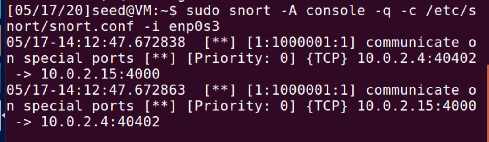

# Find `snort` rules for XSS attack

## Pre-requirement

Install `snort` on Ubuntu 16.04 (VM provided by seed-project) as

```
sudo apt install snort
```

Edit `/etc/snort/snort.conf` using `sudo gedit /etc/snort/snort.conf`:

```conf
# ipvar HOME_NET any
ipvar HOME_NET 10.0.2.0/16
```

Compose all rules in file `/etc/snort/rules/local.rules`

```
sudo gedit /etc/snort/rules/local.rules
```

Then run it with

```
sudo snort -A console -q -c /etc/snort/snort.conf -i enp0s3
```

Now, the IP address of the testing VM is set as `10.0.2.15/16`.

## Built-in rules about XSS

search the folder `/etc/snort/rules/` in local by keyword `"XSS"`:

```
egrep "XSS" /etc/snort/rules/*.rules
```

Results ([`XSS_lookup.txt`](./XSS_lookup.txt)):

```
/etc/snort/rules/community-deleted.rules:#alert tcp $EXTERNAL_NET any -> $HTTP_SERVERS $HTTP_PORTS (msg:"COMMUNITY DELETED PhpWebGallery XSS attempt"; content:"GET"; nocase; depth:3; uricontent:"comments"; nocase; uricontent:"|2E|php"; nocase; uricontent:"|3F|keyword"; nocase; reference:bugtraq,18798; classtype:web-application-attack; sid:100000848; rev:2;)
/etc/snort/rules/community-web-attacks.rules:alert tcp $EXTERNAL_NET any -> $HTTP_SERVERS $HTTP_PORTS (msg:"COMMUNITY WEB-ATTACKS SAP WAS syscmd access"; flow:to_server,established; uricontent:"/sap/bc/BSp/sap/menu/frameset.htm"; nocase; uricontent:"sap-syscmd"; nocase; reference:url,www.cybsec.com/vuln/CYBSEC_Security_Advisory_Multiple_XSS_in_SAP_WAS.pdf; classtype:web-application-activity; sid:100000183; rev:1;)
/etc/snort/rules/community-web-cgi.rules:alert tcp any any -> $HOME_NET $HTTP_PORTS (msg:"COMMUNITY WEB-CGI Roller Weblog XSS exploit"; flow:established,to_server; content:"POST"; nocase; depth:4; content:"method=post"; nocase; pcre:"/(name|email|url)=[^\r\n]*\x3Cscript\x3E/smi"; reference:bugtraq,20045; classtype:web-application-activity; sid:100000878; rev:2;)
/etc/snort/rules/community-web-cgi.rules:alert tcp any any -> $HOME_NET $HTTP_PORTS (msg:"COMMUNITY WEB-CGI Roller Weblog XSS exploit"; flow:established,to_server; content:"POST"; nocase; depth:4; content:"method=preview"; nocase; content:"content="; nocase; distance:0; reference:bugtraq,20045; classtype:web-application-activity; sid:100000879; rev:2;)
/etc/snort/rules/community-web-cgi.rules:alert tcp any any -> $HOME_NET $HTTP_PORTS (msg:"COMMUNITY WEB-CGI Roller Weblog XSS exploit"; flow:established,to_server; uricontent:"/sitesearch.do"; nocase; uricontent:"q="; nocase; uricontent:"<script>"; nocase; reference:bugtraq,20045; classtype:web-application-activity; sid:100000880; rev:2;)
/etc/snort/rules/community-web-php.rules:alert tcp $EXTERNAL_NET any -> $HTTP_SERVERS $HTTP_PORTS (msg:"COMMUNITY WEB-PHP XSS attempt"; flow:to_server,established; uricontent:"|2E|php"; nocase; uricontent:"|3C|script|3E|"; nocase; uricontent:"|3C 2F|script|3E|"; nocase; classtype:web-application-attack; sid:100000187; rev:2;)
/etc/snort/rules/community-web-php.rules:alert tcp $EXTERNAL_NET any -> $HTTP_SERVERS $HTTP_PORTS (msg:"COMMUNITY WEB-PHP Horde index.php show XSS attempt"; flow:established,to_server; uricontent:"/services/help/index.php"; nocase; uricontent:"show="; nocase; uricontent:"URL=javascript"; nocase; reference:bugtraq,18845; classtype:web-application-attack; sid:100000703; rev:2;)
/etc/snort/rules/community-web-php.rules:alert tcp $EXTERNAL_NET any -> $HOME_NET $HTTP_PORTS (msg:"COMMUNITY WEB-PHP CubeCart XSS attack"; flow:to_server,established; uricontent:"/admin/filemanager/preview.php?file="; nocase; pcre:"/((1)?&(x|y)=)?/Ri"; reference:url,retrogod.altervista.org/cubecart_3011_adv.html; classtype:web-application-attack; sid:100000871; rev:2;)
/etc/snort/rules/community-web-php.rules:alert tcp $EXTERNAL_NET any -> $HOME_NET $HTTP_PORTS (msg:"COMMUNITY WEB-PHP CubeCart XSS attack"; flow:to_server,established; uricontent:"/admin/login.php?email="; nocase; reference:url,retrogod.altervista.org/cubecart_3011_adv.html; classtype:web-application-attack; sid:100000872; rev:2;)
```

## TCP/UDP traffic on non-standard ports

Assume we want to issue warnings upon finding any TCP/UDP traffics on ports expect on own 22/23/80/443 ports:

```
alert tcp any any <> 10.0.2.15 ![22,23,80,443] (msg: "communicate on special ports";sid:1000001; rev:1;)
alert udp any any <> 10.0.2.15 ![22,23,80,443] (msg: "communicate on special ports";sid:1000002; rev:1;)
```

Try to ping its port 4000 from VM `10.0.2.4`

```
nc -vz 10.0.2.15 4000
```

It alerts as expected:



## References

- http://alexchaoyihuang.blogspot.com/2017/07/a-snort-rule-file-for-identifying-sql.html
- https://www.blackhat.com/presentations/bh-usa-04/bh-us-04-mookhey/old/bh-us-04-mookhey_whitepaper.pdf
- https://github.com/kunalgupta007/XssDetectionUsingIds
- [Managing Security with Snort & IDS Tools: Intrusion Detection with Open Source Tools](https://books.google.com/books?id=5UKt2oWpOU0C&printsec=frontcover#v=onepage&q&f=false)
- Tool: [Snort Rules loader](https://www.arl.wustl.edu/projects/fpx/stat_module/snortrules.html)

