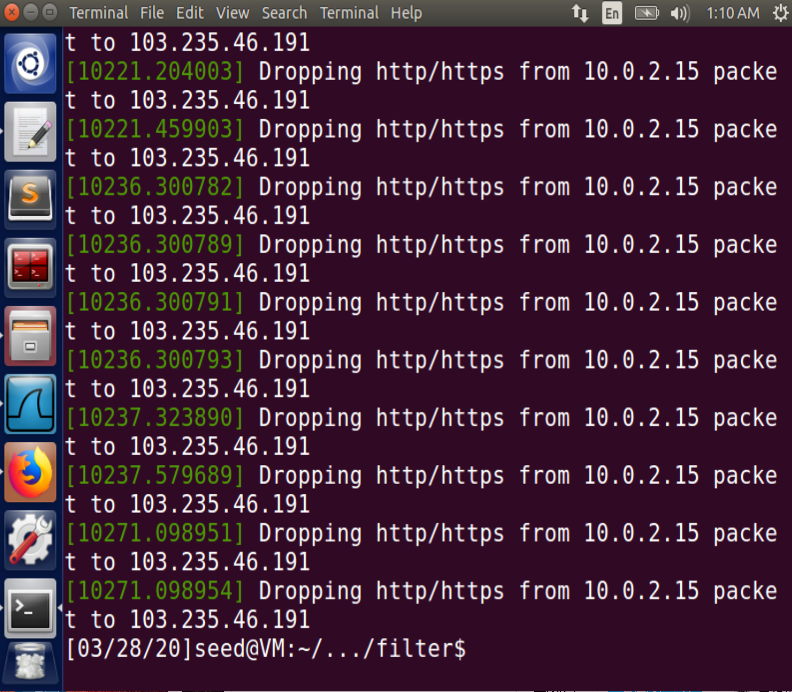
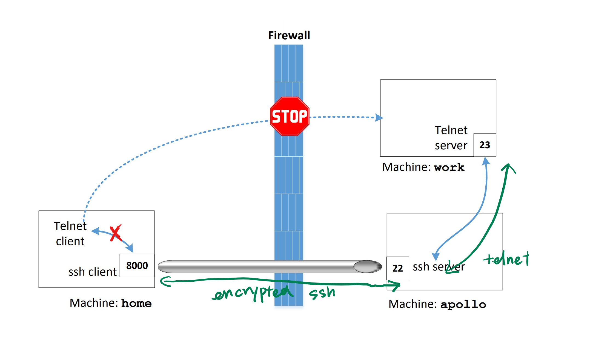
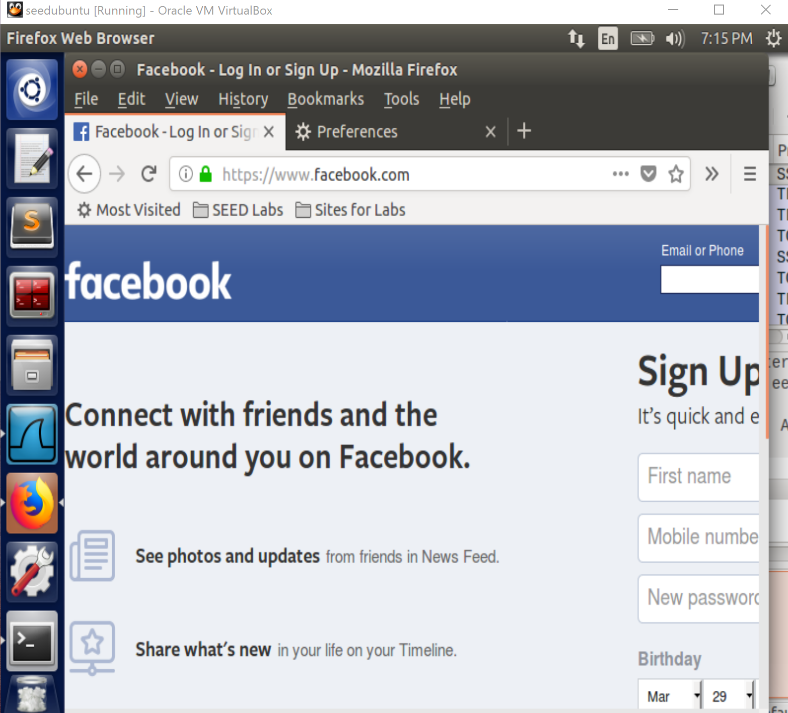
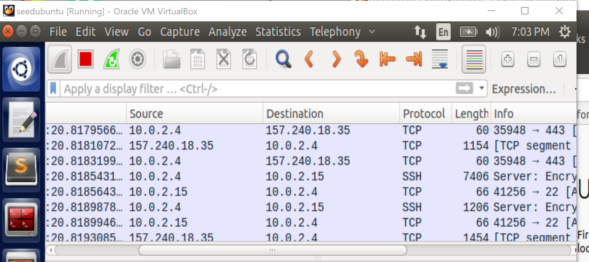
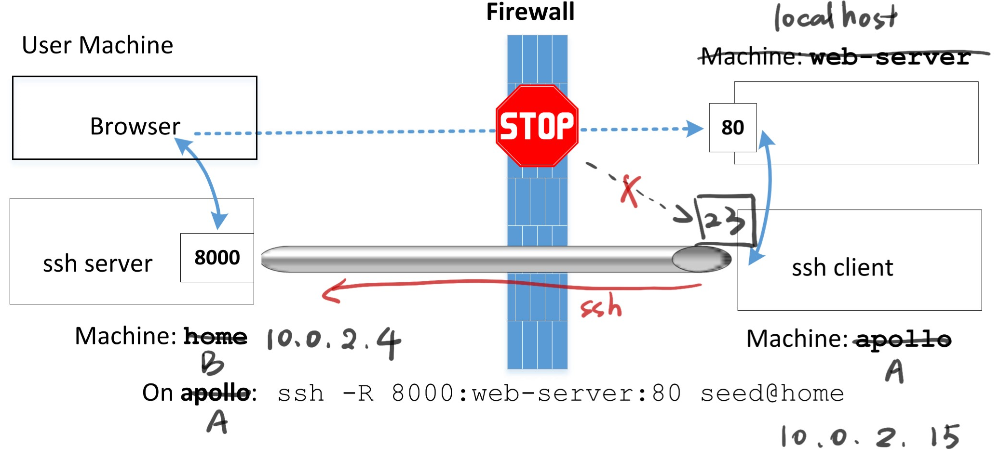
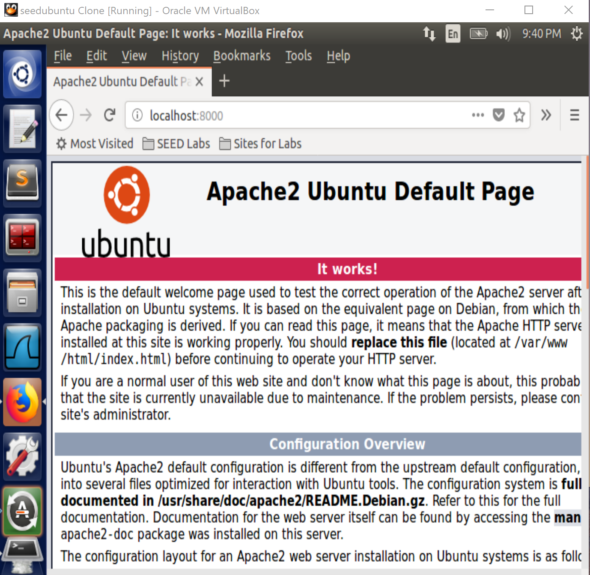

Instruction: https://seedsecuritylabs.org/Labs_16.04/PDF/Firewall.pdf

Set up 2 VMs:

- A: `10.0.2.15`
- B: `10.0.2.4`.

# Task 1

All commands run on the VM `10.0.2.15`, and modify Line 11 in its `/etc/default/ufw` with root privilege (e.g. `sudo vi`/`sudo gedit/sudo nano`+filename or whatever method you like) as:

```
DEFAULT_INPUT_POLICY="ACCEPT"
```

Or simply use the command:

```
sudo ufw default allow incoming
```

Ref to the [manual](http://manpages.ubuntu.com/manpages/xenial/man8/ufw.8.html) and [tutorial](https://help.ubuntu.com/community/UFW) of `ufw`

At first, enable it:

```
sudo ufw enable
```

After configuration, reset it to the installed status and remove added rules:

```
sudo ufw reset
```

## Prevent A from doing `telnet` to Machine B

```
sudo ufw deny out from 10.0.2.15 to 10.0.2.4 port 23
```

## Prevent B from doing `telnet` to Machine A

```
sudo ufw deny in from 10.0.2.4 to 10.0.2.15 port 23
```

## Prevent A from visiting an external web site

Use `ping` or `traceroute` to get one of the host IP address and block the corresponding `HTTP`/`HTTPS` connections:

```
sudo ufw deny out from 10.0.2.15 to host_ip port 80
sudo ufw deny out from 10.0.2.15 to host_ip port 443
```

**Note**: As this [answer](https://askubuntu.com/a/270000) explains, It is impossible to stop the accessing to a domain.

# Task 2

From the [programming manual](https://netfilter.org/documentation/HOWTO/netfilter-hacking-HOWTO-4.html) of `netfilter` module, I can implement a simplified firewall program as [`packet_filter.c`](./packet_filter/packet_filter.c)

For each rule, a callback function is defined to filter packets meeting some specified conditions.

For example, the function for [task 1.1](#prevent-a-from-doing-telnet-to-machine-b) can be defined as [`telnetFilter_1()`](./packet_filter/packet_filter.c#L33)

```c
unsigned int telnetFilter_1(void *priv, struct sk_buff *skb,
                            const struct nf_hook_state *state)
// rule for task 1.1: Prevent A from doing `telnet` to Machine B
{
    struct iphdr *iph;
    struct tcphdr *tcph;

    iph = ip_hdr(skb);
    tcph = (void *)iph + iph->ihl * 4;

    if (iph->protocol == IPPROTO_TCP && tcph->dest == htons(23) && eq_daddr(iph, "10.0.2.4") && eq_saddr(iph, "10.0.2.15"))
    {
        printk(KERN_INFO "Dropping telnet from %pI4 packet to %pI4\n", &iph->saddr, &iph->daddr);
        return NF_DROP;
    }
    else
    {
        return NF_ACCEPT;
    }
}
```

Similarly, the `if` statement can be replaced by other rules to construct more filters.

The `if`condition in [`telnetFilter_2()`](./packet_filter/packet_filter.c#L54) for [task 1.2](#prevent-b-from-doing-telnet-to-machine-a):

```c
if (iph->protocol == IPPROTO_TCP && tcph->dest == htons(23) && eq_daddr(iph, "10.0.2.15") && eq_saddr(iph, "10.0.2.4"))
```

Assume that we intend to block machine A from opening the website: http://notebook.xyli.me/. Before constructing the rule, we utilize Wireshark to get its 2 host IP address: `104.18.21.226` and `103.235.46.191`.

Based on the knowledge, the `if` condition in ['block_xyli_me'](./packet_filter/packet_filter.c#L75) for [task 1.3](#prevent-a-from-visiting-an-external-web-site) should be:

```c
if ((tcph->dest == htons(80) || tcph->dest == htons(443)) 
&& (eq_daddr(iph, "104.18.21.226") || eq_daddr(iph,"103.235.46.191")) 
&& eq_saddr(iph, "10.0.2.15"))
```

To make it scalable for at least 5 filter rules, a `nf_hook_ops` array should be declared with a large size and `regist_num` is maintained to track the actual amount of filters used in the firewall:

```c
#define MAX_RULE_NUM 10

static struct nf_hook_ops FilterHookRule[MAX_RULE_NUM];
static int regist_num = 0;
```

Regist those hooks with functions above in function[setUpFilter()](./packet_filter/packet_filter.c#L98):

```c
int setUpFilter(void)
{
    int i;
    printk(KERN_INFO "Registering filters.\n");
    FilterHookRule[0] = (struct nf_hook_ops){.hook = telnetFilter_1, .hooknum = NF_INET_LOCAL_OUT, .pf = PF_INET, .priority = NF_IP_PRI_FIRST};
    FilterHookRule[1] = (struct nf_hook_ops){.hook = telnetFilter_2, .hooknum = NF_INET_LOCAL_IN, .pf = PF_INET, .priority = NF_IP_PRI_FIRST};
    FilterHookRule[2] = (struct nf_hook_ops){.hook = block_xyli_me, .hooknum = NF_INET_LOCAL_OUT, .pf = PF_INET, .priority = NF_IP_PRI_FIRST};

    // set the amount of filter rules
    regist_num = 3;

    for (i = 0; i < regist_num; i++)
        nf_register_hook(&FilterHookRule[i]);
    return 0;
}
```

When extending the module with more rules, just focus to fill out `hooknum` and `hook`(i.e. function definition) fields like this.

**Note**: `hooknum` field, namely hook type, is not consistent with the identifiers in the book. Please read their actual definition (alias `enum`) in [`linux/netfilter.h`](https://elixir.bootlin.com/linux/v4.5/source/include/uapi/linux/netfilter.h#L46).

Define an unregist function as well and associate those functions in the module.

```c
void removeFilter(void)
{
    int i;
    printk(KERN_INFO "Filters are being removed.\n");
    //unregist hooks one by one
    for (i = 0; i < regist_num; i++)
        nf_unregister_hook(&FilterHookRule[i]);
    regist_num = 0;
}

module_init(setUpFilter);
module_exit(removeFilter);

MODULE_LICENSE("GPL");
```

Finally, write a [`makefile`](./packet_filter/makefile) and type `make` to compile:

```makefile
obj-m += packet_filter.o
all:
	make -C /lib/modules/$(shell uname -r)/build M=$(PWD) modules

clean:
	make -C /lib/modules/$(shell uname -r)/build M=$(PWD) clean
```

Install the output module `packet_filter.ko` into the kernel:

```
sudo insmod packet_filter.ko
```

Now, you can observe the firewall works, and log can be viewed with command `dmseg`:



Don't forget to uninstall the firewall after the lab:

```
sudo rmmod packet_filter
```

# Task 3

## Block all the outgoing traffic to external telnet servers.

Set up another VM C: `10.0.2.5`.

On machine A:

```
sudo ufw deny out from 10.0.2.15 to any port 23 
sudo ufw enable
```

## Block all the outgoing traffic to `www.facebook.com`

~~It's difficult because the domain has many dynamic IP addresses as hosts. For example, `ping` it at different times:~~

```
$ping www.facebook.com
PING star-mini.c10r.facebook.com (157.240.2.35) 56(84) bytes of data.
64 bytes from edge-star-mini-shv-01-ort2.facebook.com (157.240.2.35): icmp_seq=1 ttl=52 time=18.7 ms
```

```
$ ping www.facebook.com
PING star-mini.c10r.facebook.com (157.240.18.35) 56(84) bytes of data.
64 bytes from edge-star-mini-shv-02-ort2.facebook.com (157.240.18.35): icmp_seq=1 ttl=52 time=19.3 ms

```

To ensure the blocking, you can use the subnet instead of a specified IP address:

```
sudo ufw deny out from 10.0.2.15 to 157.240.2.35/16
```
## Task 3.a: Telnet to Machine B through the firewall 

**Note**: The solution given by the instruction may not work. Perhaps because `telnet` usally fails on ports other than a few certain ports (see https://aplawrence.com/DirkHart/telnet2023.html and https://superuser.com/questions/790782/using-telnet-port-number)

Here is a simple alternative method:



Don't do any extra port mappings. use the most naive way to `ssh` machine B

```
ssh seed@10.0.2.4
```

type the password and directly `telnet` machine C

```
telnet 10.0.2.5
```


## Task 3.b: Connect to Facebook using SSH Tunnel

```
ssh -D 500 -C seed@10.0.2.4
```

Then configure on Firefox, change the network proxy as manual proxy mode with SOCKS host: `127.0.0.1:9000`

1. Now, I can open `www.facebook.com`



2. When the `ssh` connection is broken, clean the history data in the browser, the website `www.facebook.com` cannot be accessed any more.
3. re-connect to machine B with `ssh` command above, the website `www.facebook.com` can be opened now.
4. And using Wireshark, it shows that the actual HTTP packet is communicated between the external host of `facebook` and machine B, then our local machine A communicate with machine B by `SSH` to request the data from `facebook`:



# Task 4

Assume that VM A is the internal machine which blocks `ssh` connections requested from VM B.

Therefore, on VM A, run

```
sudo ufw deny in from 10.0.2.4 to 10.0.2.15 port 22
sudo ufw deny in from 10.0.2.4 to 10.0.2.15 port 80
```

to emulate the set-up.

Then we can create a reverse `ssh` tunnel on machine A:

```
ssh -R 8000:localhost:80 seed@10.0.2.4
```

Reference to [How does reverse SSH tunneling work?](https://unix.stackexchange.com/questions/46235/how-does-reverse-ssh-tunneling-work)


Keep the `ssh` connection alive and leave machine A alone.



We can access the web server hosted by machine A by `localhost:8000` on machine B now:




