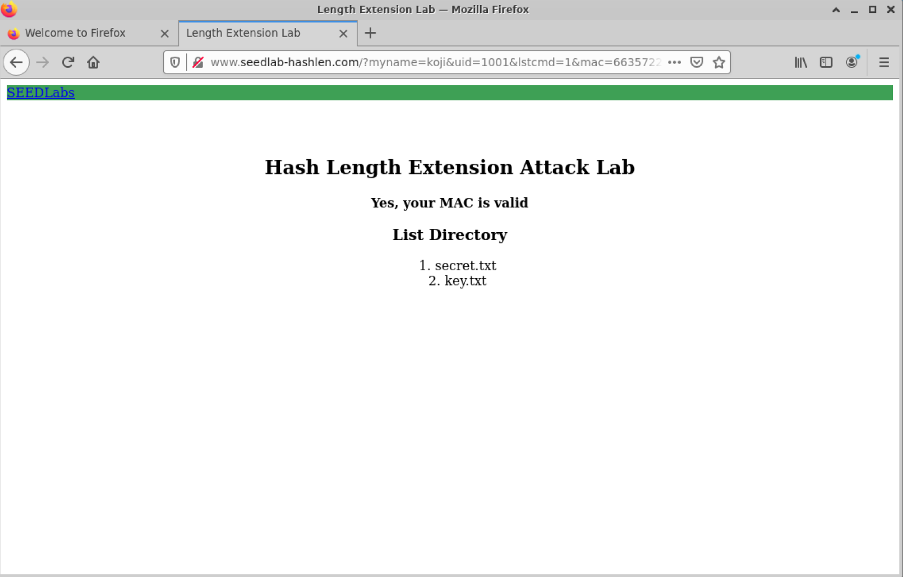
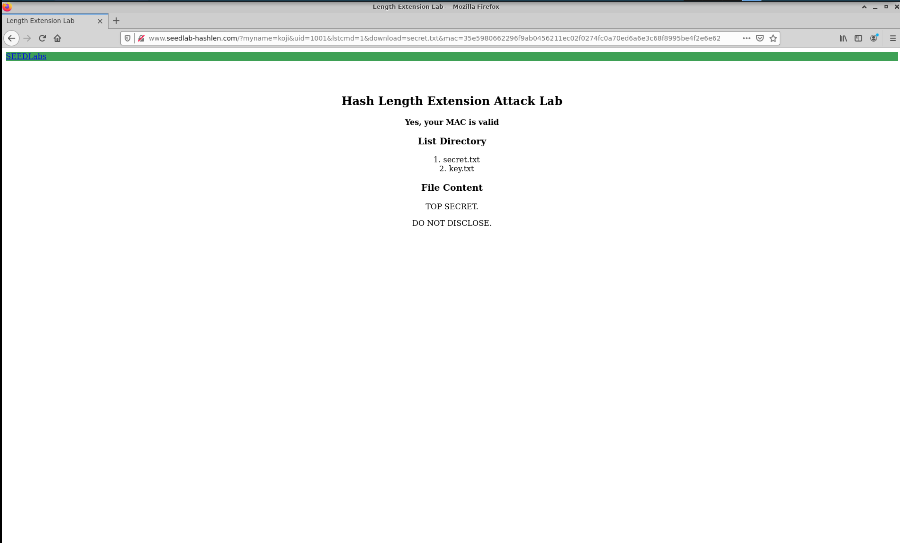
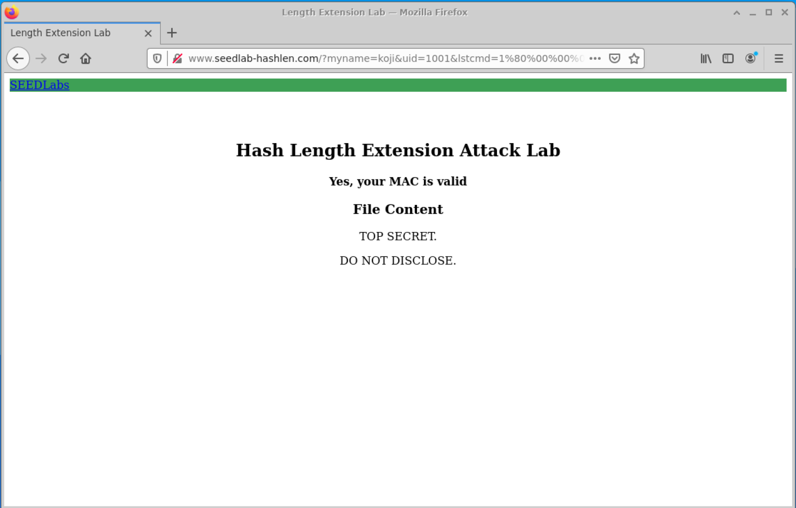
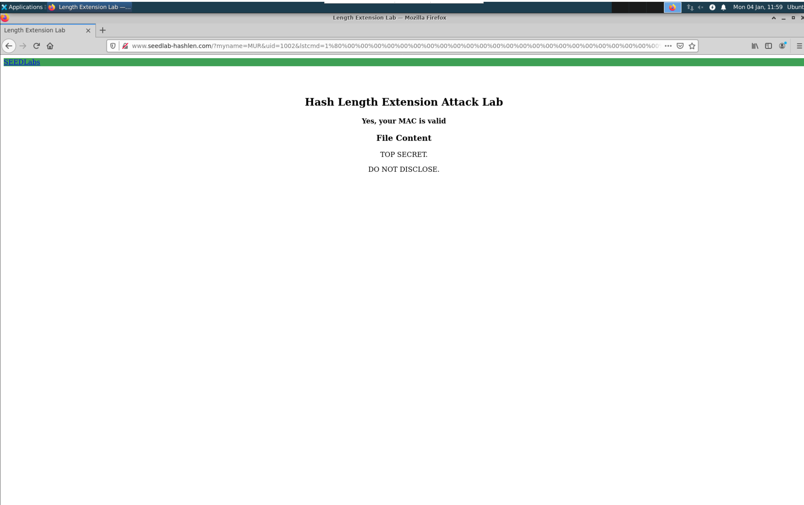
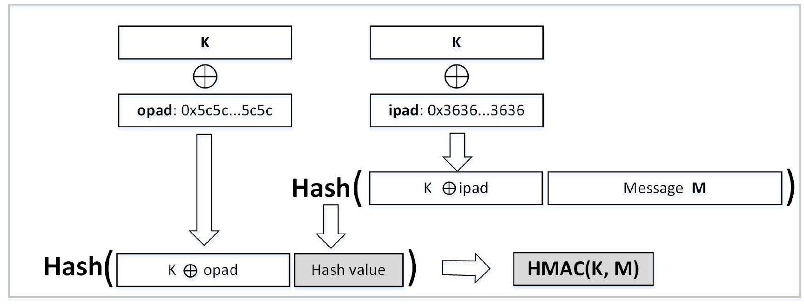

Instruction: https://seedsecuritylabs.org/Labs_20.04/Files/Crypto_Hash_Length_Ext/Crypto_Hash_Length_Ext.pdf

# Lab Environment

Set up the container and run it (`www-10.9.0.80`) in the background:

```sh
curl https://seedsecuritylabs.org/Labs_20.04/Files/Crypto_Hash_Length_Ext/Labsetup.zip -o Labsetup.zip
unzip Labsetup.zip
cd Labsetup
dcbuild
dcup -d
```

If necessary, get the running container id by `dockps` and use `docksh <id>` to start a shell on this container.

Add the following entry in `/etc/hosts` *(root privilege required, try `sudo vi /etc/hosts`)*:

```
10.9.0.80 www.seedlab-hashlen.com
```

# Task 1

Construct and send a benign request to the server:

1. Pick up a `uid` with its key value from `Labsetup/image_flask/app/LabHome/key.txt` instead of using a real name, for example, I choose the entry `1001:123456` in this task.
2. Calculate the MAC of the key concatenated with request content `R`, that is

```
Key:R = 123456:myname=koji&uid=1001&lstcmd=1
```

Suppose that the name used here is "koji" and it requests for listing all the files in `LabHome` folder.

So the MAC is calculated as:

```sh
echo -n "123456:myname=koji&uid=1001&lstcmd=1" | sha256sum
#66357225216e2e9d1eb27b44fcfaa4c60f9955a7f1318ce5e757c9ef07e6c92d  -
```

Thus the complete request is:

```
http://www.seedlab-hashlen.com/?myname=koji&uid=1001&lstcmd=1&mac=66357225216e2e9d1eb27b44fcfaa4c60f9955a7f1318ce5e757c9ef07e6c92d
```

*Don't use `curl` or `wget`, it doesn't support. Just open a Firefox browser via VNC client and visit the url link above.*

The web looks like:



For a download request, we take a similar strategy to construct:

```
http://www.seedlab-hashlen.com/?myname=koji&uid=1001&lstcmd=1&download=secret.txt&mac=35e5980662296f9ab0456211ec02f0274fc0a70ed6a6e3c68f8995be4f2e6e62
```



# Task 2

Construct the padding for 
```
123456:myname=koji&uid=1001&lstcmd=1
```

Use Python REPL to complete this work:

```sh
python
>>> payload = bytearray("123456:myname=koji&uid=1001&lstcmd=1",'utf8')
>>> len(payload)
36
>>> length_field = (len(payload)*8).to_bytes(8,'big')
>>> padding = b'\x80' + b'\x00'*(64-len(payload)-1-8) + length_field
>>> print(''.join('\\x{:02x}'.format(x) for x in padding))
\x80\x00\x00\x00\x00\x00\x00\x00\x00\x00\x00\x00\x00\x00\x00\x00\x00\x00\x00\x00\x00\x00\x00\x00\x00\x00\x01\x20
# for url-encoding
>>> print(''.join('%{:02x}'.format(x) for x in padding))
%80%00%00%00%00%00%00%00%00%00%00%00%00%00%00%00%00%00%00%00%00%00%00%00%00%00%01%20
```

# Task 3

Compile and run [`calculate_mac.c`](./calculate_mac.c), in which [`SHA256_Update`](./calculate_mac.c#L9) takes the padding bytes we obtained in [previous task](#task-2) followed by `&download=secret.txt` as the second argument.


```sh
gcc calculate_mac.c -o calculate_mac -lcrypto
./calculate_mac
```

It gives:

```
14797c6db7ca0309d20e0b3c54ac19df60861a83fe64b2713a45e18469b5f3fc
```

---

If it reports an error as:

```
gcc: error: calculate_mac.c: No such file or directory
```

try:

```
sudo apt install libssl-dev
```

---

Then, visit

```
http://www.seedlab-hashlen.com/?myname=koji&uid=1001&lstcmd=1%80%00%00%00%00%00%00%00%00%00%00%00%00%00%00%00%00%00%00%00%00%00%00%00%00%00%01%20&download=secret.txt&mac=14797c6db7ca0309d20e0b3c54ac19df60861a83fe64b2713a45e18469b5f3fc
```



# Task 4

Alternatively, to distinguish from the existing work, we turn to apply the `1002:983abe` as `mackey-uid` and "MUR" as current username.

A legitimate request to list files without MAC value:

```
http://www.seedlab-hashlen.com/?myname=MUR&uid=1002&lstcmd=1
```

can be calculated by

```sh
echo -n "983abe:myname=MUR&uid=1002&lstcmd=1" | sha256sum
# 3a286321c4cb101ce172c1377a75a4ccf46ad9ff4fc8680ec582fa1d004da2e2  -
```

Assume that we have already observed the full request URL as

```
http://www.seedlab-hashlen.com/?myname=MUR&uid=1002&lstcmd=1&mac=3a286321c4cb101ce172c1377a75a4ccf46ad9ff4fc8680ec582fa1d004da2e2
```

But we do not know the mac key of it. So we use [`length_ext.c`](./length_ext.c) to obtain the MAC after appending `"&download=secret.txt"` argument. Compile and run:

```sh
gcc length_ext.c -o length_ext -lcrypto
./length_ext
# bcea031dd94604d9b84e4886aab8e083b6ba2ec66f50316555cf1cb451bf4aed
```

Then, construct the padding of the original message as [task-2](#task-2), recall that we don't know what the mac key exactly is but we know the length of keys are fixed, so we can easily calculate the padding:

```sh
python
>>> payload = bytearray("******:myname=MUR&uid=1002&lstcmd=1",'utf8')
>>> length_field = (len(payload)*8).to_bytes(8,'big')
>>> padding = b'\x80' + b'\x00'*(64-len(payload)-1-8) + length_field
>>> print(''.join('%{:02x}'.format(x) for x in padding))
%80%00%00%00%00%00%00%00%00%00%00%00%00%00%00%00%00%00%00%00%00%00%00%00%00%00%00%01%18
```

So the full request is:

```
http://www.seedlab-hashlen.com/?myname=MUR&uid=1002&lstcmd=1%80%00%00%00%00%00%00%00%00%00%00%00%00%00%00%00%00%00%00%00%00%00%00%00%00%00%00%01%18&download=secret.txt&mac=bcea031dd94604d9b84e4886aab8e083b6ba2ec66f50316555cf1cb451bf4aed
```



# Task 5

Keyed-hash mesaage authentication code (HMAC) can be used as the follwing example:

```sh
python
>>> import hmac
>>> import hashlib
>>> key = '123456'
>>> message = 'myname=koji&uid=1001&lstcmd=1'
>>> hmac.new(bytearray(key.encode('utf8')), msg=message.encode('utf-8',
... 'surrogateescape'), digestmod=hashlib.sha256).hexdigest()
'e216c440b3a152d0a8b62e54076863080bc4febe69299ec3aa420c43033cde10'
```

Or

```sh
echo -n "myname=koji&uid=1001&lstcmd=1" | openssl dgst -sha256 -hmac "123456"
# (stdin)= e216c440b3a152d0a8b62e54076863080bc4febe69299ec3aa420c43033cde10
```

HMAC works as the figure below shows:




$H$ is a hash function and $K$ is a secret key, which could be of any length. $B$ denotes the block size for $H$.

For an input message $M$, he inner hash (left part) first computes $H(K \oplus ipad) \mathbin\Vert M$ and its result $h$ is passed to the outer hash in order to perform $H((K \oplus opad) \mathbin\Vert h$, in which `ipad` and `opad` are both constants.

In such an algorithm, the MAC key is required in both 2 hash functions. The MAC of a full message calculated by inner hash is required taking by the outer hash function, so if we don't have the internal result, which is invisible to us, we cannot compute the correct final MAC. Due to the sequential design, if the server applies HMAC instead of ordinary MAC methods we discussed above, the attacker cannot directly construct the MAC of an extended message from the final MAC of a legal request only. Therefore, hash length extension attack will fail.