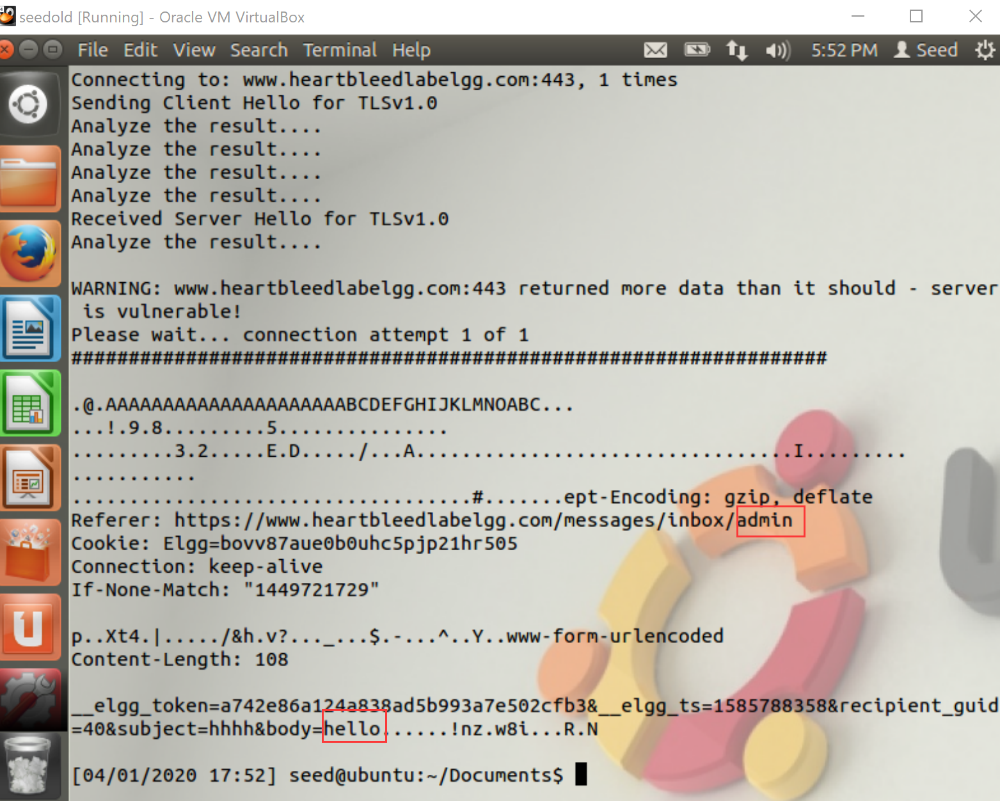
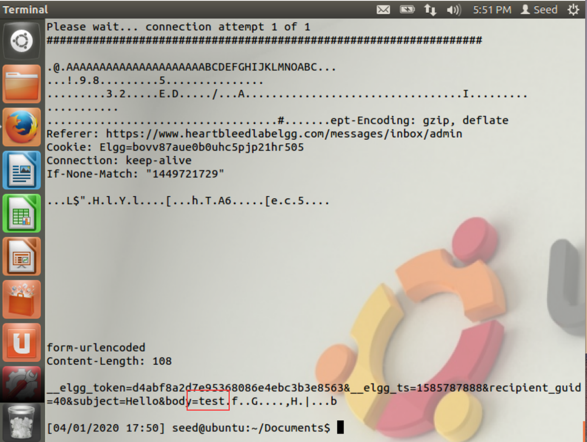
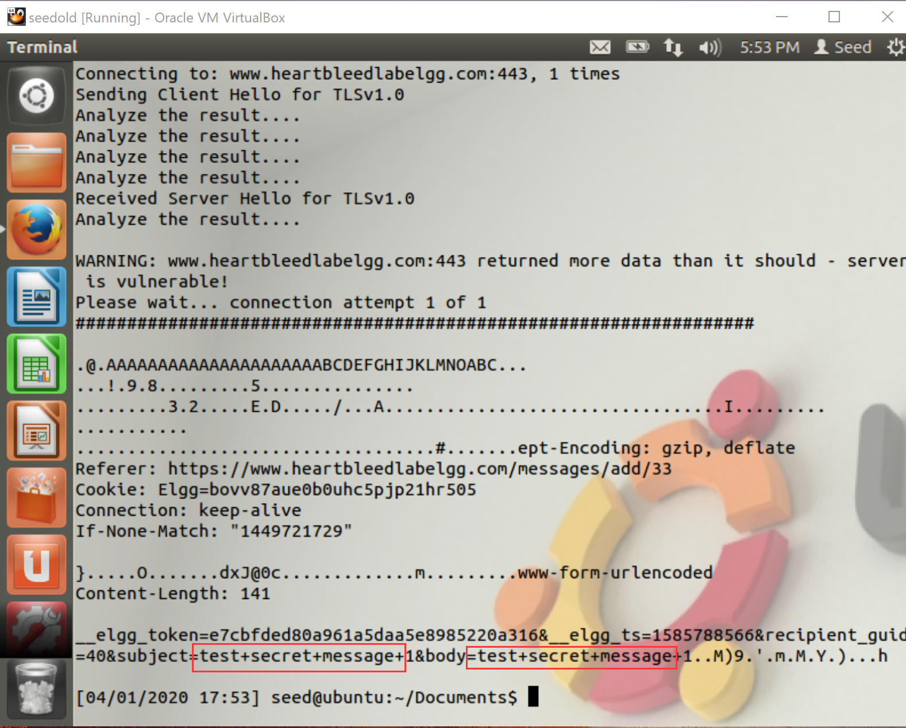
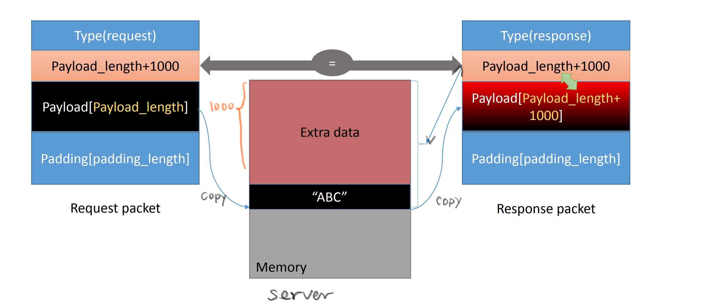

*The lab must be done on ubuntu 12.04*

Instruction: https://seedsecuritylabs.org/Labs_16.04/PDF/Heartbleed.pdf

Set up 2 VMs:

- Attacker: `10.0.2.6`
- Victim/Server: `10.0.2.7`

On the attacker edit one DNS rule:

```
sudo gedit /etc/hosts
```

Replace the line

```
127.0.0.1 www.heartbleedlabelgg.com
```

With

```
10.0.2.7 www.heartbleedlabelgg.com
```


# Task 1

Send a bunch of private messages to Boby.

Then run [attack.py](./attack.py)

```
sudo chmod u+x attack.py
./attack.py www.heartbleedlabelgg.com
```

It might not reveal any secret message in one single run. To get useful data, the program should be executed several times.







# Task 2

## Question 2.1

As the length variable decreases, the warning message

```
WARNING: www.heartbleedlabelgg.com:443 returned more data than it should - server is vulnerable!
```

vanishes. And it shows

```
Server processed malformed heartbeat, but did not return any extra data.
```

No private data can be obtained from the response printed.

## Question 2.2

The boundary value is 22.


```
$./attack.py www.heartbleedlabelgg.com --length 22
...
Server processed malformed heartbeat, but did not return any extra data.
...
$./attack.py www.heartbleedlabelgg.com --length 23
...
WARNING: www.heartbleedlabelgg.com:443 returned more data than it should - server is vulnerable!
...
```

At [Line 385](./attack.py#L385) in `attack.py`, the threshold of entire response packet length is `0x29`. The actual payload constructed by `build_heartbeat()` at [Line 205-255](./attack.py#L205) has `176/8=22` bytes. When you set the length field as a value greater than `22`, the server will blindly copy content from the pointer of the beginning of the payload string to fit the required payload length, which may include the critical data stored on the server.


