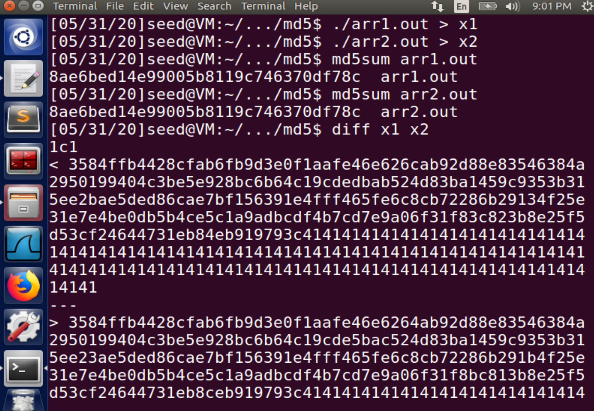
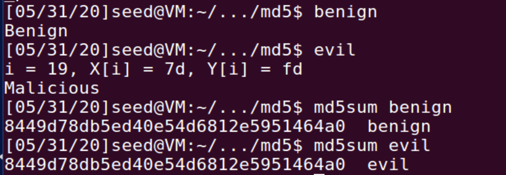

Instruction: https://seedsecuritylabs.org/Labs_16.04/PDF/Crypto_MD5_Collision.pdf


# Task 1

Generate a `prefix.txt` containing 64 `'9'`:

```
python3 -c "print('9'*64,end='')" > prefix.txt
ls -ld prefix.txt
```

Use it to create 2 files with the same MD5 value:

```
md5collgen -p prefix.txt -o out1.bin out2.bin
```

Wait for seconds, check if the 2 files are different:

```
$ diff out1.bin out2.bin
Binary files out1.bin and out2.bin differ
```

Check if their MD5 values are the same:

```
$ md5sum out1.bin
b3d3a557001d81af72250f58b1cea4aa  out1.bin
$ md5sum out2.bin
b3d3a557001d81af72250f58b1cea4aa  out2.bin
```

Compare their differences:

```
$ hexdump out1.bin > hex1
$ hexdump out2.bin > hex2
$ diff hex1 hex2
4,6c4,6
< 0000050 3d59 83f8 861b 0b01 523e 813f a5f3 9c8c
< 0000060 0412 b9f9 0e70 0fbd 508b 4256 a7ee 3f38
< 0000070 d438 668f 4abb ed3e 9003 ab89 a859 58bd
---
> 0000050 3d59 03f8 861b 0b01 523e 813f a5f3 9c8c
> 0000060 0412 b9f9 0e70 0fbd 508b 4256 27ee 3f39
> 0000070 d438 668f 4abb ed3e 9003 2b89 a859 58bd
8,10c8,10
< 0000090 7dac 713e e61b 6a1e 1acb 3d6e 86ec e602
< 00000a0 7c98 5b26 ca06 3fde 4c8a 973c 2450 28ea
< 00000b0 f128 b84a 6c42 0ac2 db2d 0427 baa5 93b1
---
> 0000090 7dac f13e e61b 6a1e 1acb 3d6e 86ec e602
> 00000a0 7c98 5b26 ca06 3fde 4c8a 973c a450 28e9
> 00000b0 f128 b84a 6c42 0ac2 db2d 8427 baa5 93b1
```

Use the program [`diff_bytes.py`](./diff_bytes.py) to find out where they differs from each other in the last 128 bytes:

```
head -c 128 out1.bin > P
head -c 128 out2.bin > Q
diff_bytes.py P Q
```

The result:

```
different bytes in 0x53 :  0x2c vs 0xac
different bytes in 0x6d :  0xb4 vs 0x34
different bytes in 0x6e :  0x96 vs 0x97
different bytes in 0x7b :  0x77 vs 0xf7
```

We make the content in `prefix.txt` as `'9'*27`. When using:

```
md5collgen -p prefix.txt -o out1.bin out2.bin
```

It also produces 2 output files with 192 bytes, which means that the prefix is padded into a multiple of 64. (it is 64 itself here.) check it by 

```
head -c 64 out1.bin | hexdump
```

We can see the end is padded as 0, which shows as an empty character if printed out.

# Task 2

Use the 2 files generated in the previous task:

```
tail -c 128 out1.bin > P
tail -c 128 out2.bin > Q
```

Check if P and Q have the same MD5 hash values:

```
$ md5sum P
7553683527861d35d134ffde7863ec62  P
$ md5sum Q
9eff026b6557922e812d4d31240b236d  Q
```

Create a new suffix:

```
python3 -c "print('114514'*10,end='')" > suffix.txt
```

Concatenate 2 files that have the same MD5 with suffixes to generate 2 new files:

```
cat out1.bin suffix > s1.out
cat out2.bin suffix > s2.out
```

Their MD5 values are exactly the same:

```
$ md5sum s1.out
c4b50342bd2b771bfa696549d3dd0198  s1.out
$ md5sum s2.out
c4b50342bd2b771bfa696549d3dd0198  s2.out
```


# Task 3

Initialize the `xyz` array as `'A'*200`:

```c
#include <stdio.h>
unsigned char xyz[200] = {
    "AAAAAAAAAAAAAAAAAAAAAAAAAAAAAAAAAAAAAAAAAAAAAAAAAA"
    "AAAAAAAAAAAAAAAAAAAAAAAAAAAAAAAAAAAAAAAAAAAAAAAAAA"
    "AAAAAAAAAAAAAAAAAAAAAAAAAAAAAAAAAAAAAAAAAAAAAAAAAA"
    "AAAAAAAAAAAAAAAAAAAAAAAAAAAAAAAAAAAAAAAAAAAAAAAAAA"};
int main()
{
    int i;
    for (i = 0; i < 200; i++)
    {
        printf("%x", xyz[i]);
    }
    printf("\n");
}
```

Compile [`print_array.c`](./print_array.c) and find the location of continous `0x41` in its executable output:


```
gcc print_array.c -o print_array
bless print_array
```

It starts from the offset: `0x1040`. Since `0x1040` (4160 in decimal) can be divided by 64, we can use the first `0x1040` bytes as prefix and generate 128 bytes to fill the contents in `xyz`.

First, we truncate the prefix and the suffix (start from the offset:4160+128) from the file:

```
head -c 4160 print_array > prefix
tail -c +4288  print_array > suffix
```

Generate 2 files with `prefix`:

```
md5collgen -p prefix -o P Q
```

Append `suffix` to make them like normal programs:

```
cat P suffix > arr1.out
cat Q suffix > arr2.out
```

Make them executable:

```
chmod u+x arr1.out arr2.out
```

Verify:



# Task 4

```c
#include <stdio.h>
#define LEN 300

unsigned char X[LEN] = {
    "AAAAAAAAAAAAAAAAAAAAAAAAAAAAAAAAAAAAAAAAAAAAAAAAAA"
    "AAAAAAAAAAAAAAAAAAAAAAAAAAAAAAAAAAAAAAAAAAAAAAAAAA"
    "AAAAAAAAAAAAAAAAAAAAAAAAAAAAAAAAAAAAAAAAAAAAAAAAAA"
    "AAAAAAAAAAAAAAAAAAAAAAAAAAAAAAAAAAAAAAAAAAAAAAAAAA"
    "AAAAAAAAAAAAAAAAAAAAAAAAAAAAAAAAAAAAAAAAAAAAAAAAAA"
    "AAAAAAAAAAAAAAAAAAAAAAAAAAAAAAAAAAAAAAAAAAAAAAAAAA"};

unsigned char Y[LEN] = {
    "AAAAAAAAAAAAAAAAAAAAAAAAAAAAAAAAAAAAAAAAAAAAAAAAAA"
    "AAAAAAAAAAAAAAAAAAAAAAAAAAAAAAAAAAAAAAAAAAAAAAAAAA"
    "AAAAAAAAAAAAAAAAAAAAAAAAAAAAAAAAAAAAAAAAAAAAAAAAAA"
    "AAAAAAAAAAAAAAAAAAAAAAAAAAAAAAAAAAAAAAAAAAAAAAAAAA"
    "AAAAAAAAAAAAAAAAAAAAAAAAAAAAAAAAAAAAAAAAAAAAAAAAAA"
    "AAAAAAAAAAAAAAAAAAAAAAAAAAAAAAAAAAAAAAAAAAAAAAAAAA"};

int main()
{
    for (int i = 0; i < LEN; i++)
    {
        if (X[i] != Y[i])
        {
            printf("i = %d, X[i] = %.2x, Y[i] = %.2x\n", i, X[i], Y[i]);
            printf("Malicious\n");
            return 0;
        }
    }
    printf("Benign\n");
    return 0;
}
```

Compile [`benign_evil.c`](./benign_evil.c)

```
gcc benign_evil.c -o benign_evil
```

Find where array `X` and `Y` start (continuous `0x41`s occur):

```
bless benign_evil
```

`X` starts from offset `0x1040` and `Y` starts from offset `0x1180`.

Obtain the `prefix` and `suffix` from `benign_evil`:

```
head -c 4160 benign_evil > prefix
tail -c +4288 benign_evil > suffix
```

```
md5collgen -p prefix -o s1 s2
```

```
tail -c 128 s1 > P
tail -c 128 s2 > Q
```

`Y` starts from `0xC1`(193) in `suffix`, So if we want to make `X=Y`, we should replace offset [193,321) with the same P or Q generated above:

```
head -c 192 suffix > suffix_pre
tail -c +320 suffix > suffix_post
```

Construct the final executable programs and make them executable:

```
cat s1 suffix_pre P suffix_post > benign
cat s2 suffix_pre P suffix_post > evil
chmod u+x benign evil
```

They do have the same MD5 but perform very different behaviors:




