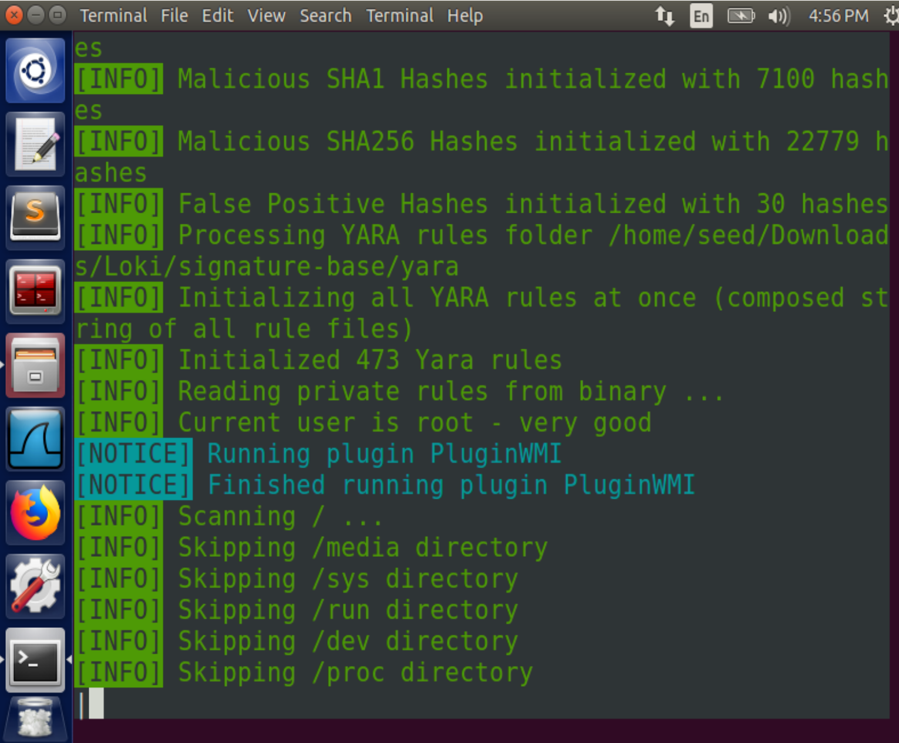

## Set-up

Set up 2 Ubuntu 16.04 provided by seed project:

- Analysis: `10.0.2.5`
- Victim: `10.0.2.8`

### Install `loki` on Analysis

Loki: https://github.com/Neo23x0/Loki

**Note**: To download the last version from [release](https://github.com/Neo23x0/Loki/releases) and then extract is **not** a feasible approach on Ubuntu, `.exe` cannot be executed directly on Linux.

Download all source codes and enter the folder:

```
git clone https://github.com/Neo23x0/Loki.git
cd ./loki
```

Since `loki.py` should be interpreted by Python 2.7, first, we need to install some dependencies:

```
pip2 install yara-python psutil netaddr rfc5424-logging-handler
```

After installed, Run `loki` to complete a simple IOC scan:




## References

[1] https://www.usenix.org/legacy/event/lisa09/tech/slides/daly.pdf
[2] https://en.wikipedia.org/wiki/Advanced_persistent_threat
[3] https://blog.christophetd.fr/malware-analysis-lab-with-virtualbox-inetsim-and-burp/