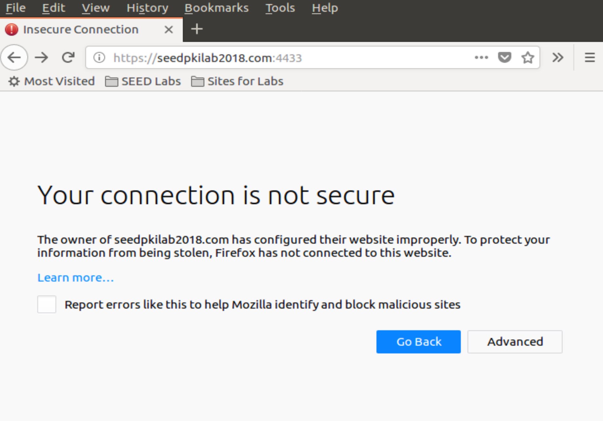
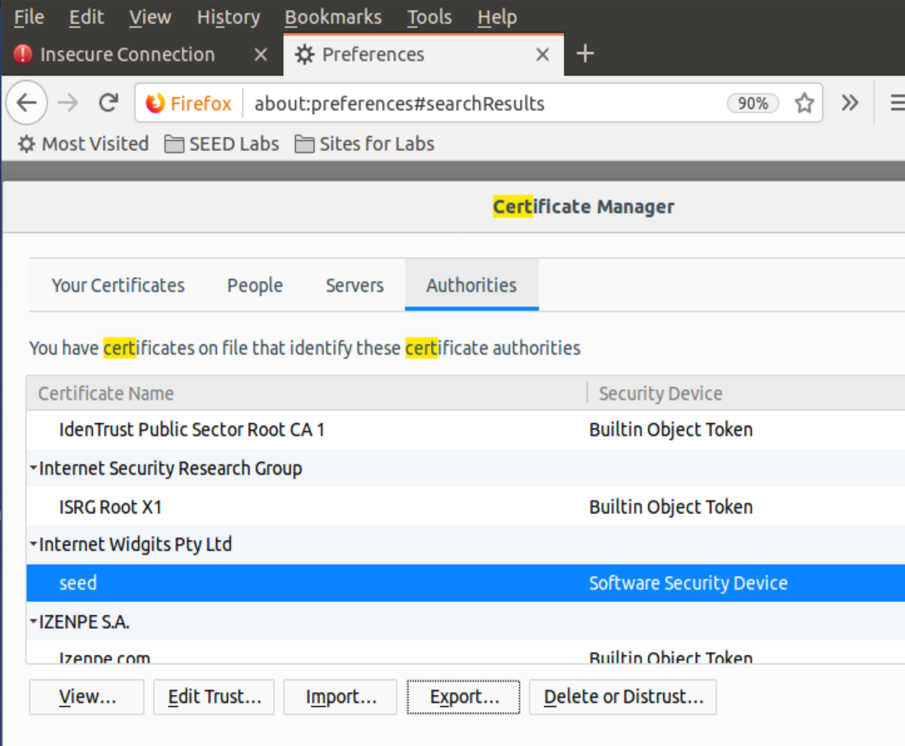
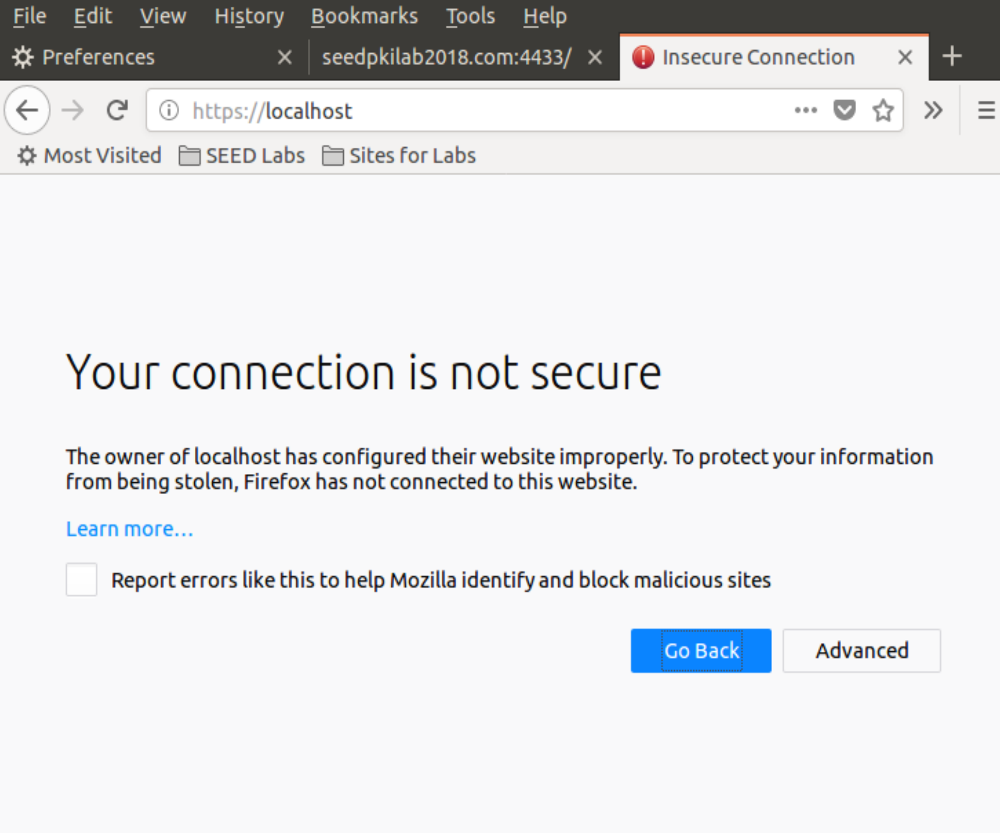
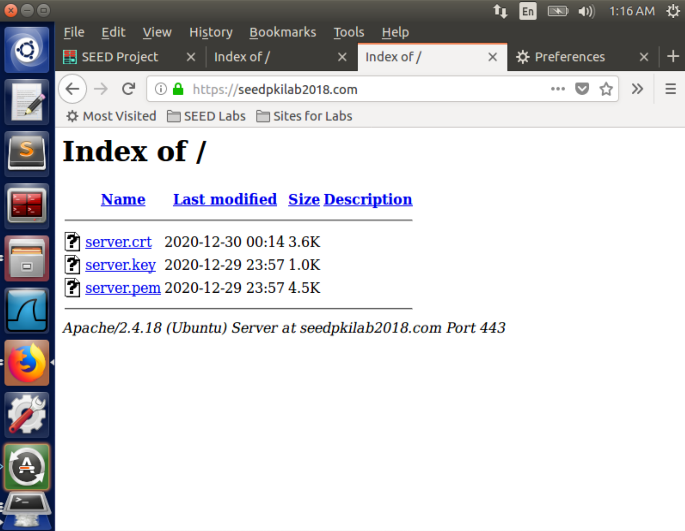

Instruction: https://seedsecuritylabs.org/Labs_16.04/PDF/Crypto_PKI.pdf

# Task 1

Copy the configuration file into current directory:

```
cp /usr/lib/ssl/openssl.cnf ./openssl.cnf
```

create new sub-directories and files according to what it specified in its `[ CA_default ]` section:

```
dir = ./demoCA # Where everything is kept
certs = $dir/certs # Where the issued certs are kept
crl_dir = $dir/crl # Where the issued crl are kept
new_certs_dir = $dir/newcerts # default place for new certs.
database = $dir/index.txt # database index file.
serial = $dir/serial # The current serial number
```

Simply create an empty file for `index.txt`, put a single number in string format in `serial`:

```
mkdir ./demoCA
cd ./demoCA
mkdir certs
mkdir crl
mkdir newcerts
touch index.txt
echo "1000" > serial
```

Start to generate the self-signed certificate for the CA:

```
openssl req -new -x509 -keyout ca.key -out ca.crt -config openssl.cnf
```

Notice that we apply `policy_match` in `openssl.cnf`, so we should keep some fields the same when creating certificates for CA and servers:

```
[ policy_match ]
countryName		= match
stateOrProvinceName	= match
organizationName	= match
organizationalUnitName	= optional
commonName		= supplied
emailAddress		= optional
```

When asked to type PEM pass phrase, remember the password you typed (e.g. I use `114514`). It will then ask you to fill in some information, you can skip it by <kbd>Enter</kbd>, except for those required by `policy_match`.

> The output of the command are stored in two files: `ca.key` and `ca.crt`. The file `ca.key` contains the CA’s **private key**, while `ca.crt` contains the **public-key certificate**.

# Task 2

As a root CA, we are ready to sign a digital certificate for `SEEDPKILab2018.com`.

## Step 1:  Generate public/private key pair

Generate an RSA key pair. Provide a pass phrase (e.g. I use `soudayo`) to encrypt the private key in `server.key` using AES-128 encryption algorithm.

```
openssl genrsa -aes128 -out server.key 1024
```

To see the actual content in `server.key`:

```
openssl rsa -in server.key -text
```

## Step 2: Generate a Certificate Signing Request (CSR)

Use `SEEDPKILab2018.com` as the common name of the certificate request

```
openssl req -new -key server.key -out server.csr -config openssl.cnf
```

Skip the unnecessary information as well, keep the necessary information (required by `policy_match` consistent with the `CA.crt` created in [Task 1](#task-1)).

Now, the new Certificate Signing Request is saved in `server.csr`, which basically includes the company's public key.

> The CSR will be sent to the CA, who will generate a certificate for the key (usually after ensuring that identity information in the CSR matches with the server's true identity)

## Step 3: Generating Certificates

In this lab, we will use our own trusted CA to generate certificates.

Use `ca.crt` and `ca.key` to convert `server.csr` to `server.crt`:

```
openssl ca -in server.csr -out server.crt -cert ca.crt -keyfile ca.key \
-config openssl.cnf
```

# Task 3

## Step 1: Configuring DNS

Open and edit `/etc/hosts`:

```
sudo gedit /etc/hosts
```

Add one line:

```
127.0.0.1 SEEDPKILab2018.com
```

## Step 2: Configuring the web server

Combine the secret key and certificate into one single file `server.pem`:

```
cp server.key server.pem
cat server.crt >> server.pem
```

Launch the web server using `server.pem`:

```
openssl s_server -cert server.pem -www
```

Now, the server is listening on port 4433. Browser https://seedpkilab2018.com:4433/



## Step 3: Getting the browser to accept our CA certificate.

Search for "certificate" in Firefox's Preferences page, click on "View Certificates" and enter "certificate manager", click on "Authorities tab" and import `CA.crt`. Check "Trust this CA to identify web sites".

Reload https://seedpkilab2018.com:4433/.



## Step 4. Testing our HTTPS website

### Modify one byte in `server.pem`

It's up to which byte you modify. Most bytes make no differences after corrupted. But some will make the certificate invalid.

### Use localhost

When browsing `https://localhost:443`, it is reported unsafe HTTPS



Because the `locolhost` has no certificate, the website is using a certificate identified for `seedpkilab2018.com`. 

# Task 4

Open configuration file of Apache HTTPS server:

```
sudo gedit /etc/apache2/sites-available/default-ssl.conf
```

Add the entry and save:

```
<VirtualHost *:443>
        ServerName www.SEEDPKILab2018.com
        DocumentRoot /var/www/html
        DirectoryIndex index.html

        SSLEngine On
        SSLCertificateFile /var/www/html/server.pem
        SSLCertificateKeyFile /var/www/html/server.key
</VirtualHost>
```

Copy the server certificate and private key to the folder:

```
sudo cp server.pem server.key /var/www/html
```

Test the Apache configuration file for errors:

```
sudo apachectl configtest
```

Enable the SSL module:

```
sudo a2enmod ssl
```

Enable the site we have just edited:

```
sudo a2ensite default-ssl
```

Restart `Apache`:

```
sudo service apache2 restart
```

Once `Apache` runs properly, open https://seedpkilab2018.com/



# Task 5

Suppose we still use this VM (`10.0.2.15`) as the malicious server, start another VM (`10.0.2.4`) as victim.

## Generate a certificate for `example.com`

use a password (e.g. I use `islander`):

```
openssl genrsa -aes128 -out example.key 1024
```

Use `example.com` as the common name of the certificate request:

```
openssl req -new -key example.key -out example.csr -config openssl.cnf
openssl ca -in example.csr -out example.crt -cert ca.crt -keyfile ca.key \
-config openssl.cnf
cp example.key example.pem
cat example.crt >> example.pem
```

Copy the certificate and private key to the website root folder:

```
sudo cp example.pem example.key /var/www/html
```

## Config and start the server

On the server VM, open `/etc/apache2/sites-available/default-ssl.conf` and add the following entry:

```
<VirtualHost *:443>
        ServerName www.example.com
        DocumentRoot /var/www/html
        DirectoryIndex index.html

        SSLEngine On
        SSLCertificateFile /var/www/html/example.pem
        SSLCertificateKeyFile /var/www/html/example.key
</VirtualHost>
```

Restart `Apache`:

```
sudo apachectl configtest
sudo service apache2 restart
```

## Config on Victim VM

On the victim VM, modify `/etc/hosts` by:

```
sudo gedit /etc/hosts
```

add one line before the ending:

```
10.0.2.15	example.com
```

To get the `ca.crt`, listen on a local port like:

```
nc -lvp 4444 > ca.crt
```

Then on the server VM, we send `ca.crt` by:

```
cat ca.crt | nc 10.0.2.4 4444
```

Once we receive the file on the victim VM, we install it on Firefox as [above](#step-3-getting-the-browser-to-accept-our-ca-certificate).