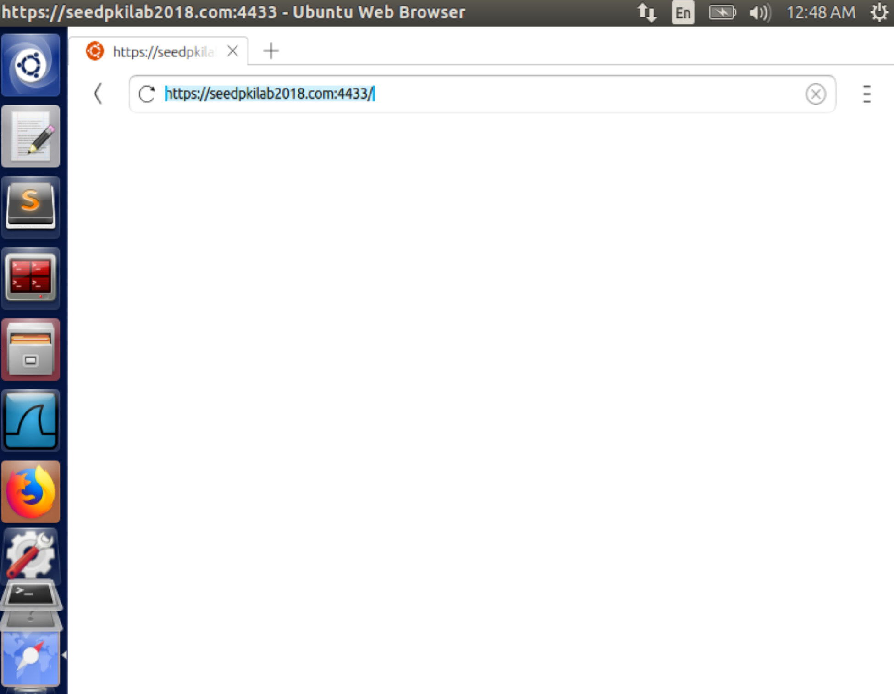

Instruction: https://seedsecuritylabs.org/Labs_16.04/PDF/Crypto_PKI.pdf

# Task 1

Copy the configuration file into current directory:

```
cp /usr/lib/ssl/openssl.cnf ./openssl.cnf
```

Replace the line below in this file:

```
policy		= policy_anything
```

with

```
policy		= policy_match
```

create new sub-directories and files according to what it specified in its `[ CA_default ]` section:

```
dir = ./demoCA # Where everything is kept
certs = $dir/certs # Where the issued certs are kept
crl_dir = $dir/crl # Where the issued crl are kept
new_certs_dir = $dir/newcerts # default place for new certs.
database = $dir/index.txt # database index file.
serial = $dir/serial # The current serial number
```

Simply create an empty file for `index.txt`, put a single number in string format in `serial`:

```
mkdir ./demoCA
cd ./demoCA
mkdir certs
mkdir crl
mkdir newcerts
touch index.txt
echo "1000" > serial
```

Start to generate the self-signed certificate for the CA:

```
openssl req -new -x509 -keyout ca.key -out ca.crt -config openssl.cnf
```

When asked to type PEM pass phrase, remember the password you typed (e.g. I use `114514`). It will then ask you to fill in some information, you can skip it by <kbd>Enter</kbd>, except for `commonName`, which is required.

> The output of the command are stored in two files: `ca.key` and `ca.crt`. The file `ca.key` contains the CA’s **private key**, while `ca.crt` contains the **public-key certificate**.

# Task 2

As a root CA, we are ready to sign a digital certificate for `SEEDPKILab2018.com`.

## Step 1:  Generate public/private key pair

Generate an RSA key pair. Provide a pass phrase (e.g. I use `soudayo`) to encrypt the private key in `server.key` using AES-128 encryption algorithm.

```
openssl genrsa -aes128 -out server.key 1024
```

To see the actual content in `server.key`:

```
openssl rsa -in server.key -text
```

## Step 2: Generate a Certificate Signing Request (CSR)

Use `SEEDPKILab2018.com` as the common name of the certificate request

```
openssl req -new -key server.key -out server.csr -config openssl.cnf
```

Skip the unnecessary information as well.

Now, the new Certificate Signing Request is saved in `server.csr`, which  basically includes the company's public key.

> The CSR will be sent to the CA, who will generate a certificate for the key (usually after ensuring that identity information in the CSR matches with the server's true identity)

## Step 3: Generating Certificates

In this lab, we will use our own trusted CA to generate certificates.

Use `ca.crt` and `ca.key` to convert `server.csr` to `server.crt`:

```
openssl ca -in server.csr -out server.crt -cert ca.crt -keyfile ca.key \
-config openssl.cnf
```

# Task 3

## Step 1: Configuring DNS

Open and edit `/etc/hosts`:

```
sudo gedit /etc/hosts
```

Add one line:

```
127.0.0.1 SEEDPKILab2018.com
```

## Step 2: Configuring the web server

Combine the secret key and certificate into one single file `server.pem`:

```
cp server.key server.pem
cat server.crt >> server.pem
```

Launch the web server using `server.pem`:

```
openssl s_server -cert server.pem -www
```

Now, the server is listening on port 4433. Browser https://seedpkilab2018.com:4433/


## Step 3: Getting the browser to accept our CA certificate.

Firefox cannot trust `CA.crt` somehow even if I have imported it to Firefox's Certificate manager:


So I have to open `CA.crt` to import it directly and use Ubuntu Web Browser to visit https://seedpkilab2018.com:4433/



## Step 4. Testing our HTTPS website

### Modify one byte in `server.pem`

It's up to which byte you modify. Most bytes make no differences after corrupted. But some will make the certificate invalid.

### Use localhost

It is the same blank page as https://seedpkilab2018.com:4433/. No error messages.


