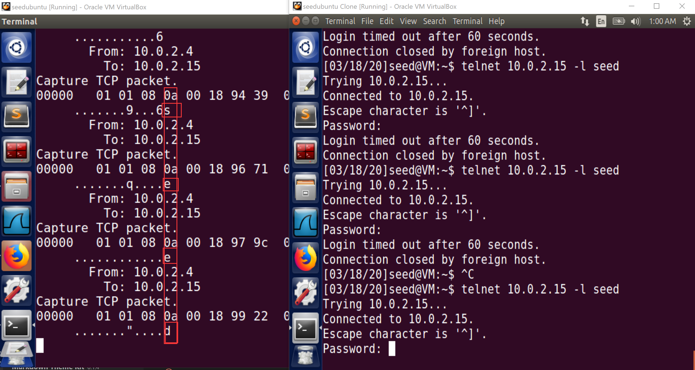
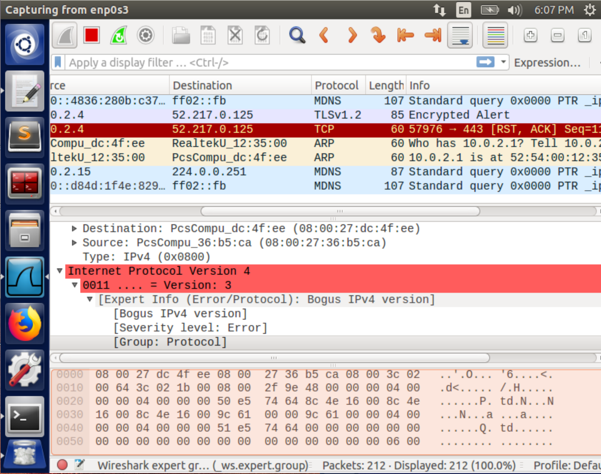
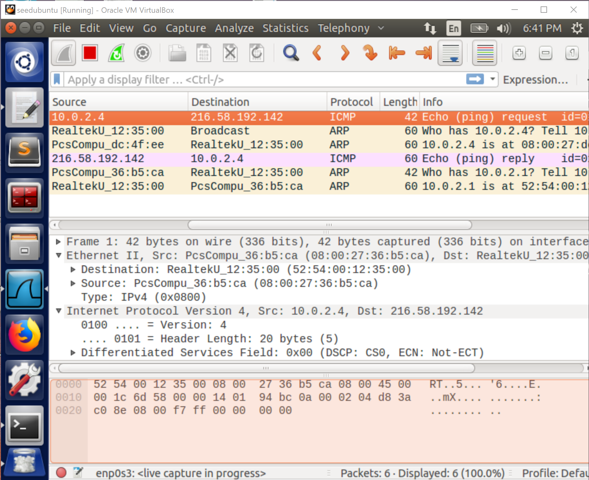
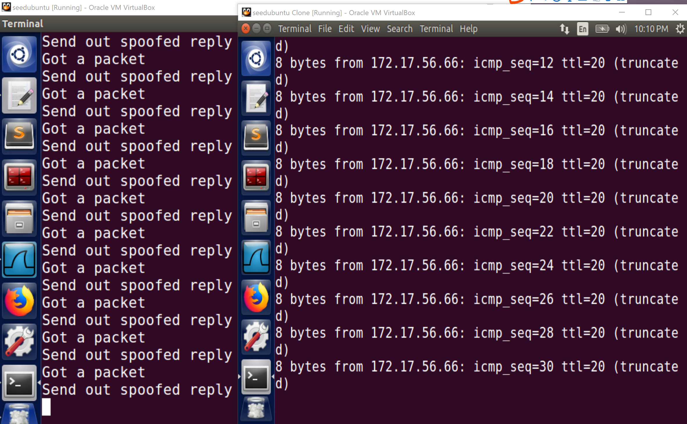

# Task 1

## Task 1.1

### Task 1.1A

Executed with `sudo`, it works to sniff the IP packet as expected. For instance, when using firefox to visit the website: https://seedsecuritylabs.org/

```
###[ Ethernet ]### 
  dst       = 52:54:00:12:35:00
  src       = 08:00:27:36:b5:ca
  type      = 0x800
###[ IP ]### 
     version   = 4
     ihl       = 5
     tos       = 0xc0
     len       = 158
     id        = 27438
     flags     = 
     frag      = 0
     ttl       = 64
     proto     = icmp
     chksum    = 0x6acb
     src       = 10.0.2.15
     dst       = 75.75.76.76
     \options   \
....
```

Without root privilege, it gives such an error message:

```
Traceback (most recent call last):
  File "sniffer.py", line 7, in <module>
    pkt = sniff(filter='icmp',prn=print_pkt)
  File "/home/seed/.local/lib/python2.7/site-packages/scapy/sendrecv.py", line 731, in sniff
    *arg, **karg)] = iface
  File "/home/seed/.local/lib/python2.7/site-packages/scapy/arch/linux.py", line 567, in __init__
    self.ins = socket.socket(socket.AF_PACKET, socket.SOCK_RAW, socket.htons(type))
  File "/usr/lib/python2.7/socket.py", line 191, in __init__
    _sock = _realsocket(family, type, proto)
socket.error: [Errno 1] Operation not permitted
```

### Task 1.1B

Ref to the [documentation](https://scapy.readthedocs.io/en/latest/usage.html#generating-sets-of-packets) of module `scapy` and [BPF syntax](https://biot.com/capstats/bpf.html), I can pass the following strings as argument `filter` in `sniff`:

- `proto icmp` / `icmp`
- `tcp dst port 23 and src host x.x.x.x`
- `net 128.230.0.0/16`

## Task 1.2

```python
>>> from scapy.all import *
>>> a = IP(src="x.x.x.x") # replace it with any ip address you want to send packets from
>>> b = ICMP() 
>>> p = a/b
>>> send(p)
```

## Task 1.3

```python
from scapy.all import *

for i in range(1,65):
    a = IP(dst='1.2.3.4',ttl=i)
    send(a/ICMP())
```

And with Wireshark, we can capture time-to-live exceeded error message packets from different sources, which are routers


## Task 1.4

From machine `10.0.2.4` run `ping 172.17.56.66`, which is an unreachable IP address.


Then on the machine `10.0.2.15` execute such a program ([`sniff_spoof_icmp.py`](./sniff_spoof_icmp.py)) as below:

```python
#!/usr/bin/python3
from scapy.all import *


def spoof_pkt(pkt):
    if 'ICMP' in pkt and pkt['ICMP'].type == 8:
        print("sniff packet from " + str(pkt['IP'].src) + " to " + str(pkt['IP'].dst))
        ip = IP(src=pkt['IP'].dst, dst=str(pkt['IP'].src), ihl=pkt['IP'].ihl)
        icmp = ICMP(type=0, id=pkt['ICMP'].id, seq=pkt['ICMP'].seq)
        data = pkt['Raw'].load
        newpkt = ip / icmp / data

        print("spoof packet from " + str(newpkt['IP'].src) + " to " + str(newpkt['IP'].dst))
        send(newpkt, verbose=0)


if __name__ == "__main__":
    sniff(filter='icmp', prn=spoof_pkt)
```

Then machine `10.0.2.4` can 'reach' host `172.17.56.66`:


# Task 2

## Task 2.1


### Task 2.1A

#### Question 1.

First, it initializes a raw socket bound to the device (NIC) that is be listening to. Then, it compiles the advanced filter rule into a low-level language and sets them as the BPF filter on the socket. Finally, it calls a loop to listen on the socket and call `got_packet()` whenever capturing a filtered packet on the socket.

#### Question 2.


If you want to set a BPF filter on the socket, packets received from the network are copied to the kernel. To listen on the socket and capture packets, it is necessary to access and modify something in kernel space, which requires root privilege. With such privilege, run `sniff` will show a `Segmentation fault` error message.

#### Question 3.

Change the third argument in (Line 22, [`sniff.c`](./sniff.c#L22))

```c
handle = pcap_open_live("enp0s3", BUFSIZ, 1, 1000, errbuf);
```

If using a non-zero `int`, the *promiscuous mode* is turned on. Otherwise, it is turned off. Keep the program run on the current VM.

Similar to [Task 1.4](#task-14), open another VM within the same subnet and use it to `ping` any host.

With promiscuous mode on, the program can capture packets of those `echo` requests above. Otherwise, it will get nothing even if `ping` runs properly. Promiscuous mode enables the program to sniff any packet coming into the NIC regardless of its actual destination host. So with it turned on, we can get packets sent among other computers.

### Task 2.1B

Change the [`filter_exp[]`](./sniff.c#L16) or directly set the third argument of [`pcap_compile()`](./sniff.c#L25) according to [BPF syntax](https://biot.com/capstats/bpf.html).

- `icmp and src host 10.0.2.4 and dst host 10.0.2.15`
- `tcp portrange 10-100`

### Task 2.1C

To simplify the problem, I suppose that on the VM `10.0.2.4` we use default telnet port (i.e. 23) with the command (`10.0.2.15` can be replaced with any reachable host, `seed` is a username) :

```
telnet 10.0.2.15 -l seed
```

Then, it asks the user to type the password in an **interactive prompt**.

Meanwhile, on the attacker machine `10.0.2.15`. I write a program [`sniff_pwd.c`](./sniff_pwd.c) to listen on such `telnet` packets with filter ["tcp port 23 and src host 10.0.2.4"](./sniff_pwd.c#L176).

From [the tutorial](https://www.tcpdump.org/pcap.htm), we know the packet data layout as:

Variable | Location (in bytes)
---------|----------
`sniff_ethernet` | 	`X`
`sniff_ip`	| `X` + `SIZE_ETHERNET` 
`sniff_tcp`	| `X` + `SIZE_ETHERNET` + `{IP header length}`
payload	 | `X` + `SIZE_ETHERNET` + `{IP header length}` + `{TCP header length}`

To get TCP payload, we should process captured packets like [this](./sniff_pwd.c#L161)
```c
if (ip->iph_protocol == IPPROTO_TCP)
{
    printf("Capture TCP packet.\n");
    char *payload = (u_char *)(packet + sizeof(struct ethheader) + sizeof(struct ipheader) + sizeof(struct sniff_tcp));
    int payload_len = ntohs(ip->iph_len) - sizeof(struct ipheader) - sizeof(struct sniff_tcp);
    print_payload(payload, payload_len);
}
```

[`print_payload()`](./sniff_pwd.c#L106) is a simple parser that makes packet data readable to human. All details can be found in [`sniff_pwd.c`](./sniff_pwd.c).

Finally, image typing `seed` letter by letter as a password on VM `10.0.2.4`. Once a letter is pressed, a TCP packet is sent from `10.0.2.4`, the attacker can sniff a packet with the letter at the end of the data field.



## Task 2.2

### Task 2.2A

For raw socket programming, to construct an IP header by providing information about the destination, I just need to set the family information and the destination IP address. Then the kernel can get the corresponding MAC address on the same subnet via ARP requests and fill all information out.

For instance, I construct an IP header in [`spoof.c`](./spoof.c#L30):

```c
sin.sin_family = AF_INET;
sin.sin_addr.s_addr = inet_addr("10.0.2.4");
sin.sin_port = htons(9090);
```

Using Wireshark, I observe that the IP packet is sent as:



### Task 2.2B

For instance, on behalf of VM `10.0.2.4`, to spoof an ICMP echo request packet to host `216.58.192.142`. I construct the headers as (more details can be found in [`spoof_icmp.c`](./spoof_icmp.c)):

```c
struct icmpheader *icmp = (struct icmpheader *)(buffer + sizeof(struct ipheader));
icmp->icmp_type = 8; //ICMP Type: 8 is request, 0 is reply.

// Calculate the checksum for integrity
icmp->icmp_chksum = 0;
icmp->icmp_chksum = in_cksum((unsigned short *)icmp,
                              sizeof(struct icmpheader));

struct ipheader *ip = (struct ipheader *)buffer;
ip->iph_ver = 4;
ip->iph_ihl = 5;
ip->iph_ttl = 20;
ip->iph_sourceip.s_addr = inet_addr("10.0.2.4");
ip->iph_destip.s_addr = inet_addr("216.58.192.142");
ip->iph_protocol = IPPROTO_ICMP;
ip->iph_len = htons(sizeof(struct ipheader) +
                    sizeof(struct icmpheader));
```

Capture the packet via Wireshark:




### Questions

#### Question 4.

The question is a little ambiguous. 

Of course, I can set the IP packet length field as any value in a program. But when using `IP_HDRINCL`(ref to https://linux.die.net/man/7/raw), it will be filled in with the actual value (`len(ipheader)`+`len(data)`) on sending regardless of what it is set as before.

Besides, in [Task 2.2B](#task-22b), we finally send the packet with [`send_raw_ip_packet()`](./spoof_icmp.c#84), in which it ends with:

```c
sendto(sock, ip, ntohs(ip->iph_len), 0,
       (struct sockaddr *)&dest_info, sizeof(dest_info));
```

The third argument of `sendto()` must be precisely specified as the actual size. Therefore, to verify the issue mentioned above, I edit it as:
```c
int ip_size = ntohs(ip->iph_len);
ip->iph_len = 0; // or whatever value you like

sendto(sock, ip, ip_size, 0,
        (struct sockaddr *)&dest_info, sizeof(dest_info));
```
Wireshark can still capture an ICMP echo request packet.

#### Question 5.

There is always no need to fill out the IP checksum field by hand (also ref to https://linux.die.net/man/7/raw). However, when sending an ICMP packet (e.g. [Task 2.2B](#task-22b)), the ICMP checksum field will not be filled out automatically. Even though the packet can be sent with an incorrect checksum, upon receiving the packet, the dst host first checks the checksum. If the checksum is not set properly, the host may consider it as an invalid request and drop the packet. So you will not capture the reply packet.


#### Question 6.

Use `gdb` in normal user shell to find out where the root privilege is required:

```
gdb -q spoof
Reading symbols from spoof...(no debugging symbols found)...done.
gdb-peda$ b sendto
Breakpoint 1 at 0x8048420
gdb-peda$ r
Starting program: /home/seed/Documents/packet/spoof 
[Thread debugging using libthread_db enabled]
Using host libthread_db library "/lib/i386-linux-gnu/libthread_db.so.1".
socket() error: Operation not permitted
[Inferior 1 (process 4468) exited with code 0377]
Warning: not running or target is remote
```

It gets stuck with the fact that a raw socket cannot be created by a normal user because a raw socket can read any packet copied from kernel space. In short, it can read packets of all users.

## Task 2.3

Modify the function `got_packet()` in [`sniff.c`](./sniff.c#L6) : Add the processing of spoofing an ICMP echo reply packet with the same ICMP `id`, ICMP `seq`, reversed src and dst IP in IP header with the captured packet. For instance, its my implement of critical part in [`sniff_and_then_spoof.c`](./sniff_and_then_spoof.c#L98):

```c
void got_packet(u_char *args, const struct pcap_pkthdr *header,
                const u_char *packet)
{
    printf("Got a packet\n");
    char buffer[1500];
    struct ipheader *captured_ip = (struct ipheader *)(packet + sizeof(struct ethheader));
    struct icmpheader *captured_icmp = (struct icmpheader *)(packet + sizeof(struct ethheader) + sizeof(struct ipheader));

    memset(buffer, 0, 1500);

    struct icmpheader *icmp = (struct icmpheader *)(buffer + sizeof(struct ipheader));
    icmp->icmp_type = 0; //ICMP Type: 8 is request, 0 is reply.
    // Calculate the checksum for integrity
    icmp->icmp_id = captured_icmp->icmp_id;
    icmp->icmp_seq = captured_icmp->icmp_seq;
    icmp->icmp_chksum = 0;
    icmp->icmp_chksum = in_cksum((unsigned short *)icmp,
                                 sizeof(struct icmpheader));

    struct ipheader *ip = (struct ipheader *)buffer;
    ip->iph_ver = 4;
    ip->iph_ihl = captured_ip->iph_ihl;
    ip->iph_ttl = 20;
    ip->iph_sourceip = captured_ip->iph_destip;
    ip->iph_destip = captured_ip->iph_sourceip;
    ip->iph_protocol = IPPROTO_ICMP;
    ip->iph_len = htons(sizeof(struct ipheader) +
                        sizeof(struct icmpheader));
    send_raw_ip_packet(ip);
    printf("Send out spoofed reply\n");
}
```

Similar to [Task 1.4](#task-14), when VM `10.0.2.4` `ping`s an unreablable host `172.17.56.66`, run program [`sniff_and_then_spoof`](./sniff_and_then_spoof.c) on VM `10.0.2.15` with root privilege. The spoofed echo replies are accepted as replies from the destination host.




