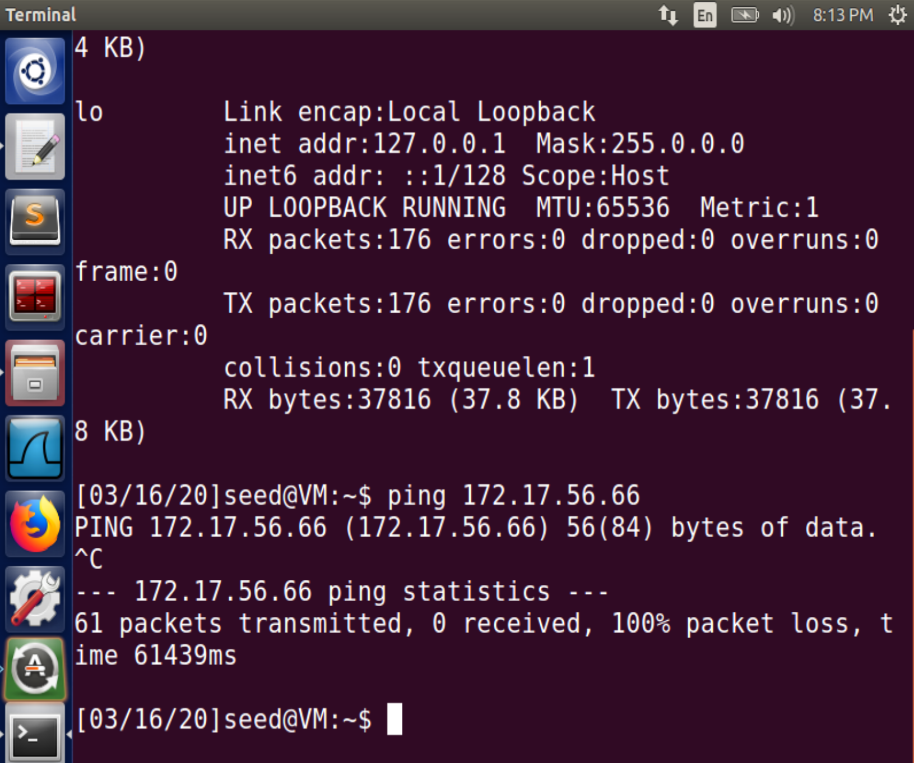
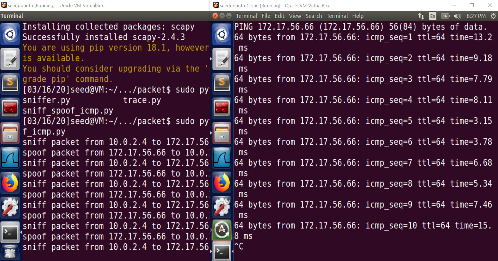
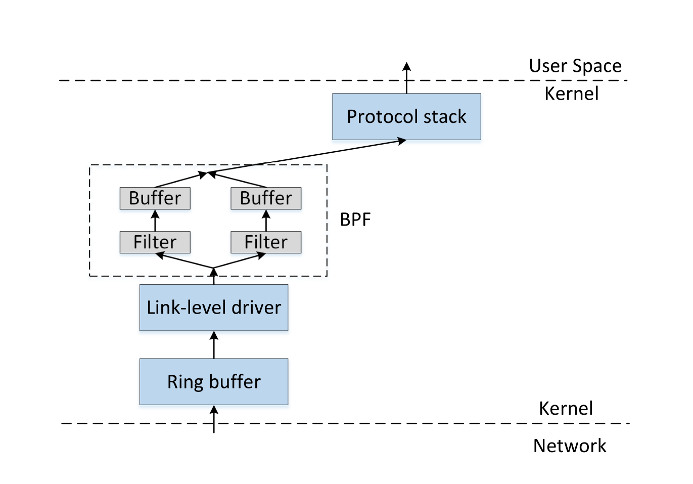

# Task 1

## Task 1.1

### Task 1.1A

Executed with `sudo`, it works to sniff the IP packet as expected. For instance, when using firefox to visit the website: https://seedsecuritylabs.org/

```
###[ Ethernet ]### 
  dst       = 52:54:00:12:35:00
  src       = 08:00:27:36:b5:ca
  type      = 0x800
###[ IP ]### 
     version   = 4
     ihl       = 5
     tos       = 0xc0
     len       = 158
     id        = 27438
     flags     = 
     frag      = 0
     ttl       = 64
     proto     = icmp
     chksum    = 0x6acb
     src       = 10.0.2.15
     dst       = 75.75.76.76
     \options   \
....
```

Without root privilege, it gives such an error message:

```
Traceback (most recent call last):
  File "sniffer.py", line 7, in <module>
    pkt = sniff(filter='icmp',prn=print_pkt)
  File "/home/seed/.local/lib/python2.7/site-packages/scapy/sendrecv.py", line 731, in sniff
    *arg, **karg)] = iface
  File "/home/seed/.local/lib/python2.7/site-packages/scapy/arch/linux.py", line 567, in __init__
    self.ins = socket.socket(socket.AF_PACKET, socket.SOCK_RAW, socket.htons(type))
  File "/usr/lib/python2.7/socket.py", line 191, in __init__
    _sock = _realsocket(family, type, proto)
socket.error: [Errno 1] Operation not permitted
```

### Task 1.1B

Ref to the [documentation](https://scapy.readthedocs.io/en/latest/usage.html#generating-sets-of-packets) of module `scapy` and [BPF syntax](https://biot.com/capstats/bpf.html), I can pass the following strings as argument `filter` in `sniff`:

- `proto icmp` / `icmp`
- `tcp dst port 23 and src host x.x.x.x`
- `net 128.230.0.0/16`

## Task 1.2

```py
>>> from scapy.all import *
>>> a = IP(src="x.x.x.x") # replace it with any ip address you want to send packets from
>>> b = ICMP() 
>>> p = a/b
>>> send(p)
```

## Task 1.3

```py
from scapy.all import *

for i in range(1,65):
    a = IP(dst='1.2.3.4',ttl=i)
    send(a/ICMP())
```

And with wireshark, we can capture time-to-live exceeded error message packets from different sources, which are routers


## Task 1.4

From machine `10.0.2.4` run `ping 172.17.56.66`, which is an unreachable IP address.



Then on the machine `10.0.2.15` execute such a program ([`sniff_spoof_icmp.py`](./sniff_spoof_icmp.py)) as below:

```py
#!/usr/bin/python3
from scapy.all import *


def spoof_pkt(pkt):
    if 'ICMP' in pkt and pkt['ICMP'].type == 8:
        print("sniff packet from " + str(pkt['IP'].src) + " to " + str(pkt['IP'].dst))
        ip = IP(src=pkt['IP'].dst, dst=str(pkt['IP'].src), ihl=pkt['IP'].ihl)
        icmp = ICMP(type=0, id=pkt['ICMP'].id, seq=pkt['ICMP'].seq)
        data = pkt['Raw'].load
        newpkt = ip / icmp / data

        print("spoof packet from " + str(newpkt['IP'].src) + " to " + str(newpkt['IP'].dst))
        send(newpkt, verbose=0)


if __name__ == "__main__":
    sniff(filter='icmp', prn=spoof_pkt)
```

Then machine `10.0.2.4` can 'reach' host `172.17.56.66`:




# Task 2

## Task 2.1


### Task 2.1A

#### Question 1.

First, it initializes a raw socket bound to the device (NIC) that is be listening to. Then, it compiles the advanced filter rule into a low-level language and sets them as the BPF filter on the socket. Finally, it calls a loop to listen on the socket and call `got_packet()` whenever capturing a filtered packet on the socket.

#### Question 2.



If you want to set a BPF filter on the socket, packets received from the network are copied to the kernel. To listen on the socket and capture packets, it is necessary to access and modify something in kernel space, which requires root privilege. With such privilege, run `sniff` will show a `Segmentation fault` error message.

#### Question 3.

Change the third argument in (Line 22, [`sniff.c`](./sniff.c#L22))

```c
handle = pcap_open_live("enp0s3", BUFSIZ, 1, 1000, errbuf);
```

If using a non-zero `int`, the *promiscuous mode* is turned on. Otherwise, it is turned off. Keep the program run on the current VM.

Similar to [Task 1.4](#task-14), open another VM within the same subnet and use it to `ping` any host.

With promiscuous mode on, the program can capture packets of those `echo` requests above. Otherwise, it will get nothing even if `ping` runs properly. Promiscuous mode enables the program to sniff any packet coming into the NIC regardless of its actual destination host. So with it turned on, we can get packets sent among other computers.

### Task 2.1B

Change the [`filter_exp[]`](./sniff.c#L16) or directly set the third argument of [`pcap_compile()`](./sniff.c#L25) according to [BPF syntax](https://biot.com/capstats/bpf.html).

- `icmp and src host 10.0.2.4 and dst host 10.0.2.15`
- `tcp portrange 10-100`