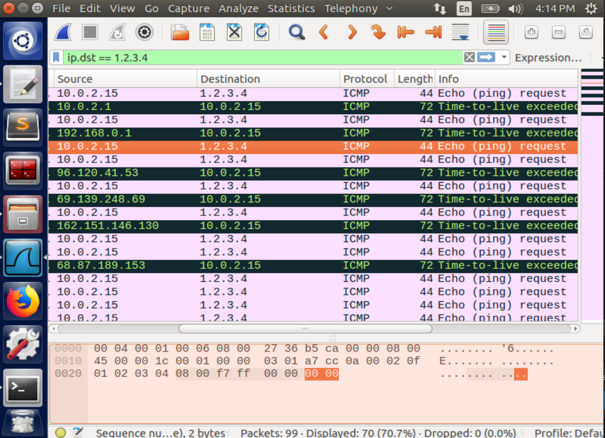

# Task 1

## Task 1.1

### Task 1.1A

Executed with `sudo`, it works to sniff the IP packet as expected. For instance, when using firefox to visit the website: https://seedsecuritylabs.org/

```
###[ Ethernet ]### 
  dst       = 52:54:00:12:35:00
  src       = 08:00:27:36:b5:ca
  type      = 0x800
###[ IP ]### 
     version   = 4
     ihl       = 5
     tos       = 0xc0
     len       = 158
     id        = 27438
     flags     = 
     frag      = 0
     ttl       = 64
     proto     = icmp
     chksum    = 0x6acb
     src       = 10.0.2.15
     dst       = 75.75.76.76
     \options   \
....
```

Without root privilege, it gives such an error message:

```
Traceback (most recent call last):
  File "sniffer.py", line 7, in <module>
    pkt = sniff(filter='icmp',prn=print_pkt)
  File "/home/seed/.local/lib/python2.7/site-packages/scapy/sendrecv.py", line 731, in sniff
    *arg, **karg)] = iface
  File "/home/seed/.local/lib/python2.7/site-packages/scapy/arch/linux.py", line 567, in __init__
    self.ins = socket.socket(socket.AF_PACKET, socket.SOCK_RAW, socket.htons(type))
  File "/usr/lib/python2.7/socket.py", line 191, in __init__
    _sock = _realsocket(family, type, proto)
socket.error: [Errno 1] Operation not permitted
```

### Task 1.1B

Ref to the [documentation](https://scapy.readthedocs.io/en/latest/usage.html#generating-sets-of-packets) of module `scapy` and [BPF syntax](https://biot.com/capstats/bpf.html), I can pass the following strings as argument `filter` in `sniff`:

- `proto icmp` / `icmp`
- `tcp dst port 23 and src host x.x.x.x`
- `net 128.230.0.0/16`

## Task 1.2

```py
>>> from scapy.all import *
>>> a = IP(src="x.x.x.x") # replace it with any ip address you want to send packets from
>>> b = ICMP() 
>>> p = a/b
>>> send(p)
```

## Task 1.3

```py
from scapy.all import *

for i in range(1,65):
    a = IP(dst='1.2.3.4',ttl=i)
    send(a/ICMP())
```

And with wireshark, we can capture time-to-live exceeded error message packets from different sources, which are routers




