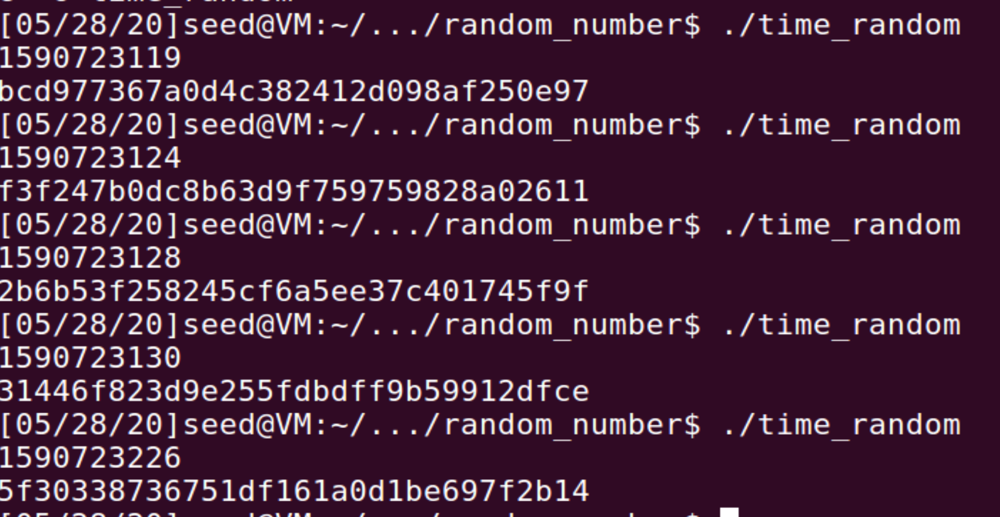

Instruction: https://seedsecuritylabs.org/Labs_16.04/PDF/Crypto_Random_Number.pdf

# Task 1

compile [`time_random.c`](./time_random.c) and run:

```
gcc time_random.c -o time_random
./time_random
```

Executing `./time_random` several times, it always gives different results:



Because it uses the current time as a random seed to generate random numbers, which guarantee the seed is always different in each run.

Comment out the line [`srand(time(NULL));`](./time_random.c#L11), recompile it and run, the numbers generated are the same now:


# Task 2

Get the epoch of `2018-04-17 23:08:49` by:

```
date -d "2018-04-17 23:08:49" +%s
```

It returns `1524020929`. Then we  list all possible random numbers generated by [`time_random.c`](./time_random.c) **within the two hours** by adding a loop before [line 12](./time_random.c#L12) in it as [`time_guess.c`](./time_guess.c):

```c
#include <stdio.h>
#include <stdlib.h>
#include <time.h>
#define KEYSIZE 16

void main()
{
    int i;
    char key[KEYSIZE];
    for (time_t t = 1524020929 - 60 * 60 * 2; t < 1524020929; t++) // within 2h window
    {
        srand(t);
        for (i = 0; i < KEYSIZE; i++)
        {
            key[i] = rand() % 256;
            printf("%.2x", (unsigned char)key[i]);
        }
        printf("\n");
    }
}
```

get lists:

```
gcc time_guess.c -o time_guess
time_guess > key_dict.txt
```

Use a brute-force method to crack the key from `key_dict.txt` as [guess_key.py](./guess_key.py):

```py
#!/usr/bin/python3
from Crypto.Cipher import AES

data = bytearray.fromhex('255044462d312e350a25d0d4c5d80a34')
ciphertext = bytearray.fromhex('d06bf9d0dab8e8ef880660d2af65aa82')
iv = bytearray.fromhex('09080706050403020100A2B2C2D2E2F2')

with open('key_dict.txt') as f:
    keys = f.readlines()

for k in keys:
    k = k.rstrip('\n')
    key = bytearray.fromhex(k)
    cipher = AES.new(key=key, mode=AES.MODE_CBC, iv=iv)
    guess = cipher.encrypt(data)
    if guess == ciphertext:
        print("find the key:", k)
        exit(0)

print("cannot find the key!")
```

It finds out the key:

```
$chmod u+X guess_key.py
$guess_key.py
find the key: 95fa2030e73ed3f8da761b4eb805dfd7
```
