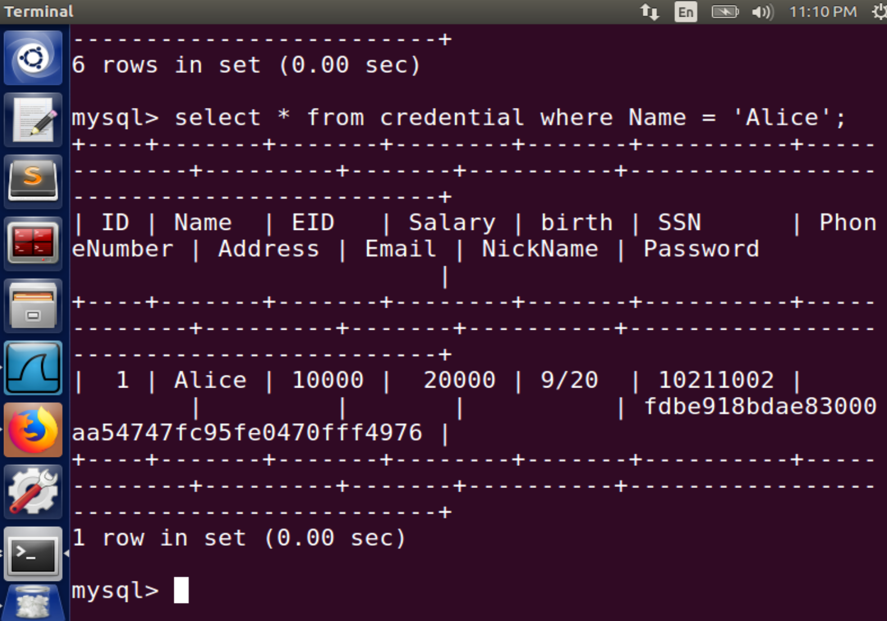

Instruction: https://seedsecuritylabs.org/Labs_16.04/PDF/Web_SQL_Injection.pdf

# Set-up

2 VMs:

- attacker: `10.0.2.15`
- server: `10.0.2.4`

Edit the DNS record in `/etc/hosts` on the attacker:

```
10.0.2.4       www.SeedLabSQLInjection.com
```

# Task 1

Log in MYSQL:

```
mysql -u root -pseedubuntu
mysql> use Users;
mysql> show tables;
```

Use such a SQL query:

```sql
select * from credential where Name = 'Alice';
```

