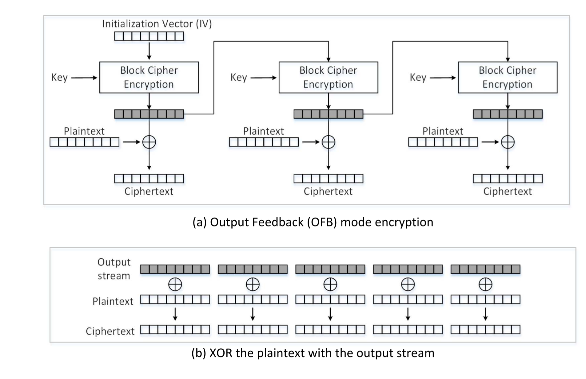

Instruction: https://seedsecuritylabs.org/Labs_16.04/PDF/Crypto_Encryption.pdf

# Task 1

- Step 1: Use the text of [the Gettysburg Address](https://en.wikipedia.org/wiki/Gettysburg_Address) as the original article file [`gettysburg.txt`](./gettysburg.txt). The usage of `tr` is available in [GNU documentations](https://www.gnu.org/software/coreutils/manual/html_node/tr-invocation.html#tr-invocation). `-d` means 'delete' and `-cd` means 'delete the complement of', so first we just keep the letters, spaces, and newlines as the plaintext.
  
```
$tr [:upper:] [:lower:] < gettysburg.txt > lowercase.txt
$tr -cd '[a-z][\n][:space:]' < lowercase.txt > plaintext.txt
```

- Step 2: Use Python console to generate a permutation of `a-z`:

```python
>>> import random
>>> s = "abcdefghijklmnopqrstuvwxyz"
>>> ''.join(random.sample(s,len(s)))
'azfgmunhrqwetlxicdksjbpvyo'
```

- Step 3: Encryption

```
$tr "abcdefghijklmnopqrstuvwxyz" "azfgmunhrqwetlxicdksjbpvyo" < plaintext.txt > ciphertext.txt
```

## Break 

Use http://www.richkni.co.uk/php/crypta/freq.php to analyze the frequency of `ciphertext.txt`, its full report shows as [`analysis.md`](./analysis.md).

By [single letter frequcey](./analysis.md#Letter-frequencies),the letters in ciphertext sorted by frequency are:

```
msaxhdlrgkefpnubjiztywcqvo 
```

Compared with letter frequency rank as  `eothasinrdluymwfgcbpkvjqxz` in modern English (see [Wikipedia](https://en.wikipedia.org/wiki/Letter_frequency))

```
$ tr 'msaxhdlrgkefpnubjiztywcqvo' 'eothasinrdluymwfgcbpkvjqxz' < ciphertext.txt > out1.txt
```

# Task 2

Ref to the [manual](https://www.openssl.org/docs/man1.0.2/man1/openssl-enc.html) of `enc`.


## Cipher Block Chaining (CBC)

> Each block of plaintext is XORed with the previous cipher block.


```sh
#encrypt
$openssl enc  -aes-128-cbc  -e -in plaintext.txt -out cbc_cipher.bin \
-K 00112233445566778889aabbccddeeff \
-iv 0102030405060708
#decrypt
$openssl enc  -aes-128-cbc  -d -in cbc_cipher.bin -out cbc_plain.txt \
-K 00112233445566778889aabbccddeeff \
-iv 0102030405060708
#valid
$diff plaintext.txt cbc_plain.txt
```

## Cipher Feedback (CFB)

> The ciphertext from the previous block is fed into the block cipher for encryption, and the output of the encryption is XORed with the plaintext to generate the actual ciphertext.


```sh
#encrypt
$openssl enc  -aes-128-cfb  -e -in plaintext.txt -out cfb_cipher.bin \
-K 00112233445566778889aabbccddeeff \
-iv 0102030405060708
#decrypt
$openssl enc  -aes-128-cfb  -d -in cfb_cipher.bin -out cfb_plain.txt \
-K 00112233445566778889aabbccddeeff \
-iv 0102030405060708
#valid
$diff plaintext.txt cfb_plain.txt
```

## Output Feedback (OFB)

> Similar to CFB, except that the data **before** *(while in CFB, it should be "after")* the XOR operation is fed into the next block.


```sh
#encrypt
$openssl enc  -aes-128-ofb  -e -in plaintext.txt -out ofb_cipher.bin \
-K 00112233445566778889aabbccddeeff \
-iv 0102030405060708
#decrypt
$openssl enc  -aes-128-ofb  -d -in ofb_cipher.bin -out ofb_plain.txt \
-K 00112233445566778889aabbccddeeff \
-iv 0102030405060708
#valid
$diff plaintext.txt ofb_plain.txt
```

## Counter (CTR)

> Each block of key stream is generated by encrypting the counter value for the block. Nonce servers as IV, increased by some value (no need to be fixed to 1 ) as a counter.


```sh
#encrypt
$openssl enc  -aes-128-ctr  -e -in plaintext.txt -out ctr_cipher.bin \
-K 00112233445566778889aabbccddeeff \
-iv 0102030405060708
#decrypt
$openssl enc  -aes-128-ctr  -d -in ctr_cipher.bin -out ctr_plain.txt \
-K 00112233445566778889aabbccddeeff \
-iv 0102030405060708
#valid
$diff plaintext.txt ctr_plain.txt
```

# Task 3


Encrypt the picture [`pic_original.bmp`](https://seedsecuritylabs.org/Labs_16.04/Crypto/Crypto_Encryption/files/pic_original.bmp) as 

```
openssl enc  -aes-128-ecb  -e -in pic_original.bmp -out cipher_pic.bmp \
-K 00112233445566778889aabbccddeeff
```

Reset the header of the encrypted picture to make it openable by picture viewer:

```
head -c 54 pic_original.bmp > header
tail -c +55 cipher_pic.bmp > body
cat header body > full_cipher_pic.bmp
```

The output encrypted picture is displayed as:


It seems similar to the original picture in some way. Because we break the file into blocks of size 128 bit, and the use AES algorithm to encrypt each block. If two blocks are the same in the original picture, they will remain identical in the encrypted one. 

# Task 4

```sh
echo -n "123456" > test.txt
ls -ld test.txt
openssl enc  -aes-128-ecb  -e -in test.txt -out output.bin \
-K 00112233445566778889aabbccddeeff
ls -ld output.bin 
```
It shows that `test.txt` has 6 bytes while `output.bin` has 16. Padding occurs during ECB encryption.

Similar, try other modes by replacing `-aes-128-ecb` and adding the argument `-iv`

```sh
# cbc
openssl enc  -aes-128-cbc  -e -in test.txt -out output.bin \
-K 00112233445566778889aabbccddeeff \
-iv 0102030405060708
ls -ld output.bin # 16
# cfb
openssl enc  -aes-128-cfb  -e -in test.txt -out output.bin \
-K 00112233445566778889aabbccddeeff \
-iv 0102030405060708
ls -ld output.bin #6
# ofb
openssl enc  -aes-128-ofb  -e -in test.txt -out output.bin \
-K 00112233445566778889aabbccddeeff \
-iv 0102030405060708
ls -ld output.bin #6
```

CFB and OFB don't need padding. Because they take outputs of the previous block, which must be of the same size equal to cipher block size, as the inputs of its last cipher block encryption.

```sh
echo -n "12345" > f1.txt # 5 bytes
echo -n "123456789A" > f2.txt # 10 bytes
echo -n "0123456789ABCDEF" > f3.txt # 16 bytes
```

Encrypt 3 files with CBC mode:

```sh
openssl enc  -aes-128-cbc  -e -in f.txt -out output.bin \ # replace f.txt with actual plaintext
-K 00112233445566778889aabbccddeeff \
-iv 0102030405060708
ls -ld output.bin
```

It shows that the output of `f3.txt` contains 32 bytes but the other 2 has 16 bytes.

The original `f1.txt`:

```sh
$xxd -g 1 f1.txt
00000000: 31 32 33 34 35                                   12345
```

Decrypt `output.bin` with `-nopad`:

```
openssl enc  -aes-128-cbc  -d -in output.bin -out plain_f1.txt \
-K 00112233445566778889aabbccddeeff \
-iv 0102030405060708 -nopad
```

Then the output file has 16 bytes, and:

```sh
$xxd -g 1 plain_f1.txt 
00000000: 31 32 33 34 35 0b 0b 0b 0b 0b 0b 0b 0b 0b 0b 0b  12345...........
```

The paddings during encryption are treated as ciphertext.

# Task 5

Create a big file containing more than 1000 bytes

```sh
$python -c "print '1234567890'*100" > big_file.txt
$-ld big_file.txt
#1001
```

Encrypt it and then decrypt:

```sh
openssl enc  -aes-128-ecb  -e -in big_file.txt -out output.bin \
-K 00112233445566778889aabbccddeeff 
```

Or

```sh
openssl enc  -aes-128-cbc  -e -in big_file.txt -out output.bin \ #replace cbc as cfb,ofb
-K 00112233445566778889aabbccddeeff \
-iv 0102030405060708
```

corrupt the 55-th(`0x37`) byte of `output.bin` as `0x00` using `bless`

And then decrypt it:

```sh
openssl enc  -aes-128-ecb  -d -in output.bin -out decrypted.txt \
-K 00112233445566778889aabbccddeeff 
```

Or

```sh
openssl enc  -aes-128-cbc  -d -in output.bin -out decrypted.txt \ #replace cbc as cfb,ofb
-K 00112233445566778889aabbccddeeff \
-iv 0102030405060708
```

Check their differences by [`diff.py`](./diff.py):

```py
#!/usr/bin/python3
with open('big_file.txt', 'rb') as f:
    f1 = f.read()
with open('decrypted.txt', 'rb') as f:
    f2 = f.read()
res = 0
for i in range(min(len(f1), len(f2))):
    if f1[i] != f2[i]:
        res += 1
print("diff bytes: "+str(res+abs(len(f1)-len(f2))))
```

`diff` between the original files and decrypted files:

<!-- openssl enc  -aes-128-ofb  -e -in big_file.txt -out output.bin \
-K 00112233445566778889aabbccddeeff \
-iv 0102030405060708

openssl enc  -aes-128-ofb  -d -in output.bin -out decrypted.txt \
-K 00112233445566778889aabbccddeeff \
-iv 0102030405060708 -->


Mode | Different bytes
---------|----------
 ECB | 16
 CBC | 17
 CFB | 17
 OFB | 1

# Task 6

## Task 6.1

When plaintexts are the same, using the same IV leads to the same ciphertexts.

## Task 6.2

For OFB mode, If the **key** and **IV** keep unchanged, *known-plaintext attack* is feasible.

Output stream can be obtained by XORing plaintext and ciphertext block by block. Similarly, to get plaintext, I can XOR plaintext and ciphertext. When sharing the same key and IV for OFB mode, the output streams are **identical** among encryptions.



Assuming that we know a plaintext `p1` and its OFB ciphertext `c1`, and another OFB ciphertext `c2` with the same key and IV. But we do not know the plaintext `p2` of `c2`, to figure about it:

First, get the output stream from the encryption of the first plaintext `p1`:

`output_stream` = `p1` `XOR` `c1`

Then get `p2` by:

`p2` = `output_stream` `XOR` `c2`

Reduce it to:

`p2` = `p1` `XOR` `c1` `XOR` `c2`

Use [`known-plaintext-attack.py`](./known-plaintext-attack.py):

```py
#!/usr/bin/python3
from sys import argv

_, first, second, third = argv
p1 = bytearray(first,encoding='utf-8')
c1 = bytearray.fromhex(second)
c2 = bytearray.fromhex(third)
p2 = bytearray(x ^ y ^ z for x, y, z in zip(p1, c1, c2))
print(p2.decode('utf-8'))
```

On the instance of

```
Plaintext (P1): This is a known message!
Ciphertext (C1): a469b1c502c1cab966965e50425438e1bb1b5f9037a4c159
Plaintext (P2): (unknown to you)
Ciphertext (C2): bf73bcd3509299d566c35b5d450337e1bb175f903fafc159
```

```sh
known-plaintext-attack.py "This is a known message!" \
a469b1c502c1cab966965e50425438e1bb1b5f9037a4c159 \
bf73bcd3509299d566c35b5d450337e1bb175f903fafc159 \
```

Get `P2` as `"Order: Launch a missile!"`

For CFB mode, as [its demonstration](#cipher-feedback-cfb), it is the same situation for the initial block (i.e. can get plaintext by simple `XOR`). However, if the key remains secret, the following parts of ciphertext will not be revealed.

## Task 6.3

I guess `p1` is `"Yes"`.

So construct 

`P2` = `"Yes"` `XOR` `IV` `XOR` `IV_NEXT`

Where `IV` is the IV used to generate `C1` and `IV_NEXT` is the predictable IV used to encrypt the next plaintext input.

In this case:

```
Encryption method: 128-bit AES with CBC mode.
Key (in hex): 00112233445566778899aabbccddeeff (known only to Bob)
Ciphertext (C1): bef65565572ccee2a9f9553154ed9498 (known to both)
IV used on P1 (known to both)
(in ascii): 1234567890123456
(in hex) : 31323334353637383930313233343536
Next IV (known to both)
(in ascii): 1234567890123457
(in hex) : 31323334353637383930313233343537
```

In practice, because the length of the payload is too short, which is required to padding according to [PKCS\#7](https://tools.ietf.org/html/rfc2315#section-10.3), We have to do some subtle adoption based on [`known-plaintext-attack.py`](./known-plaintext-attack.py) to create [`cipher_cons.py`](./cipher_cons.py):

```py
#!/usr/bin/python3
from sys import argv

_, first, second, third = argv
p1 = bytearray(first, encoding='utf-8')
padding = 16 - len(p1) % 16  # padding to match the block size as 128 bit
p1.extend([padding]*padding)
IV = bytearray.fromhex(second)
IV_NEXT = bytearray.fromhex(third)
p2 = bytearray(x ^ y ^ z for x, y, z in zip(p1, IV, IV_NEXT))
print(p2.decode('utf-8'), end='')
```

```sh
cipher_cons.py "Yes" 31323334353637383930313233343536 31323334353637383930313233343537 > p2
```

To get `c2`, query with `p2`:

```sh
openssl enc  -aes-128-cbc  -e -in p2 -out c2 \
-K 00112233445566778899aabbccddeeff \
-iv 31323334353637383930313233343537
```

Note that when the plaintext is a multiple of 16 bytes, it should be padded with another 16 bytes according to [PKCS\#7](https://tools.ietf.org/html/rfc2315#section-10.3) for encryption. To compare with actual `c1`, we just need the first block of `c2`:

```sh
$xxd -p c2
bef65565572ccee2a9f9553154ed94983402de3f0dd16ce789e5475779aca405
```

Its first 16 bytes are the same as `c1`, therefore, the hypothesis holds: 

`p1` = `"Yes"`

Verify:

```sh
$echo -n "bef65565572ccee2a9f9553154ed9498" | xxd -r -p > c1
$openssl enc  -aes-128-cbc  -d -in c1 -out p1 \
-K 00112233445566778899aabbccddeeff \
-iv 31323334353637383930313233343536
$cat p2
Yes
```