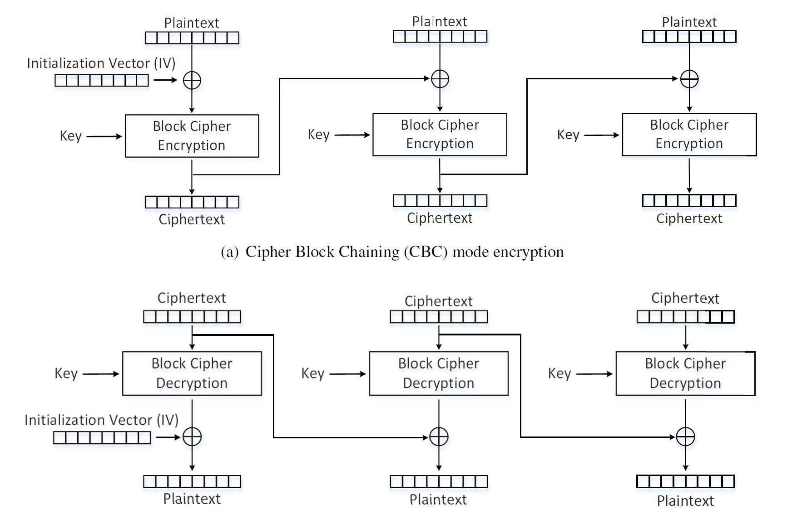
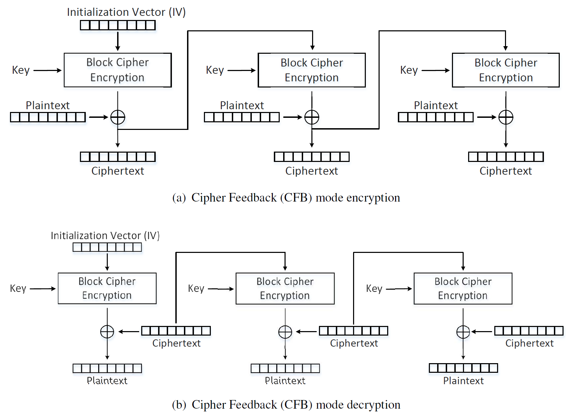
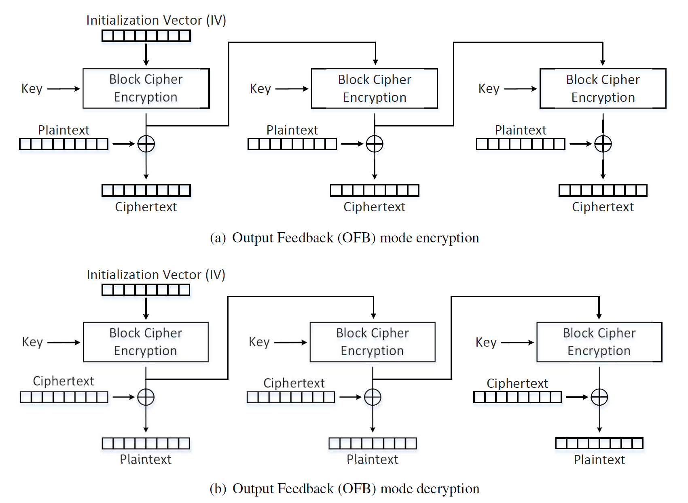
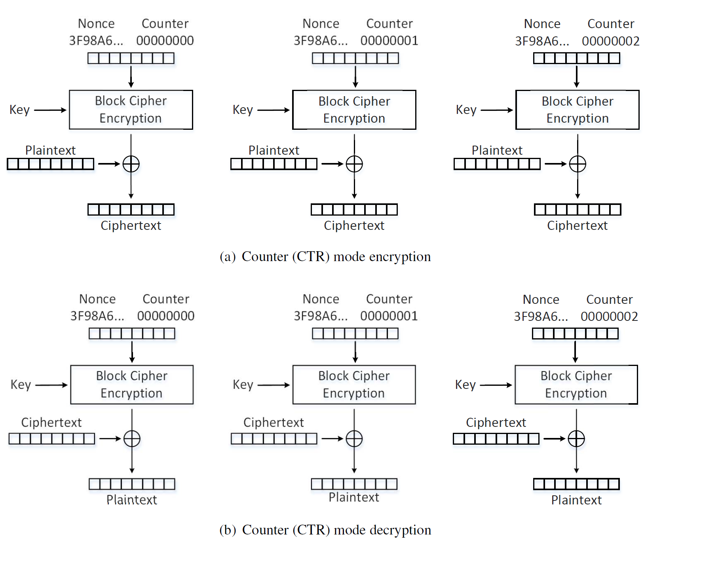
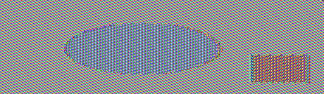

Instruction: https://seedsecuritylabs.org/Labs_16.04/PDF/Crypto_Encryption.pdf

# Task 1

- Step 1: Use the text of [the Gettysburg Address](https://en.wikipedia.org/wiki/Gettysburg_Address) as the original article file [`gettysburg.txt`](./gettysburg.txt). The usage of `tr` is available in [GNU documentations](https://www.gnu.org/software/coreutils/manual/html_node/tr-invocation.html#tr-invocation). `-d` means 'delete' and `-cd` means 'delete the complement of', so first we just keep the letters, spaces, and newlines as the plaintext.
  
```
$tr [:upper:] [:lower:] < gettysburg.txt > lowercase.txt
$tr -cd '[a-z][\n][:space:]' < lowercase.txt > plaintext.txt
```

- Step 2: Use Python console to generate a permutation of `a-z`:

```python
>>> import random
>>> s = "abcdefghijklmnopqrstuvwxyz"
>>> ''.join(random.sample(s,len(s)))
'azfgmunhrqwetlxicdksjbpvyo'
```

- Step 3: Encryption

```
$tr "abcdefghijklmnopqrstuvwxyz" "azfgmunhrqwetlxicdksjbpvyo" < plaintext.txt > ciphertext.txt
```

## Break 

Use http://www.richkni.co.uk/php/crypta/freq.php to analyze the frequency of `ciphertext.txt`, its full report shows as [`analysis.md`](./analysis.md).

By [single letter frequcey](./analysis.md#Letter-frequencies),the letters in ciphertext sorted by frequency are:

```
msaxhdlrgkefpnubjiztywcqvo 
```

Compared with letter frequency rank as  `eothasinrdluymwfgcbpkvjqxz` in modern English (see [Wikipedia](https://en.wikipedia.org/wiki/Letter_frequency))

```
$ tr 'msaxhdlrgkefpnubjiztywcqvo' 'eothasinrdluymwfgcbpkvjqxz' < ciphertext.txt > out1.txt
```

# Task 2

Ref to the [manual](https://www.openssl.org/docs/man1.0.2/man1/openssl-enc.html) of `enc`.


## Cipher Block Chaining (CBC)

> Each block of plaintext is XORed with the previous cipher block.



```sh
#encrypt
$openssl enc  -aes-128-cbc  -e -in plaintext.txt -out cbc_cipher.bin \
-K 00112233445566778889aabbccddeeff \
-iv 0102030405060708
#decrypt
$openssl enc  -aes-128-cbc  -d -in cbc_cipher.bin -out cbc_plain.txt \
-K 00112233445566778889aabbccddeeff \
-iv 0102030405060708
#valid
$diff plaintext.txt cbc_plain.txt
```

## Cipher Feedback (CFB)

> The ciphertext from the previous block is fed into the block cipher for encryption, and the output of the encryption is XORed with the plaintext to generate the actual ciphertext.



```sh
#encrypt
$openssl enc  -aes-128-cfb  -e -in plaintext.txt -out cfb_cipher.bin \
-K 00112233445566778889aabbccddeeff \
-iv 0102030405060708
#decrypt
$openssl enc  -aes-128-cfb  -d -in cfb_cipher.bin -out cfb_plain.txt \
-K 00112233445566778889aabbccddeeff \
-iv 0102030405060708
#valid
$diff plaintext.txt cfb_plain.txt
```

## Output Feedback (OFB)

> Similar to CFB, except that the data **before** *(while in CFB, it should be "after")* the XOR operation is fed into the next block.



```sh
#encrypt
$openssl enc  -aes-128-ofb  -e -in plaintext.txt -out ofb_cipher.bin \
-K 00112233445566778889aabbccddeeff \
-iv 0102030405060708
#decrypt
$openssl enc  -aes-128-ofb  -d -in ofb_cipher.bin -out ofb_plain.txt \
-K 00112233445566778889aabbccddeeff \
-iv 0102030405060708
#valid
$diff plaintext.txt ofb_plain.txt
```

## Counter (CTR)

> Each block of key stream is generated by encrypting the counter value for the block. Nonce servers as IV, increased by some value (no need to be fixed to 1 ) as a counter.



```sh
#encrypt
$openssl enc  -aes-128-ctr  -e -in plaintext.txt -out ctr_cipher.bin \
-K 00112233445566778889aabbccddeeff \
-iv 0102030405060708
#decrypt
$openssl enc  -aes-128-ctr  -d -in ctr_cipher.bin -out ctr_plain.txt \
-K 00112233445566778889aabbccddeeff \
-iv 0102030405060708
#valid
$diff plaintext.txt ctr_plain.txt
```

# Task 3


Encrypt the picture [`pic_original.bmp`](https://seedsecuritylabs.org/Labs_16.04/Crypto/Crypto_Encryption/files/pic_original.bmp) as 

```
openssl enc  -aes-128-ecb  -e -in pic_original.bmp -out cipher_pic.bmp \
-K 00112233445566778889aabbccddeeff
```

Reset the header of the encrypted picture to make it openable by picture viewer:

```
head -c 54 pic_original.bmp > header
tail -c +55 cipher_pic.bmp > body
cat header body > full_cipher_pic.bmp
```

The output encrypted picture is displayed as:



It seems similar to the original picture in some way. Because we break the file into blocks of size 128 bit, and the use AES algorithm to encrypt each block. If two blocks are the same in the original picture, they will remain identical in the encrypted one. 

# Task 4

```sh
echo -n "123456" > test.txt
ls -ld test.txt
openssl enc  -aes-128-ecb  -e -in test.txt -out output.bin \
-K 00112233445566778889aabbccddeeff
ls -ld output.bin 
```
It shows that `test.txt` has 6 bytes while `output.bin` has 16. Padding occurs during ECB encryption.

Similar, try other modes by replacing `-aes-128-ecb` and adding the argument `-iv`

```sh
# cbc
openssl enc  -aes-128-cbc  -e -in test.txt -out output.bin \
-K 00112233445566778889aabbccddeeff \
-iv 0102030405060708
ls -ld output.bin # 16
# cfb
openssl enc  -aes-128-cfb  -e -in test.txt -out output.bin \
-K 00112233445566778889aabbccddeeff \
-iv 0102030405060708
ls -ld output.bin #6
# ofb
openssl enc  -aes-128-ofb  -e -in test.txt -out output.bin \
-K 00112233445566778889aabbccddeeff \
-iv 0102030405060708
ls -ld output.bin #6
```

CFB and OFB don't need padding. Because they take outputs of the previous block, which must be of the same size equal to cipher block size, as the inputs of its last cipher block encryption.

```sh
echo -n "12345" > f1.txt # 5 bytes
echo -n "123456789A" > f2.txt # 10 bytes
echo -n "0123456789ABCDEF" > f3.txt # 16 bytes
```

Encrypt 3 files with CBC mode:

```sh
openssl enc  -aes-128-cbc  -e -in f.txt -out output.bin \ # replace f.txt with actual plaintext
-K 00112233445566778889aabbccddeeff \
-iv 0102030405060708
ls -ld output.bin
```

It shows that the output of `f3.txt` contains 32 bytes but the other 2 has 16 bytes.

The original `f1.txt`:

```sh
$xxd -g 1 f1.txt
00000000: 31 32 33 34 35                                   12345
```

Decrypt `output.bin` with `-nopad`:

```
openssl enc  -aes-128-cbc  -d -in output.bin -out plain_f1.txt \
-K 00112233445566778889aabbccddeeff \
-iv 0102030405060708 -nopad
```

Then the output file has 16 bytes, and:

```sh
$xxd -g 1 plain_f1.txt 
00000000: 31 32 33 34 35 0b 0b 0b 0b 0b 0b 0b 0b 0b 0b 0b  12345...........
```

The paddings during encryption are treated as ciphertext.