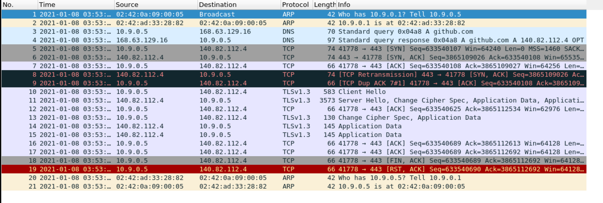
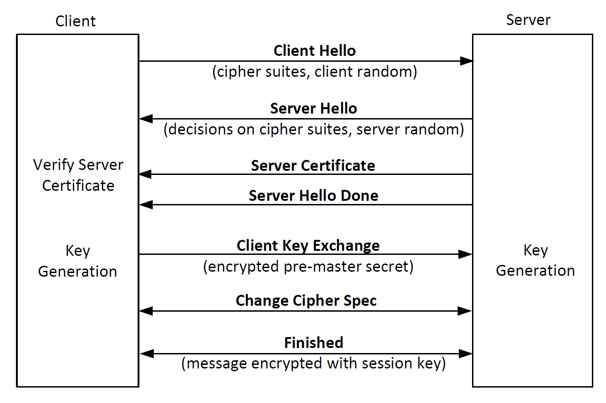

Instruction: https://seedsecuritylabs.org/Labs_20.04/Files/Crypto_TLS/Crypto_TLS.pdf

# Lab Environment

Set up 3 containers:

```
client: 10.9.0.5
server: 10.9.0.43
proxy: 10.9.0.143
```

```sh
curl https://seedsecuritylabs.org/Labs_20.04/Files/Crypto_TLS/Labsetup.zip -o Labsetup.zip
unzip Labsetup.zip
cd Labsetup
dcbuild
dcup -d
```

# Task 1

## Task 1.a

We try to create a TCP connection between our VM (**not container**) with https://github.com/

```
cd volumes
./handshake.py github.com
```

It gives:

```
After making TCP connection. Press any key to continue ...
=== Cipher used: ('TLS_AES_128_GCM_SHA256', 'TLSv1.3', 128)
=== Server hostname: github.com
=== Server certificate:
{'OCSP': ('http://ocsp.digicert.com',),
 'caIssuers': ('http://cacerts.digicert.com/DigiCertSHA2HighAssuranceServerCA.crt',),
 'crlDistributionPoints': ('http://crl3.digicert.com/sha2-ha-server-g6.crl',
                           'http://crl4.digicert.com/sha2-ha-server-g6.crl'),
 'issuer': ((('countryName', 'US'),),
            (('organizationName', 'DigiCert Inc'),),
            (('organizationalUnitName', 'www.digicert.com'),),
            (('commonName', 'DigiCert SHA2 High Assurance Server CA'),)),
 'notAfter': 'May 10 12:00:00 2022 GMT',
 'notBefore': 'May  5 00:00:00 2020 GMT',
 'serialNumber': '0557C80B282683A17B0A114493296B79',
 'subject': ((('countryName', 'US'),),
             (('stateOrProvinceName', 'California'),),
             (('localityName', 'San Francisco'),),
             (('organizationName', 'GitHub, Inc.'),),
             (('commonName', 'github.com'),)),
 'subjectAltName': (('DNS', 'github.com'), ('DNS', 'www.github.com')),
 'version': 3}
[{'issuer': ((('countryName', 'US'),),
             (('organizationName', 'DigiCert Inc'),),
             (('organizationalUnitName', 'www.digicert.com'),),
             (('commonName', 'DigiCert High Assurance EV Root CA'),)),
  'notAfter': 'Nov 10 00:00:00 2031 GMT',
  'notBefore': 'Nov 10 00:00:00 2006 GMT',
  'serialNumber': '02AC5C266A0B409B8F0B79F2AE462577',
  'subject': ((('countryName', 'US'),),
              (('organizationName', 'DigiCert Inc'),),
              (('organizationalUnitName', 'www.digicert.com'),),
              (('commonName', 'DigiCert High Assurance EV Root CA'),)),
  'version': 3}]
```

Reference to the [SSL module documentation](https://docs.python.org/3/library/ssl.html#ssl.SSLContext.load_verify_locations), `/etc/ssl/certs/` specifies the location of CA certificates that are used to validate the servers' certificates.

It may be hard to keep tracing of packets in TLS handshake when running VNC server. So we can run the script in one container via `dockerps` and focus on the corresponding network interface:



The captured packets depict a process as:


*(the figure comes from https://www.cloudflare.com/learning/ssl/what-happens-in-a-tls-handshake/)*

After a 3-way TCP handshake, a TCP connection is established ([Line 23](./handshake.py#L23)), the TLS handshake happens right after it ([Line 29](./handshake.py#L29)).

A clearer illustration of TLS handshake from the seed book:



## Task 1.b

After creating the TCP connection, it fails to verify server's certificate:

```
Traceback (most recent call last):
  File "./handshake.py", line 29, in <module>
    ssock.do_handshake()   # Start the handshake
  File "/usr/lib/python3.8/ssl.py", line 1309, in do_handshake
    self._sslobj.do_handshake()
ssl.SSLCertVerificationError: [SSL: CERTIFICATE_VERIFY_FAILED] certificate verify failed: unable to get local issuer certificate (_ssl.c:1123)
```

As we see before, the CA used to verify GitHub server's certificate is "DigiCert High Assurance EV Root CA", which is displayed by <kbd>subject</kbd> -> <kbd>commonName</kbd> in previous output. But `DigiCert_High_Assurance_EV_Root_CA.pem` is just a symbolic link to `/usr/share/ca-certificates/mozilla/` folder, the actual CA is stored as `/usr/share/ca-certificates/mozilla/DigiCert_High_Assurance_EV_Root_CA.crt`, copy it to your `./client-certs` folder.

**Tips**: If you are still not sure which CA on earth is accessed by the program, you can use 

```
inotifywait -me access /usr/share/ca-certificates/mozilla/
```

while running unchanged `handshake.py` to monitor which `crt` is being accessed.

And we need to make a symbolic with the hash value of its common name field:

```sh
openssl x509 -in client-certs/DigiCert_High_Assurance_EV_Root_CA.crt -noout -subject_hash
# 244b5494
ln -s client-certs/DigiCert_High_Assurance_EV_Root_CA.crt client-certs/244b5494.0
```

Comment out Line 10 and uncomment Line 11 in [`handshake.py`](./handshake.py#L10), then re-run it, it can give the same output as before now.